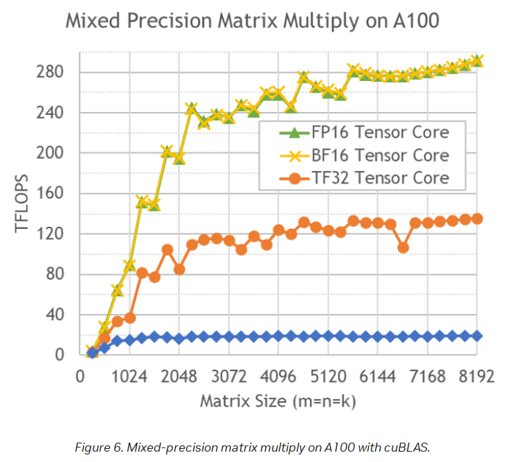

# 加速器

计算加速器是 ML 训练的主力。起初只有 GPU。但现在还有 TPU、IPU、FPGA、HPU、QPU、RDU 等等，而且还在不断发明中。

存在两种主要的 ML 工作负载 - 训练和推理。还有微调工作负载，通常与训练相同，除非执行更轻量级的 [LORA 风格](https://arxiv.org/abs/2106.09685)微调。后者比正常微调需要明显更少的资源和时间。

在语言模型中，推理期间的生成是按顺序执行的——一次一个令牌。因此，它必须一次又一次地重复相同的"前向"调用，每次都是一个相当小的"matmul"（矩阵乘法或 GEMM）。这可以在加速器（如 GPU）上完成，也可以在一些最新的 CPU 上完成，这些 CPU 可以相当高效地处理推理。

在训练期间，整个序列长度在一次巨大的"matmul"操作中处理。因此，如果序列长度为 4k，那么训练同一个模型将需要一个能够处理比推理多 4k 倍操作并能快速完成的计算单元。加速器在这项任务上表现出色。事实上，它们必须相乘的矩阵越大，计算就越高效。

另一个计算上的区别是，虽然训练和推理在"前向"传播中必须执行相同总量的"matmul"，但在"后向"传播中（仅用于训练），为了计算关于输入和权重的梯度，会额外执行 2 倍的"matmul"。如果使用激活重计算，则会额外执行一次"前向"传播。因此，训练过程比推理需要多 3-4 倍的"matmul"。

## 小节

通用：
- [基准测试](benchmarks)

NVIDIA:
- [NVIDIA GPU 故障排除](nvidia/debug.md)

AMD:
- [AMD GPU 故障排除](amd/debug.md)
- [AMD GPU 性能](amd/performance.md)

## 高端加速器现实概览

虽然未来可能会有所改变，但与消费级 GPU 市场不同，截至本文撰写时，高端加速器并不多，如果您在云上租用，大多数提供商或多或少都会提供相同的几种加速器。

GPU:
- 截至今天，ML 云/HPC 已开始从 NVIDIA H100s 过渡到 H200s，由于 NVIDIA GPU 通常短缺，这将需要几个月的时间。B200、GB200 正在开始出现。B300 和 GB300 已于 2024 年 12 月宣布！
- AMD 的 MI325X 现在在二级云提供商中广泛可用。MI355X 正在开始出现。MI400X 有望在 2026 年推出。

HPU:
- 英特尔的 Gaudi2 和 Gaudi3 在英特尔的云上可用。
- Falcon Shores 将于 2025 年取代 Gaudi
- Jaguar Shores 将于 2026 年取代 Falcon Shores

IPU:
- Graphcore 的 IPU 产品曾在 Paperspace 上短暂提供，但现在已经没有了。我不确定是否还有人提供这些产品。

TPU:
- 谷歌的 TPU 当然是可用的，但它们并不是最理想的加速器，因为你只能租用它们，而且软件在 GPU 和 TPU 之间的转换并不那么容易，所以许多（大多数？）开发者仍然留在 GPU 领域，因为他们不想被锁定在谷歌垄断的硬件上。
- 亚马逊的 Trainium2 与 TPU 架构非常相似，可在 AWS 上使用

关于 Pod 和机架：
- Cerebras 的 WaferScale Engine (WSE)
- SambaNova 的 DataScale
- 数十种不同的 Pod 和机架配置，将上述 GPU 与超高速互连相结合。

截至 2025 年第五季度，情况大致如此。

本文档的其余部分将详细比较上述大部分内容，如果您想阅读规格，请前往[此处](#high-end-accelerators-for-ml-workloads)。

由于我们大多数人是租用计算资源，从未见过它长什么样，所以这里展示了一个 8xH100 节点在物理上是什么样子（这是戴尔 PowerEdge XE9680 机架式服务器的 GPU 托盘）：


## 术语表

- CPU: 中央处理器
- FMA: 融合乘加
- FPGA: 现场可编程门阵列
- GCD: 图形计算芯片
- GPU: 图形处理单元
- HBM: 高带宽内存
- HPC: 高性能计算
- HPU: Habana Gaudi AI 处理器单元
- IPU: 智能处理单元
- MAMF: 最大可实现 Matmul FLOPS
- MME: 矩阵乘法引擎
- QPU: 量子处理单元
- RDU: 可重构数据流单元
- TBP: 总板功耗
- TDP: 热设计功耗或热设计参数
- TGP: 总图形功耗
- TPU: 张量处理单元

[Modal 的附加术语表](https://modal.com/gpu-glossary)

## 最重要的事情

我将在本书中多次声明以下内容——仅仅购买/租用最昂贵的加速器并期望获得高投资回报（ROI）是不够的。

ML 训练高 ROI 的两个指标是：
1. 训练完成的速度，因为如果训练时间比计划长 2-3 倍，你的模型可能在发布前就变得无关紧要了——在当前竞争激烈的 ML 市场中，时间就是一切。
2. 训练模型所花费的总金额，因为如果训练时间比计划长 2-3 倍，你最终将多花费 2-3 倍的钱。

除非购买/租用的其余硬件经过精心挑选以匹配所需的工作负载，否则加速器很可能会大量空闲，时间和金钱都会损失。最关键的组件是[网络](../../network)，然后是[存储](../../storage/)，最不关键的是 [CPU](../cpu) 和 [CPU 内存](../cpu-memory)（至少对于典型的训练工作负载来说是这样，其中任何 CPU 限制都可以通过多个 `DataLoader` 工作进程来补偿）。

如果计算是租用的，通常没有选择的自由——硬件要么是固定的，要么一些组件可能是可更换的，但选择不多。因此，有时所选的云提供商不提供足够匹配的硬件，在这种情况下，最好寻找不同的提供商。

如果您购买自己的服务器，那么我建议在购买前进行非常深入的尽职调查。

除了硬件，你当然还需要能够高效部署硬件的软件。

我们将在本书的各个章节中讨论硬件和软件方面的问题。你可能想从[这里](../../training/performance)和[这里](../../training/model-parallelism)开始。

## 我们关心哪些加速器特性

让我们在以下部分中使用 NVIDIA A100 规格作为参考点。


[来源](https://www.nvidia.com/en-us/data-center/a100/)

### TFLOPS

如前所述，ML 训练和推理所做的大部分工作是矩阵乘法。如果你还记得你的代数，矩阵乘法是由许多乘法后跟求和组成的。这些计算中的每一个都可以被计数，并定义芯片在一秒钟内可以执行多少次这样的操作。

这是判断加速器的关键特性之一。术语 TFLOPS 定义了芯片每秒可以执行多少万亿次浮点运算。越多越好。对于不同的数据类型有不同的定义。例如，以下是从 [A100 规格](https://www.nvidia.com/en-us/data-center/a100/)中提取的理论峰值 TFLOPS 的几个条目：

| 数据类型 \ TFLOPS | 无稀疏性 | 有稀疏性 |
| :-------------------- | -----------: | ----------: |
| FP32 | 19.5 | 不适用 |
| Tensor Float 32 (TF32) | 156 | 312 |
| BFLOAT16 Tensor Core | 312 | 624 |
| FP16 Tensor Core | 312 | 624 |
| FP8 Tensor Core | 624 | 1248 |
| INT8 Tensor Core | 624 | 1248 |

注意：

* INT8 以 TeraOperations 为单位测量，因为它不是浮点运算。

* 术语 FLOPS 可能意味着浮点运算的总数，例如，在计算单个 Transformer 迭代需要多少 FLOPS 时，它也可能意味着每秒的浮点运算 - 所以要注意上下文。当您阅读加速器规格时，它几乎总是每秒的定义。当讨论模型架构时，它通常只是浮点运算的总数。

所以你可以看到 int8 比 bf16 快 2 倍，而 bf16 又比 tf32 快 2 倍。

此外，TFLOps 取决于矩阵大小，如下表所示：



[来源](https://developer.nvidia.com/blog/cuda-11-features-revealed/)

如您所见，由于[瓦片和波浪量化效应](../../training/performance#tile-and-wave-quantization)，性能差异是非线性的。

#### 如何计算理论 TFLOPS

理论峰值 FLOPS 是在加速器规格中公布的。它的计算公式是：

`理论 FLOPS = 计算单元时钟速度 * 每个时钟周期每个计算单元的 FLOPs * 计算单元数量`

其中：
- `compute_unit_clock_speed` - 计算单元时钟每秒滴答的次数，单位为赫兹
- `flops_per_clock_cycle_per_compute_unit` - 计算单元每个时钟周期可以执行的浮点运算次数。
- `num_compute_units` - 设备中有多少个单元

每个时钟周期每个计算单元的 FLOPs 通常不会公布，但人们经常能找到的是每个时钟周期每个计算单元的 FMA 规格。FMA 是融合乘加。由于 1 个 FMA 由 2 个 FLOP 组成，我们可以将上述公式扩展为：

`理论 FLOPS = 计算单元时钟速度 * 每个时钟周期每个计算单元的 FMAs * 2 * 计算单元数量`

让我们验证一下这个公式是否正确。让我们计算一些 BF16（半精度）的 TFLOPS，并与公布的规格进行比较。

首先，我们从 [wiki](https://en.wikipedia.org/wiki/Hopper_(microarchitecture)#H100_accelerator_and_DGX_H100) 中提取必要的加速器规格。

棘手的部分是找到 BF16（半精度）每个 CUDA 核心每个时钟周期的 FMA 操作数。我在这里找到了它们[这里](https://forums.developer.nvidia.com/t/how-to-calculate-the-tensor-core-fp16-performance-of-h100/244727/2)。大多数来自[A100 白皮书](https://images.nvidia.com/aem-dam/en-zz/Solutions/data-center/nvidia-ampere-architecture-whitepaper.pdf)（在 pdf 中搜索"FMA"，然后选择您目标精度所列出的那些）。[H100 白皮书](https://resources.nvidia.com/en-us-tensor-core)省略了许多具体的 FMA 数字，但包含了相对于 A100 白皮书中列出的 FMA 的乘数）。

**对于 NVIDIA @ BF16**:

对于 NVIDIA BF16 操作，一个计算单元就是一个 CUDA 核心。

| 加速器 | 升压时钟 | 每个时钟周期每个 CUDA 核心的 FMA 操作数 | CUDA 核心数 | 规格 TFLOPS |
| :--------- | ---------: | -------------------------------------: | ----------: | ----------: |
| H100 SXM | 1980Mhz | 512 | 528 | 989 |
| A100 SXM | 1410MHz | 256 | 432 | 312 |

现在我们来做数学计算，将上表中的数字代入最后一个基于 FMA 的公式中：

- `1980*10**6 * 512 * 2 * 528 / 10**12 = 1070.530` TFLOPS
- `1410*10**6 * 256 * 2 * 432 / 10**12 = 311.87` TFLOPS

计算出的 A100 SXM TFLOPS 数字与公布的 312 TFLOPS 相符，但 H100 SXM 略有偏差（比规格高出约 80 点）——很可能在计算其理论规格时使用了较低的升压时钟速度。我们可以利用规格 TFLOPS 反向工程出它是什么：`989 / (512 * 2 * 528 / 10**12) / 10**6 = 1829.20`。事实上，一些互联网文章公布 1830Mhz 为 H100 SXM 的实际升压时钟速度。

**对于 AMD @ BF16**：

| 加速器 | 升压时钟 | 每个时钟周期每个 Tensor Core 的 FMA 操作 | Tensor Cores | 规格 TFLOPS |
| :--------- | ---------: | -------------------------------------: | ----------: | ----------: |
| MI300X | 2100Mhz | 256 | 1216 | 1307 |

让我们像以前一样自己计算：

- `2100*10**6 * 256 * 2 * 1216 / 10**12 = 1307.4` TFLOPS - 与公布的规格相符，尽管大多数时候您会在文献中看到向下取整的 `1300` TFLOPS。

**对于 Intel @ BF16**：

Intel Gaudi 使用 MME 进行 BF16 `matmul`

| 加速器 | 升压时钟 | 每个时钟周期每个 MME 的 FMA 操作数 | MMEs | 规格 TFLOPS |
| :--------- | ---------: | -------------------------------: | ----: | ----------: |
| Gaudi 2 | 1650Mhz | 256*256 | 2 | 432 |
| Gaudi 3 | 1600Mhz | 256*256 | 8 | 1677 |
| | | | | |

让我们像以前一样自己计算：

- Gaudi 2: `1650*10**6 * 256*256 * 2 * 2 / 10**12 = 432.5` TFLOPS - 与公布的规格相符
- Gaudi 3: `1600*10**6 * 256*256 * 2 * 8 / 10**12 = 1677` TFLOPS - 注意，这与白皮书中公布的规格（1835 TFLOPS）不符，因为为了达到 1835 TFLOPS，时钟必须是 1750Mhz。也就是说，目前 Gaudi3 的版本运行在 1600Mhz。

现在应该很明显了，如果您的加速器运行的升压时钟低于规格（例如，过热导致加速器降频），预期的 TFLOPS 将低于宣传值。

要检查您的加速器在负载下的实际时钟速度：
- NVIDIA: `nvidia-settings -q GPUCurrentClockFreqs`
- AMD: `rocm-smi -g` 用于实际值，`amd-smi metric --clock` 用于理论值
- Intel: `hl-smi –display CLOCK`

#### TFLOPS 比较表

我们来看看支持的[数据类型](../../training/dtype.md)以及高端加速器对应的理论峰值 TFLOPS 规格（无稀疏性）。按 bf16 列排序。

| 加速器 \ TFLOPS | fp32 | tf32 | fp16 | bf16 | fp8 | int8 | fp6 | fp4 | 备注 |
| :--------------- | ----: | -----: | ---: | ---: | ---: | ---: | --: | -----: | ----: |
| NVIDIA GB200 SXM | 80 | 1250.0 | 2500 | 2500 | 5000 | 5000 | 5000 | 10000 | 2 |
| AMD MI355X | ?? | ?? | 2300 | 2300 | 4600 | 4600 | 9200 | 9200 | |
| NVIDIA B200 SXM | 80 | 1125.0 | 2250 | 2250 | 4500 | 4500 | 4500 | 9000 | |
| Intel Gaudi3 | 229.0 | 459.0 | 459 | 1677 | 1677 | V | X | X | 1,8 |
| AMD MI325X | 163.4 | 653.7 | 1300 | 1300 | 2600 | 2600 | X | X | 7 |
| AMD MI300X | 163.4 | 653.7 | 1300 | 1300 | 2600 | 2600 | X | X | |
| NVIDIA H200 SXM | 67.0 | 494.5 | 989 | 989 | 1979 | 1979 | X | X | 4 |
| NVIDIA H100 SXM | 67.0 | 494.5 | 989 | 989 | 1979 | 1979 | X | X | 3 |
| NVIDIA GH200 SXM | 67.0 | 494.5 | 989 | 989 | 1979 | 1979 | X | X | 6 |
| NVIDIA H100 PCIe | 51.0 | 378.0 | 756 | 756 | 1513 | 1513 | X | X | |
| AWS Trainium2 / Ultra | 181.0 | 667.0 | 667 | 667 | 1299 | X | X | X | 9 |
| Google TPU v5p | X | X | X | 459 | X | 918 | X | X | |
| Intel Gaudi2 | V | V | V | 432 | 865 | V | X | X | 1 |
| AMD MI250X | 47.9 | X | 383 | 383 | X | 383 | X | X | |
| NVIDIA L40S | 91.6 | 183.0 | 362 | 362 | 733 | 733 | X | X | |
| AMD MI250 | 45.3 | X | 362 | 362 | X | 362 | X | X | |
| NVIDIA A100 SXM | 19.5 | 156.0 | 312 | 312 | X | 624 | X | X | |
| NVIDIA A100 PCIe | 19.5 | 156.0 | 312 | 312 | X | 624 | X | X | 5 |
| Google TPU v4 | X | X | X | 275 | X | 275 | X | X | |
| Google TPU v5e | X | X | X | 197 | X | 394 | X | X | |
| | | | | | | | | | |
| NVIDIA B300 SXM | ?? | | | | | | | | |
| | | | | | | | | | |

行特定注释：

1. 英特尔 Gaudi2 和 3 仅发布了部分 TFLOPS [规格](https://www.intel.com/content/www/us/en/content-details/817486/intel-gaudi-3-ai-accelerator-white-paper.html)，但它确实支持 FP32、TF32、BF16、FP16 和 FP8、INT8 和 INT16。这些数字用于 MME（矩阵）计算。

2. 由于 GB200 是 2 个 B200 芯片，为了公平比较，表格中包含了每个芯片的 TFLOPS - 实际的 GB200 你需要乘以 2 - 它似乎也让 B200 芯片运行得更快一些，所以规格比独立的 B200 更高。这也意味着，你通常的 8-GPU 节点，使用 GB200 后会变成 4-GPU 节点（但这相当于 8x B200，并有额外约 10% 的计算速度提升）。

3. 我没有包括 `NVIDIA H100 dual NVL`，因为它，嗯，是 2 个 GPU - 所以这不公平 - 它的 FLOPS 与 H100 相同，但所有东西都是 2 倍，另外它有更多的内存（每个芯片 94GB，而 H100 是 80GB），内存也快一点。

4. H200 与 H100 相同，但拥有 141GB vs 80GB 的 HBM 内存，并且其内存速度更快，HBMe@4.8TBps vs HBM@3.35TBps - 所以基本上 H200 解决了 H100 的计算效率问题。

5. 奇怪的是，NVIDIA A100 PCIe 和 SXM 修订版的[规格](https://www.nvidia.com/en-us/data-center/a100/)据报道具有相同的 TFLOPS，考虑到 SXM 版本多用 30% 的功率并使用快 5% 的 HBM，这很奇怪。

6. GH200 - 与 GB200 注释相同 - 这是 2 个芯片，因此表中包含每个芯片的规格，不含稀疏性。

7. MI325X 的计算与 MI300X 相同，但内存更多、功耗更大（计算效率更高）。

8. 截至本文撰写时，Gaudi3 运行在 1600Mhz (MME)，而不是计划的 1750Mhz，因此其 BF16 TFLOPS 为 1677，而不是白皮书规格的 1835。fp8 也是如此，其 TFLOPS 与 BF16 相同。

9. Trainium2 还支持 FP8/FP16/BF16/TF32 @ 2563 TFLOPS，稀疏度为 4:1

一般说明：

* int8 以 TeraOperations 为单位进行测量，因为它不是浮点运算。

* 如果你发现的数字是上述数字的两倍 - 这通常意味着带有稀疏性（目前几乎没有人能从中受益，因为我们的矩阵是稠密的）。

* 查看规格时要非常小心您正在阅读的数字 - 许多供应商经常发布带有稀疏性的 TFLOPS，因为它们大约大 2 倍，但如果他们甚至表明这一点，他们通常会用小字。我不得不要求 NVIDIA 在他们的 H100 规格中添加一个注释，说明那些数字是带有稀疏性的，因为他们最初没有提到这个重要的技术事实。截至本文撰写时，99% 的时间您将不使用稀疏性，因此您大多数时候关心的实际理论 TFLOps 是没有稀疏性的（即上表）。

* 还要注意，如果加速器 A 公布的 TFLOPS 高于加速器 B，这并不意味着 A 更快。这些是理论数字，不仅在实践中永远无法实现 - 实际的 TFLOPS 效率 (HFU) 可能因供应商而异，甚至对于同一供应商的不同加速器架构也可能差异很大。

#### 最大可实现 FLOPS

宣传的理论峰值 FLOPS 的问题在于它们**非常**理论化，即使提供了所有完美条件，在实践中也无法实现。每个加速器都有其自身的现实 FLOPS，这是没有公布的，并且有一些轶事社区报告尽力找出实际的最佳值，但我还没有找到任何官方报告。

如果您找到可靠的报告（论文？）显示本章讨论的一个或多个高端加速器可以预期的实际 TFLOPS，请好心地提交一个包含此信息的 PR。关键是要有可以供读者验证所提议信息的来源参考。

为了给我的话提供一个数值上的感觉，让我们以 A100 为例，其规格中 bf16 峰值性能为 312 TFLOPS。在 FlashAttention 发明之前，众所周知，对于 fp16/bf16 混合精度训练方案，150TFLOPS 接近可以获得的最高值。而有了 FlashAttention，大约在 180+TFLOPS。这当然是在训练 LLM 时测量的，其中网络和 IO 也参与其中，这会产生额外的开销。所以这里的最大可实现峰值性能可能在 200 到 300 TFLOPS 之间。

您可以通过在单个加速器上进行完美对齐的最大尺寸矩阵的`matmul`来测量实际可达到的峰值TFLOPS。您可以使用[最大可实现Matmul FLOPS查找器](benchmarks#maximum-achievable-matmul-flops-finder)来重现结果。但是，当然，这只会告诉您给定的加速器及其软件堆栈在`matmul`方面的表现如何——根据工作负载的不同，这可能是您需要知道的全部，也可能不是。

MAMF 代表[最大可实现 Matmul FLOPS](#maximum-achievable-matmul-flops-comparison-table)，这是我本人创造的一个术语。对于从事性能优化工作的人来说，它非常实用。

#### 最大可实现 Matmul FLOPS 比较表

以下测量结果是针对 BF16 和 FP8 输入的 `matmul`（无稀疏性）TFLOPS（关于 MAMF 的含义见上文）。对每个形状使用 50 次预热迭代后的 100 次迭代的平均值。按加速器效率排序：

**BF16**:

| 加速器 | MAMF | 理论值 | 效率 | 最佳形状 MxNxK | torch 版本 | 备注 |
| :--------------- | -----: | -----: | ---------: | :---------------- | :-------------- | :----- |
| NVIDIA A100 SXM | 271.2 | 312 | 86.9% | 1024x10240x5120 | 2.6.0+cu126 | |
| NVIDIA GH200 SXM | 828.6 | 989 | 83.6% | 1024x15360x4096 | 2.6.0+cu126 | 900W 141GB HBM3e 版本 |
| NVIDIA A100 PCIe | 252.9 | 312 | 81.1% | 2048x5120x6144 | 2.5.1+cu124 | |
| NVIDIA H100 SXM | 794.5 | 989 | 80.3% | 2048x2048x13312 | 2.7.0+cu126 | |
| AMD MI325X | 784.9 | 1300 | 60.4% | 13312x10240x8192 | 2.6.0+6.2.4 | 1000W, PYTORCH_TUNABLEOP_ENABLED=1 |
| AMD MI300X | 668.4 | 1300 | 51.4% | 10240x15360x8192 | 2.5.1+6.3.42131 | PYTORCH_TUNABLEOP_ENABLED=1 |
| Intel Gaudi 2 | | 432 | | | | |
| Intel Gaudi 3 | | 1677 | | | | |
| | | | | | | |

**FP8 (`float8_e4m3fn`)**:

| 加速器 | MAMF | 理论值 | 效率 | 最佳形状 MxNxK | torch 版本 | 备注 |
| :--------------- | -----: | -----: | ---------: | :---------------- | :---------- | :----- |
| NVIDIA GH200 SXM | 1535.0 | 1979 | 77.6% | 1024x14336x14336 | 2.6.0+cu126 | 900W 141GB HBM3e 版本 |
| NVIDIA H100 SXM | 1402.6 | 1979 | 70.9% | 1024x9216x14336 | 2.7.0+cu126 | |
| Intel Gaudi 2 | | 865 | | | | |
| Intel Gaudi 3 | | 1677 | | | | |
| AMD MI300X | | 2600 | | | | |
| | | | | | | |

以下是旧的 v1 版本表格，在基准测试期间没有重置缓存，理论上应该给出更高的分数 - 一旦我重新填充 v2 表格，它将被删除。

| 加速器 | MAMF | 理论值 | 效率 | 最佳形状 | 备注 |
| :--------------- | -----: | -----: | ---------: | :---------------- | ---------------: |
| Intel Gaudi 2 | 429.3 | 432.0 | 99.4% | 20224x19968x11520 | Gaudi 1.15 |
| NVIDIA A100 SXM | 267.9 | 312.0 | 85.9% | 6912x2048x16384 | CUDA-12.1 |
| NVIDIA GH200 SXM | 821.0 | 989.0 | 83.0% | 11264x1536x19712 | CUDA-12.5 |
| NVIDIA A100 PCIe | 256.4 | 312.0 | 82.2% | 2304x1536x5120 | CUDA-12.1 |
| NVIDIA H100 SXM | 792.1 | 989.0 | 80.1% | 6144x2816x17920 | CUDA-12.1 |
| Intel Gaudi 3 | 1288.8 | 1677.0 | 76.8% | 22272x12288x7936 | Gaudi 1.19 |
| AMD MI250X | 147.0 | 191.5 | 76.7% | 1024x19968x14080 | ROCm-6.2 / 1 GCD |
| AMD MI300X | 781.9 | 1300.0 | 60.1% | 4096x4864x10240 | ROCm-6.2 |
| | | | | | |

警告：这些数字是通过对各种形状的非穷尽子空间进行`matmul`的蛮力搜索获得的。请参阅：[最大可实现 Matmul TFLOPS 查找器](benchmarks#maximum-achievable-matmul-flops-finder)，使用的是测量时可用的软件组件，因此我强烈建议您在您的特定设置上重新运行 `mamf-finder.py` 以获得真实于您设置的数字。此表中的数字是粗略估计，不应作为绝对值使用。随着软件的改进，这些数字将会提高，越来越接近理论规格。因此，理想情况下，它们应该每 6 个月左右重新运行一次。

注意：
- 完整的理论值请参见[理论加速器 TFLOPS](#tflops-comparison-table)
- 效率是 MAMF/理论值*100
- 虽然 `mean` 可能是大多数用户感兴趣的，但脚本会报告 `max`、`median` 和 `mean` - 如果您想要其他数字。
- 最佳形状是脚本检测到的，但可能还有许多其他具有类似性能的形状 - 列出它是为了可重现性
- 如果您获得的性能远低于此表中的数字，请检查目标硬件是否有足够的冷却，如果加速器过热，通常会降低其性能。当然，这里的假设是电源符合规格。后者在数据中心很少是问题，但冷却不良并不少见。
- 您使用的软件会产生巨大差异 - 例如，使用 MI300X 和 ROCm-6.1，我记录了 450TFLOPS，但如您所见，ROCm-6.2 有了显著改进，跃升了整整 300 TFLOPS。BLAS 库类型/版本也可能有很大影响。
- 然后还有各种系统优化——例如，在 MI300X 的情况下，必须在内核设置中禁用 numa_balancing。
- AMD MI250X 有 2 个 GCD - 因此理论 TFLOPS 需要减半，因为单个 matmul 只使用其中一个，而 383 TFLOPS 是针对 2 个 GCD 报告的。

同样重要的是要理解，知道某个特定形状（如 `4352x3840x13568`）的最大可实现 Matmul TFLOPS，并不意味着您可以在实际应用程序中期望获得相同的性能，因为您几乎不可能遇到那个确切的形状。相反，为了很好地了解您的系统，您应该使用模型在训练期间实际使用的形状来运行 MAMF Finder。这确实是该工具的主要意图。一旦您有了那个 TFLOPS 测量值，当您测量训练报告的实际 TFLOPS 时，您就会对可以停止优化的位置有一个很好的感觉。

最后，我想再次重申，**这里的意图不是指责哪个加速器比另一个更高效，而是为了让大家对情况有所了解，并帮助您理解何时需要继续优化您的系统，何时应该停止。所以，从这些笔记和数字开始，然后测量您自己的用例，并使用后者的测量结果来获得最佳结果。**

更新：这个新指标开始流行起来。AMD 发布了这张图表，并[解释了为什么加速器在变得更快的同时效率却在下降](https://rocm.blogs.amd.com/software-tools-optimization/Understanding_Peak_and_Max-Achievable_FLOPS/README.html)：


[来源](https://rocm.blogs.amd.com/software-tools-optimization/Understanding_Peak_and_Max-Achievable_FLOPS/README.html)

#### 并非所有加速器都生而平等

在衡量一个加速器的性能时，你需要意识到，虽然它给你的是大概的性能数字，但其他加速器可能会表现得略有不同。我在一个 8-gpu 节点上看到过 5% 甚至更高的差异。

这部分与制造工艺有关，每个加速器安装得如何，更重要的是每个加速器冷却得有多均匀。例如，当使用风冷时，靠近冷却源的加速器很可能会比离得远的表现得更好，特别是因为现在从一排耗散的热空气会被吹到下一排加速器。使用液冷情况应该会更好。

因此，您希望同时测量节点上所有加速器的性能。例如，在 NVIDIA 节点上，如果每个基准测试测量单个加速器，您可以这样做：
```
CUDA_VISIBLE_DEVICES=0 ./some-benchmark
CUDA_VISIBLE_DEVICES=2 ./some-benchmark
...
CUDA_VISIBLE_DEVICES=7 ./some-benchmark
```

现在你想要的是最慢的性能，因为当在一个集合中使用时，那个最慢的加速器（落后者）将为所有其他加速器设定速度。

如果您进行多节点训练，那么当然，您会希望测量它们全部。

所以如果你决定计算你的可实现 [MFU](../../training/performance#mfu-vs-hfu)（而不是理论上的），你会想测量所有参与的加速器的可实现 FLOPS，并选择最慢的加速器的值。（如果它真的是一个异常值，你可能也想考虑更换它）。

### 加速器内存大小和速度

加速器使用[高带宽内存](https://en.wikipedia.org/wiki/High_Bandwidth_Memory) (HBM)，这是一种 3D 版本的 SDRAM 内存。例如，A100-SXM 配备 HBM2，速度为 1.6TBps，而 H100-SXM 配备 HBM3，速度为 3.35TBps（请参阅下面每个加速器的完整表格）。

以下是规格：

| 类型 | 每个引脚<br>最大数据<br>速率 (Gbps) | 堆叠<br>高度 | 每个通道<br>位数 | 每个堆叠<br>的芯片数 | 每个堆叠<br>的芯片容量<br>(GBs) | 每个堆叠<br>最大容量<br>(GBs) | 每个堆叠<br>最大数据<br>速率 (GBps) |
| :---- | --: | -: | --: | -: | -: | -: | ---: |
| HBM1 | 1.0 | 8 | 128 | 4 | 1 | 4 | 128 |
| HBM2 | 2.4 | 8 | 128 | 8 | 1 | 8 | 307 |
| HBM2e | 3.6 | 8 | 128 | 12 | 2 | 24 | 461 |
| HBM3 | 6.4 | 16 | 64 | 12 | 2 | 24 | 819 |
| HBM3e | 9.8 | 16 | 64 | 16 | 3 | 48 | 1229 |
| HBM4 | 6.4 | 32 | 64 | 16 | 4 | 64 | 1638 |

注意：

- 在研究这个表格时，我发现上述数字有很大的差异。我认为这是因为要么有不同的实现，要么规格多次更改，不同的出版物记录了不同的规格。上表来自[维基百科](https://en.wikipedia.org/wiki/High_Bandwidth_Memory)。
- 由于 HBM 是多个 DRAM 芯片的堆叠，*堆叠高度*指定了每个设备有多少个芯片。

通常，设备上的内存越多越好。在任何给定时间，通常模型的大部分权重都没有被使用，因为它们在等待轮到它们被处理，因此大的内存允许更多的模型驻留在加速器内存中，并立即可用以进行访问和更新。当内存不足时，有时模型必须被分割到多个加速器上，或者卸载到 CPU 和/或磁盘。

以下是近期高端加速器的内存规格（有些尚未普遍可用），按内存大小排序，然后是带宽：

| 加速器 | 内存<br>(GBs) | 类型 | 峰值<br>带宽<br>(TBps) |
| :------------------- | ----------------: | :---- | -------------------: |
| NVIDIA B300 SXM | 288 | HBM3e | 8.00 |
| AMD MI355X | 288 | HBM3e | 8.00 |
| AMD MI325X | 256 | HBM3e | 6.00 |
| NVIDIA B200 SXM | 192 | HBM3e | 8.00 |
| AMD MI300X | 192 | HBM3 | 5.30 |
| NVIDIA GH200 SXM (2) | 141 | HBM3e | 4.80 |
| NVIDIA H200 SXM | 141 | HBM3e | 4.80 |
| Intel Gaudi3 | 128 | HBM2e | 3.70 |
| AMD MI250 | 128 | HBM2e | 3.28 |
| AMD MI250X | 128 | HBM2e | 3.28 |
| NVIDIA GH200 SXM (1) | 96 | HBM3 | 4.00 |
| Intel Gaudi2 | 96 | HBM2e | 2.46 |
| AWS Trainium2 / Ultra | 96 | HBM3 | 2.90 |
| Google TPU v5p | 95 | HBM2e | 4.80 |
| NVIDIA H100 SXM | 80 | HBM3 | 3.35 |
| NVIDIA A100 SXM | 80 | HBM2e | 2.00 |
| NVIDIA H100 PCIe | 80 | HBM3 | 2.00 |
| NVIDIA A100 PCIe | 80 | HBM2e | 1.94 |
| NVIDIA L40S | 48 | GDDR6 | 0.86 |
| Google TPU v4 | 32 | HBM2 | 1.20 |
| Google TPU v5e | 16 | HBM2 | 1.60 |

注意：

* 我没有包括 `NVIDIA H100 dual NVL`，因为它有 2 个 H100 GPU，每个芯片多 14GB 内存，内存也稍快（3.9TBps vs 3.35TBps）——但这在上面的表格中会有不公平的优势，因为其他所有都是按芯片计算的。（我猜 AMD250 也是 2 个 GCD，但它们无论如何竞争力不强，很快就会被更新的产品从这个表格中取代）

内存速度（带宽）当然非常重要，因为如果它不够快，计算就会空闲等待数据从内存中移动。

### 缓存

高性能缓存用于存储常用指令和数据。L1 通常是最小和最快的，然后 L2 稍大稍慢，还可能有 L3 缓存，它更大更慢。所有这些缓存都大大减少了对 HBM 的访问。

缓存大小通常对运行基准测试很重要——因为需要在每个实验之间重置缓存。

很难对不同加速器上的缓存进行比较，因为它们使用不同的方法。

列：

- **L3** 列是为可选的额外缓存准备的：一些加速器只有 L1/L2 缓存，而另一些则有额外的缓存——例如，MI300X 有 256MB 的 AMD Infinity 缓存，他们也称之为末级缓存 (LLC)，而 Gaudi3 可以将其 L2 缓存用作 L3 缓存。

- 在不同的加速器中，单元可以是不同的东西，例如，在 AMD 中，它们将是加速器复合芯片（XCD）或计算芯片，对于 NVIDIA，这通常是 SM，对于 Intel，这些是 DCORE（深度学习核心）。

按 L2 总量排序，因为它似乎是所有列出的加速器中都有的缓存。

| 加速器 | L1/单元 | L2/单元 | 单元数 | L1 总量 | L2 总量 | L3 总量 | 备注 |
| :------------------- | ------: | ------: | ----: | -------: | -------: | -------: | :---- |
| Intel Gaudi3 | | 24MB | 4 | | 96MB | | 2,4 |
| NVIDIA GH100 SXM | 256KB | | 132 | 33.00MB | 60MB | | |
| NVIDIA GH200 SXM | 256KB | | 132 | 33.00MB | 60MB | | |
| NVIDIA H200 SXM | 192KB | | 132 | 24.75MB | 50MB | | |
| NVIDIA H100 SXM | 192KB | | 132 | 24.75MB | 50MB | | |
| Intel Gaudi2 | | | | | 48MB | | 2,3 |
| NVIDIA A100 SXM | 128KB | | 108 | 20.25MB | 40MB | | |
| NVIDIA A100 PCIe | 128KB | | 108 | 20.25MB | 40MB | | |
| AMD MI300X | 32KB | 4MB | 8 | 0.25MB | 32MB | 256MB | 1 |
| AMD MI325X | 32KB | 4MB | 8 | 0.25MB | 32MB | 256MB | 1 |
| | | | | | | | |
| AMD MI355X | ??? | | | | | | |
| NVIDIA B200 SXM | ??? | | | | | | |
| NVIDIA B300 SXM | ??? | | | | | | |
| | | | | | | | |

注意：

1. AMD 提供 L3 AMD Infinity Cache，它在规格中也称为末级缓存 (LLC)

2. Gaudi 的架构与 GPU 不同。在 Gaudi 的情况下，MME 和 TPC 有私有缓冲区，执行一些 L1 缓存的功能，称为悬挂缓冲区。这些缓冲区提供的主要功能是从缓冲区重用数据（而不是多次从 L2/L3/HBM 读取相同的数据）。Gaudi2 和 Gaudi3 对于 TPC 和 MME 都有相同的这些缓冲区。

3. Gaudi2 没有缓存。它使用 scratchpad SRAM 代替缓存，这意味着软件决定在任何时候什么东西进入或离开 SRAM。有专门的 DMA 引擎，软件需要编程来执行 SRAM 和 HBM 之间的所有数据移动。

4. 96MB 缓存可以由软件配置为单个 L3 缓存或 4 个 24MB L2 缓存片（这是在张量级粒度上）。L2 配置比 L3 快 2 倍。

### 时钟速度

也称为[时钟频率](https://en.wikipedia.org/wiki/Clock_rate)，此规格告诉我们卡以何种频率运行。随着硬件变得更快，新一代产品通常会提高时钟速度。

当您阅读规格时，您可能会看到一个或两个规格：

- 基本时钟是空闲加速器的最低时钟
- 升压时钟（或峰值引擎时钟）是重负载下的保证时钟 - 但可能会超过。

通常只指定升压时钟。

如果您需要[计算理论 TFLOPS](#how-to-calculate-theoretical-tflops)，这些数字很有用。

我观察到，同一个加速器在不同的规格中可能会有不同的时钟频率，这可能是因为并非所有的"最终"版本都是相同的。所以一定要仔细检查你的特定加速器的实际规格。

时钟速度单位为 Mhz

| 加速器 | 升压时钟 | 备注 |
| :------------------- | ----------: | :---- |
| NVIDIA H200 SXM | 1830 | |
| NVIDIA H100 SXM | 1830 | |
| NVIDIA A100 SXM | 1410 | |
| NVIDIA A100 PCIe | 1410 | |
| AMD MI300X | 2100 | |
| AMD MI325X | 2100 | |
| Intel Gaudi2 | 1650 | MME=1650, TPC=1800 |
| Intel Gaudi3 | 1600 | MME=1600, TPC=1600 |
| | | |
| NVIDIA B200 SXM | ? | |
| NVIDIA B300 SXM | ? | |
| AMD MI355X | ? | |
| | | |

### 功耗

有三种不同的定义，它们唯一的区别在于测量中包含了加速器卡的哪些部分：

1. **热设计功耗 (TDP)** 是子系统允许消耗的最大功率，也是加速器可以产生的最大热量。此测量仅针对加速器芯片。
2. **总图形功耗 (TGP)** 与 TDP 相同，但额外包括 PCB 的功耗，但不包括冷却和 LED（如果有）。
3. **总板功耗 (TBP)** 与 TGP 相同，但额外包括冷却和 LED（如果有）。

由于高端加速器通常需要外部冷却并且没有 LED，TGP 和 TBP 通常意味着相同。

实际功耗（以瓦特为单位）会根据加速器是空闲还是用于计算而有所不同。

如果您是云计算用户，通常您不需要关心这些值，因为您不是直接为功耗付费，它已经包含在您的套餐中了。对于那些自己托管硬件的人来说，这些值很重要，因为它们告诉您需要多少电力和冷却来保持硬件正常运行，而不会被降频或熔毁。

这些数字对于了解一个人能多接近公布的理论 TFLOPS 也很重要，TDP 越高，计算效率就越高。例如，虽然 AMD MI325X 具有与其前身 MI300X 相同的理论计算规格，但前者的有效计算效率更高，因为其 TDP 高出 250W。换句话-说，给定两个具有相同或非常相似的[理论计算规格](#tflops-comparison-table)的加速器 - TDP 较高的那个在可持续计算方面会更好。

一些规格报告 TDP，另一些报告 TGP/TBP，因此表格根据公布的测量值有不同的列。所有测量单位均为瓦特：

| 加速器 | TGP/TBP | TDP | 备注 |
| :------------------- | ------: | ----: | :---- |
| NVIDIA GB300 SXM | | 1400 | |
| NVIDIA B300 SXM | | 1300 | |
| NVIDIA GB200 SXM | | 1200 | |
| NVIDIA B200 SXM | | 1000 | |
| AMD MI325X | 1000 | | |
| Intel Gaudi3 | | 900 | |
| AMD MI300X | 750 | | |
| NVIDIA H200 SXM | | 700 | |
| NVIDIA H100 SXM | | 700 | |
| Intel Gaudi2 | | 600 | |
| NVIDIA H200 NVL | | 600 | |
| AMD MI250X | | 560 | |
| AWS Trainium2 / Ultra | | 500 | |
| NVIDIA H100 NVL | | 400 | |
| NVIDIA A100 SXM | | 400 | 1 |
| NVIDIA A100 PCIe | | 300 | |
| | | | |
| AMD MI355X | ?? | | |

1. HGX A100-80GB 定制散热解决方案 (CTS) SKU 可支持高达 500W 的 TDP

补充说明：

1. 谷歌不公布近期 TPU 的功耗规格，旧的可以在[这里](https://en.wikipedia.org/wiki/Tensor_Processing_Unit#Products)找到

### 冷却

当您购买自己的硬件时，这会引起关注，当您在云上租用时，提供商希望能负责足够的冷却。

对于冷却，唯一重要的实践理解是，如果加速器没有保持凉爽，它们会降低其计算时钟，从而减慢一切，甚至有时会崩溃，尽管降频应该可以防止这种情况发生。

对于 NVIDIA GPU，要检查您的 GPU 是否被降频，请运行 `nvidia-smi -q -d PERFORMANCE` - 如果 `SW Thermal Slowdown` 或其他一些条目是 `Active` - 那么您没有获得 GPU 的全部性能，您需要研究更好的冷却方案。

## 高端 ML 工作负载加速器

### 云加速器

最常见的加速器，可以从计算云租用或购买：

NVIDIA:
- B200 - 尚无官方规格 - 只能从 DGX 规格中推断：https://www.nvidia.com/en-us/data-center/hgx/（XXX：官方规格发布后更新）
- [H200](https://www.nvidia.com/en-us/data-center/h200/) - 主要与 H100 相同，但内存更多、更快！预计 2024 年年中某个时候上市。
- [H100](https://www.nvidia.com/en-us/data-center/h100) - 比 A100 快 2-3 倍（半精度），fp8 快 6 倍，自 2023 年第四季度起在所有一级计算云上提供。
- [GH200](https://www.nvidia.com/en-us/data-center/grace-hopper-superchip/) - 一卡双芯 - (1) H100 w/ 96GB HBM3 或 144GB HBM3e + (2) Grace CPU w/ 624GB RAM - 据报道首批产品已上市。不要与 H200 混淆，后者是不同的卡。
- [L40S](https://www.nvidia.com/en-us/data-center/l40s/) - 一款功能强大的卡，据说比 H100 便宜 2 倍以上，并且比 A100 更强大。
- [A100](https://www.nvidia.com/en-us/data-center/a100/#specifications) - 可用性很高，但已经开始过时。但考虑到比 H100 低得多的成本，这仍然是一款很棒的 GPU。

AMD:
- [MI250](https://www.amd.com/en/products/accelerators/instinct/mi200/mi250.html) ~= A100 - 很少有云提供
- [MI300X](https://www.amd.com/en/products/accelerators/instinct/mi300/mi300x.html) ~= H100 - 主要在二级云上可用（许多新创公司）
- [MI325X](https://www.amd.com/en/products/accelerators/instinct/mi300/mi325x.html) ~= H200 - 刚刚开始出现，主要在二级云上

Intel:
- [Gaudi2](https://habana.ai/products/gaudi2/) 理论 TFLOPS 介于 A100 和 H100 之间 [规格](https://docs.habana.ai/en/latest/Gaudi_Overview/Gaudi_Architecture.html) - 在 Intel 云上可用。AWS 通过 [DL1 实例](https://aws.amazon.com/ec2/instance-types/dl1/)提供旧的 Gaudi1。它也可以通过 Supermicro 和 WiWynn 进行本地部署。
- [Gaudi3](https://habana.ai/products/gaudi3/), 理论 TFLOPS 略低于 B200 - 已在 Intel 云上可用 - [规格](https://www.intel.com/content/www/us/en/content-details/817486/intel-gaudi-3-ai-accelerator-white-paper.html)

Amazon:
- [Trainium2](https://awsdocs-neuron.readthedocs-hosted.com/en/latest/general/arch/neuron-hardware/trainium2.html) < H100 - 在 AWS 上可用（通过 PyTorch XLA 工作）

Graphcore:
- [IPU](https://www.graphcore.ai/products/ipu) - 可通过 [Paperspace](https://www.paperspace.com/graphcore) 获得。最新产品 MK2 (C600) 每张卡只有 0.9GB SRAM，因此不清楚这张卡如何能做任何 ML 方面的事情 - 即使是小型模型的推理也无法容纳其模型权重 - 但 Graphcore 正在开发一些新东西，我被告知我们很快就会发现。这里有一个很好的解释[IPU 是如何工作的](https://thytu.com/posts/ipus-101/)。

SambaNova:
- [DataScale SN30](https://sambanova.ai/products/datascale/)

### 本地加速器集群

Cerebras:
- [集群](https://www.cerebras.net/product-cluster/)
- [系统](https://www.cerebras.net/product-system/)
基于 WaferScale Engine (WSE)。

### 仅限云的解决方案

这些只能通过云使用：

谷歌
- [TPU](https://cloud.google.com/tpu), [规格](https://cloud.google.com/tpu/docs/system-architecture-tpu-vm) - 锁定，无法像 NVIDIA -> AMD 那样切换到其他供应商

Cerebras:
- [Cloud](https://www.cerebras.net/product-cloud/)

### 新硬件初创公司

这些是未来可能与巨头竞争的对手。

他们通常针对推理。

- [TensTorrent](https://tenstorrent.com), [n150s/n300s 规格](https://docs.tenstorrent.com/aibs/wormhole/specifications.html)
- [d-Matrix](https://www.d-matrix.ai), [规格](https://www.d-matrix.ai/product/)

### 如何获得最优惠的价格

请记住，只要您愿意批量购买/租用或租用 1-3 年，广告价格几乎总是可以协商的。您会发现，您最终支付的实际价格可能比广告的"公开"价格低很多倍。一些云提供商已经在他们的网站上根据您选择的更长承诺期提供了折扣，但最好还是直接与他们的销售团队协商。除了或代替 $$ 折扣，您还可以免费获得一些有用的功能/升级。

如果您的公司有风险投资，提及这一点会很有帮助，因为这样云提供商就知道您将来可能会购买更多的计算资源，也更可能提供更多折扣。

二级云的价格可能比一级云更优惠。截至本文撰写时，一级云是 AWS、OCI、Azure 和 GCP。

对于基准价格，应该很容易找到一些提供跨云最新公开价格比较的好网站——只需搜索类似[云 gpu 价格比较](https://www.google.com/search?q=cloud+gpu+pricing+comparison)的内容即可。一些好的起点：[vast.ai](https://cloud.vast.ai/create/)，特别是对于集群[gpulist.ai](https://gpulist.ai)。

在选购解决方案时，请记住，仅仅租用最强大的加速器是不够的。您还需要快速的[节点内](../../network#intra-node-networking)和[节点间](../../network#inter-node-networking)连接以及足够快的[存储](../../storage)——没有这些，昂贵的加速器会空闲等待数据到达，您可能会浪费大量资金和时间。

## 加速器详解

### NVIDIA

缩写：

- CUDA: Compute Unified Device Architecture (NVIDIA 专有)

NVIDIA 特有的 GPU 关键特性：
- CUDA 核心 - 类似于 CPU 核心，但与通常拥有 10-100 个强大核心的 CPU 不同，CUDA 核心较弱，以数千计，允许进行大规模通用计算（并行化）。像 CPU 核心一样，CUDA 核心在每个时钟周期执行单个操作。
- 张量核心 - 专为执行快速乘法和加法运算（如矩阵乘法）而设计的特殊计算单元。它们在每个时钟周期执行多个操作。它们可以在低精度或混合精度数据类型上以一定的损失（fp16、bf16、tf32、fp8 等）执行极快的计算。这些核心是专门为 ML 工作负载设计的。
- 流式多处理器 (SM) 是 CUDA 核心、张量核心和其他组件的集群。

例如，A100-80GB 拥有：

- 6912 个 CUDA 核心
- 432 个张量核心（第三代）
- 108 个流式多处理器 (SM)

H100 拥有：

- 16896 个 FP32 CUDA 核心
- 528 个张量核心（第四代）
- 132 个流式多处理器 (SM)

### AMD

AMD 特定的关键 GPU 特性：
- 流处理器 - 在功能上类似于 CUDA 核心 - 也就是说，这些是并行计算单元。但它们不完全相同，所以不能仅通过比较 CUDA 核心数与流处理器数来比较 2 个 GPU。
- 计算单元 - 是流处理器和其他组件的集群

例如，AMD MI250 拥有：
- 13,312 个流处理器
- 208 个计算单元

### Intel Gaudi

[架构](https://docs.habana.ai/en/latest/Gaudi_Overview/Gaudi_Architecture.html)

- 芯片上集成了 24 个 100 千兆以太网 (RoCEv2) - 其中 21 个用于节点内，3 个用于节点间（因此 `21*8=168` 个卡用于节点内（每个 GPU 262.5GBps），`3*8=24` 个卡用于节点间（节点间 2.4Tbps））
- 板载 96GB HBM2E 内存，每个芯片带宽为 2.45 TBps，每个节点总共 768GB

一个服务器/节点由 8 个 GPU 组成，然后可以用这些服务器的机架进行扩展。

没有官方的 TFLOPS 信息发布（与英特尔代表交谈后，他们无意发布任何信息）。他们发布了[以下基准测试](https://developer.habana.ai/resources/habana-models-performance/)，但我不确定如何使用这些来将此计算与其他提供商进行比较。

比较：据说 Gaudi2 与 NVIDIA H100 竞争

## API

部署高端 GPU 需要哪些软件？

### NVIDIA

NVIDIA GPU 在 [CUDA](https://developer.nvidia.com/cuda-toolkit) 上运行

### AMD

AMD GPU 在 [ROCm](https://www.amd.com/en/products/software/rocm.html) 上运行 - 注意，在 PyTorch 中，您可以在基于 ROCm 的 GPU 上使用基于 CUDA 的软件！因此，切换到最新的 AMD MI250、MI300X 和其他新兴产品应该很简单。

### Intel Gaudi

API 通过 [Habana SynapseAI® SDK](https://habana.ai/training-software/) 提供，它支持 PyTorch 和 TensorFlow。

有用的集成：
- [HF Optimum Habana](https://github.com/huggingface/optimum-habana)，其中也包括 [DeepSpeed](https://github.com/deepspeedai/DeepSpeed) 集成。

## 同类比较

很难比较不同产品的规格，因为几乎所有竞争对手都使用了营销技巧，所以人们无法比较两套规格并了解实际差异。

- [MLPerf via MLCommons](https://mlcommons.org/en/) 发布了各种硬件基准测试，用于衡量训练、推理、存储和其他任务的性能。例如，截至本文撰写时，这是最新的 [训练 v3.0](https://mlcommons.org/en/training-normal-30/) 和 [推理 v3.1](https://mlcommons.org/en/inference-datacenter-31/) 结果。

   然而我不知道如何利用它——几乎不可能理解或控制视图。恕我直言，这是一个很好的意图，却迷失在过度工程化和没有考虑用户如何从中受益之中。例如，我不在乎 CV 数据，我只想快速查看 LLM 的行，但我做不到。而且比较仍然不是同类比较，所以我不知道你怎么可能弄清楚哪个硬件更好。

## 电源和冷却

您很可能是租用您的加速器节点，而其他人负责确保它们正常运行，但如果您拥有加速器，您确实需要知道如何提供足够的电力和适当的冷却。

### 电源

一些高端消费级 GPU 卡有 2 个甚至 3 个 PCI-E 8 针电源插座。确保您有尽可能多的独立 12V PCI-E 8 针电缆插入卡中，有多少个插座就插多少根。不要使用同一根电缆一端的 2 个分叉（也称为猪尾电缆）。也就是说，如果 GPU 上有 2 个插座，您需要 2 根 PCI-E 8 针电缆从您的 PSU 连接到卡，而不是一根末端有 2 个 PCI-E 8 针连接器的电缆！否则您将无法发挥卡的全部性能。

每个 PCI-E 8-Pin 电源线需要插入 PSU 侧的 12V 轨道，并可提供高达 150W 的功率。

其他一些卡可能使用 PCI-E 12-Pin 连接器，这些连接器可以提供高达 500-600W 的功率。

低端卡可能使用 6-Pin 连接器，可提供高达 75W 的功率。

此外，您还需要具有稳定电压的高端 PSU。一些质量较低的 PSU 可能无法为显卡提供其达到峰值性能所需的稳定电压。

当然，PSU 需要有足够的未使用瓦数来为卡供电。

### 冷却

当 GPU 过热时，它会开始降频，无法提供全部性能，如果温度过高，甚至可能会关机。

很难说 GPU 在重负载下最好的温度是多少，但可能任何低于 +80C 的温度都是好的，但越低越好——也许 70-75C 是一个很好的范围。降频很可能在 84-90C 左右开始。但除了降频性能外，长时间的非常高的温度很可能会缩短 GPU 的寿命。
