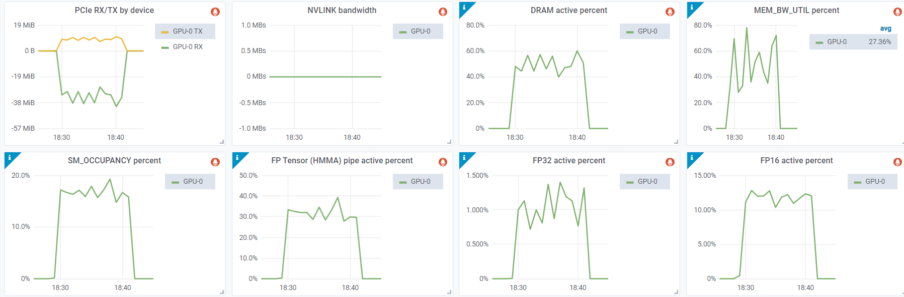

# NVIDIA GPU 故障排除

## 术语表

- DBE: 双比特 ECC 错误
- DCGM: (NVIDIA) 数据中心 GPU 管理器
- ECC: 纠错码
- FB: 帧缓冲
- SBE: 单比特 ECC 错误
- SDC: 静默数据损坏

## Xid 错误

没有硬件是完美的，有时由于制造问题或磨损（特别是由于暴露在高温下），GPU 很可能会遇到各种硬件问题。其中许多问题会自动得到纠正，而无需真正了解发生了什么。如果应用程序继续运行，通常无需担心。如果应用程序由于硬件问题而崩溃，了解原因以及如何处理就非常重要。

使用少数 GPU 的普通用户可能永远不需要了解与 GPU 相关的硬件问题，但是如果您接触到大规模 ML 训练，您很可能会使用数百到数千个 GPU，那么您肯定会想了解不同的硬件问题。

在您的系统日志中，您可能会偶尔看到 Xid 错误，例如：

```
NVRM: Xid (PCI:0000:10:1c): 63, pid=1896, Row Remapper: New row marked for remapping, reset gpu to activate.
```

要获取这些日志，以下方法之一应该可行：
```
sudo grep Xid /var/log/syslog
sudo dmesg -T | grep Xid
```

通常，只要训练不崩溃，这些错误通常表示硬件自动纠正的问题。

Xid 错误的完整列表及其解释可以在[这里](https://docs.nvidia.com/deploy/xid-errors/index.html)找到。

您可以运行 `nvidia-smi -q` 并查看是否有任何错误计数报告。例如，在这种 Xid 63 的情况下，您会看到类似以下内容：

```
Timestamp                                 : Wed Jun  7 19:32:16 2023
Driver Version                            : 510.73.08
CUDA Version                              : 11.6

Attached GPUs                             : 8
GPU 00000000:10:1C.0
    Product Name                          : NVIDIA A100-SXM4-80GB
    [...]
    ECC Errors
        Volatile
            SRAM Correctable              : 0
            SRAM Uncorrectable            : 0
            DRAM Correctable              : 177
            DRAM Uncorrectable            : 0
        Aggregate
            SRAM Correctable              : 0
            SRAM Uncorrectable            : 0
            DRAM Correctable              : 177
            DRAM Uncorrectable            : 0
    Retired Pages
        Single Bit ECC                    : N/A
        Double Bit ECC                    : N/A
        Pending Page Blacklist            : N/A
    Remapped Rows
        Correctable Error                 : 1
        Uncorrectable Error               : 0
        Pending                           : Yes
        Remapping Failure Occurred        : No
        Bank Remap Availability Histogram
            Max                           : 639 bank(s)
            High                          : 1 bank(s)
            Partial                       : 0 bank(s)
            Low                           : 0 bank(s)
            None                          : 0 bank(s)
[...]
```

在这里我们可以看到 Xid 63 对应于：

```
ECC 页面淘汰或行重映射记录事件
```

这可能有 3 个原因：硬件错误 / 驱动程序错误 / 帧缓冲 (FB) 损坏

此错误意味着其中一个内存行出现故障，并且在重新启动和/或 GPU 重置后，将使用 640 个备用内存行之一（在 A100 中）来替换坏行。因此，我们在上面的报告中看到只剩下 639 个 bank（总共 640 个）。

上面 `ECC Errors` 报告的 Volatile 部分指的是自上次重新启动/GPU 重置以来记录的错误。Aggregate 部分记录了自 GPU 首次使用以来的相同错误。

现在，有两种类型的错误 - 可纠正和不可纠正。可纠正的是单位 ECC 错误 (SBE)，其中尽管内存有故障，驱动程序仍然可以恢复正确的值。不可纠正的是多个位有故障，称为双位 ECC 错误 (DBE)。通常，如果在同一内存地址发生 1 个 DBE 或 2 个 SBE 错误，驱动程序将淘汰整个内存页。有关完整信息，请参阅[此文档](https://docs.nvidia.com/deploy/dynamic-page-retirement/index.html)

可纠正的错误不会影响应用程序，不可纠正的错误将导致应用程序崩溃。包含不可纠正的 ECC 错误的内存页将被列入黑名单，直到 GPU 被重置后才能访问。

如果有计划淘汰的页面，您将在 `nvidia-smi -q` 的输出中看到类似以下内容：

```
    Retired pages
        Single Bit ECC             : 2
        Double Bit ECC             : 0
        Pending Page Blacklist    : Yes
```

每个淘汰的页面都会减少应用程序可用的总内存。但是，淘汰的页面总量最多只有 4MB，因此它不会大幅减少可用的 GPU 总内存。

要更深入地进行 GPU 调试，请参阅[此文档](https://docs.nvidia.com/deploy/gpu-debug-guidelines/index.html) - 它包含一个有用的分类图表，有助于确定何时对 GPU 进行 RMA。本文档包含有关 Xid 63 类错误的其他信息。

例如，它建议：

> 如果与 XID 94 相关，则需要重新启动遇到错误的应用程序。系统上的所有其他应用程序可以继续按原样运行，直到有方便的时间重新启动以激活行重映射。
> 有关基于行重映射故障的 GPU RMA 指南，请参见下文。

如果在重新启动后，同一内存地址出现相同的情况，则意味着内存重映射失败，并且将再次发出 Xid 64。如果这种情况持续下去，则意味着您有一个无法自动纠正的硬件问题，需要对 GPU 进行 RMA。

在其他时候，您可能会收到 Xid 63 或 64，并且应用程序会崩溃。这通常会产生额外的 Xid 错误，但大多数时候这意味着错误是不可纠正的（即，它是 DBE 类型的错误，然后它将是 Xid 48）。

如前所述，要重置 GPU，您可以简单地重新启动机器，或运行：

```
nvidia-smi -r -i gpu_id
```

其中 `gpu_id` 是您要重置的 gpu 的序列号，例如 `0` 表示第一个 GPU。没有 `-i`，所有 GPU 都将被重置。

### 遇到不可纠正的 ECC 错误

如果您收到错误：
```
CUDA error: uncorrectable ECC error encountered
```
与上一节一样，这次检查 `nvidia-smi -q` 的 `ECC Errors` 条目输出将告诉您哪个 GPU 是有问题的。但是，如果您需要快速检查以便在节点至少有一个 GPU 出现此问题时回收该节点，您可以这样做：

```
$ nvidia-smi -q | grep -i correctable | grep -v 0
            SRAM Uncorrectable            : 1
            SRAM Uncorrectable            : 5
```
在一个好的节点上，这应该不会返回任何内容，因为所有计数器都应该是 0。但是在上面的例子中，我们有一个坏掉的 GPU——有两个条目，因为完整的记录是：

```
    ECC Errors
        Volatile
            SRAM Correctable              : 0
            SRAM Uncorrectable            : 1
            DRAM Correctable              : 0
            DRAM Uncorrectable            : 0
        Aggregate
            SRAM Correctable              : 0
            SRAM Uncorrectable            : 5
            DRAM Correctable              : 0
            DRAM Uncorrectable            : 0
```
第一个条目是 `Volatile`（自上次 GPU 驱动程序重新加载以来计数的错误），第二个是 `Aggregate`（GPU 整个生命周期的总错误计数器）。在这个例子中，我们看到 SRAM Uncorrectable 错误的 Volatile 计数器为 1，而生命周期计数器为 5——也就是说，这并不是 GPU 第一次遇到这个问题。

这通常对应于 Xid 94 错误（参见：[Xid 错误](#xid-errors)，很可能没有 Xid 48）。

要解决此问题，与上一节一样，重置有问题的 GPU：
```
nvidia-smi -r -i gpu_id
```
重新启动机器将有同样的效果。

现在，关于聚合 SRAM 不可纠正错误，如果您有超过 4 个，这通常是 RMA 该 GPU 的原因。


## 运行诊断

如果您怀疑给定节点上有一个或多个 NVIDIA GPU 损坏，`dcgmi` 是一个快速查找任何坏 GPU 的好工具。

NVIDIA® Data Center GPU Manager (DCGM) 的文档在[这里](https://docs.nvidia.com/datacenter/dcgm/latest/user-guide/index.html)，可以从[这里](https://github.com/NVIDIA/DCGM#quickstart)下载。

这是一个 slurm 脚本示例，它将运行非常深入的诊断（`-r 3`），在一个 8-GPU 节点上大约需要 10 分钟才能完成：

```
$ cat dcgmi-1n.slurm
#!/bin/bash
#SBATCH --job-name=dcgmi-1n
#SBATCH --nodes=1
#SBATCH --ntasks-per-node=1
#SBATCH --cpus-per-task=96
#SBATCH --gres=gpu:8
#SBATCH --exclusive
#SBATCH --output=%x-%j.out

set -x -e
echo "开始时间: $(date)"
srun --output=%x-%j-%N.out dcgmi diag -r 3
echo "结束时间: $(date)"
```

现在在选择的特定节点上运行它：
```
sbatch --nodelist=node-115 dcgmi-1n.slurm
sbatch --nodelist=node-151 dcgmi-1n.slurm
sbatch --nodelist=node-170 dcgmi-1n.slurm
```
编辑 nodelist 参数以指向要运行的节点名称。

如果节点已排空或已关闭，并且您无法使用此节点启动 slurm 作业，只需 `ssh` 到该节点并直接在该节点上运行命令：
```
dcgmi diag -r 3
```
如果诊断没有发现任何问题，但应用程序仍然无法工作，请使用级别 4 重新运行诊断，现在需要超过 1 小时才能完成：
```
dcgmi diag -r 4
```

脚注：显然，静默数据损坏 (SDC) 只能通过 `dcgmi diag -r 4` 检测到，即使这样也可能漏掉一些。这个问题偶尔会发生，您甚至可能不知道您的 GPU 有时会搞砸 `matmul`。我很确定我们遇到过这种情况，因为我们在训练期间遇到了奇怪的故障，我花了很多天与 NVIDIA 团队诊断问题，但我们没有成功——最终问题消失了，可能是因为报告了故障的坏 GPU 被更换了。

例如，如果您遇到重复的 Xid 64 错误，诊断报告很可能会包含：

```
+---------------------------+------------------------------------------------+
| Diagnostic                | Result                                         |
+===========================+================================================+
|-----  Deployment  --------+------------------------------------------------|
| Error                     | GPU 3 has uncorrectable memory errors and row  |
|                           |  remappings are pending                        |
```

所以你现在知道要对那个有问题的 GPU 进行 RMA，如果重映射失败的话。

但是，实际上，我发现大多数时候 `-r 2` 已经可以检测到有故障的 GPU。而且它只需要几分钟就可以完成。这是一个在有故障的节点上 `-r 2` 输出的例子：

```
| GPU Memory                | Pass - GPUs: 1, 2, 3, 4, 5, 6, 7               |
|                           | Fail - GPU: 0                                  |
| Warning                   | GPU 0 Thermal violations totaling 13.3 second  |
|                           | s started at 9.7 seconds into the test for GP  |
|                           | U 0 Verify that the cooling on this machine i  |
|                           | s functional, including external, thermal mat  |
|                           | erial interface, fans, and any other componen  |
|                           | ts.
```

`dcgmi` 工具包含各种其他级别的诊断，其中一些在几分钟内完成，可以作为 SLURM 作业结尾的快速诊断，以确保节点已准备好为下一个 SLURM 作业工作，而不是在用户启动其作业并崩溃后才发现问题。

在提交 RMA 报告时，您将被要求运行 `nvidia-bug-report` 脚本，其输出需要与 RMA 请求一起提交。

我通常也用以下命令之一保存日志以备后用：
```
dcgmi diag -r 2 | tee -a dcgmi-r2-`hostname`.txt
dcgmi diag -r 3 | tee -a dcgmi-r3-`hostname`.txt
dcgmi diag -r 4 | tee -a dcgmi-r4-`hostname`.txt
```

## 如何获取 VBIOS 信息

在研究问题时，GPU VBIOS 版本可能很重要。让我们将名称和总线 ID 添加到查询中，我们得到：

```
$ nvidia-smi --query-gpu=gpu_name,gpu_bus_id,vbios_version --format=csv
name, pci.bus_id, vbios_version
NVIDIA H100 80GB HBM3, 00000000:04:00.0, 96.00.89.00.01
[...]
NVIDIA H100 80GB HBM3, 00000000:8B:00.0, 96.00.89.00.01
```

提示：要查询数十个其他项目，请运行：
```
nvidia-smi --help-query-gpu
```

## 如何检查您的 GPU 的 PCIe 代数是否受支持

检查系统启动信息中的 PCIe 带宽报告：

```
$ sudo dmesg | grep -i 'limited by'
[   10.735323] pci 0000:04:00.0: 252.048 Gb/s available PCIe bandwidth, limited by 16.0 GT/s PCIe x16 link at 0000:01:00.0 (capable of 504.112 Gb/s with 32.0 GT/s PCIe x16 link)
[...]
[   13.301989] pci 0000:8b:00.0: 252.048 Gb/s available PCIe bandwidth, limited by 16.0 GT/s PCIe x16 link at 0000:87:00.0 (capable of 504.112 Gb/s with 32.0 GT/s PCIe x16 link)
```

在这个例子中，由于 PCIe 5 的规格是 504Gbps，你可以看到在这个节点上只有一半的可用带宽，因为 PCIe 交换机是 gen4。有关 PCIe 规格，请参见[此](../../../network#pcie)。

由于您很可能使用 [NVLink](../../../network#nvlink) 将 GPU 相互连接，这不应该影响 GPU 到 GPU 的通信，但它会减慢 GPU 和主机之间的任何数据移动，因为数据速度受最慢链接速度的限制。


## 如何检查 NVLink 链接的错误计数器

如果您担心您的 NVLink 出现故障，可以检查其错误计数器：
```
$ nvidia-smi nvlink -e
GPU 0: NVIDIA H100 80GB HBM3 (UUID: GPU-abcdefab-cdef-abdc-abcd-abababababab)
         Link 0: Replay Errors: 0
         Link 0: Recovery Errors: 0
         Link 0: CRC Errors: 0

         Link 1: Replay Errors: 0
         Link 1: Recovery Errors: 0
         Link 1: CRC Errors: 0

         [...]

         Link 17: Replay Errors: 0
         Link 17: Recovery Errors: 0
         Link 17: CRC Errors: 0
```

另一个有用的命令是：
```
$ nvidia-smi nvlink --status
GPU 0: NVIDIA H100 80GB HBM3 (UUID: GPU-abcdefab-cdef-abdc-abcd-abababababab)
         Link 0: 26.562 GB/s
         [...]
         Link 17: 26.562 GB/s
```
这个告诉你每个链接的当前速度

运行 `nvidia-smi nvlink -h` 以发现更多功能（报告、重置计数器等）。


## 如何检测节点是否缺少 GPU

如果您获得了一个新的虚拟机，在某些奇怪的情况下，GPU 数量会少于预期。以下是您可以快速测试是否有 8 个 GPU 的方法：

```
cat << 'EOT' >> test-gpu-count.sh
#!/bin/bash

set -e

# test the node has 8 gpus
test $(nvidia-smi -q | grep UUID | wc -l) != 8 && echo "坏掉的节点：少于 8 个 gpu" && false
EOT
```
然后：

```
bash test-gpu-count.sh
```


## 如何检测是否一次又一次地得到同一个坏掉的节点

这主要与租用 GPU 节点的云用户有关。

所以你启动了一台新的虚拟机，发现它有一个或多个坏掉的 NVIDIA GPU。你丢弃了它，然后又启动了一台新的，结果 GPU 又坏了。

很有可能你得到的是同一个节点，上面有同样的坏 GPU。以下是你如何知道的方法。

在丢弃当前节点之前，运行并记录：

```
$ nvidia-smi -q | grep UUID
    GPU UUID                              : GPU-2b416d09-4537-ecc1-54fd-c6c83a764be9
    GPU UUID                              : GPU-0309d0d1-8620-43a3-83d2-95074e75ec9e
    GPU UUID                              : GPU-4fa60d47-b408-6119-cf63-a1f12c6f7673
    GPU UUID                              : GPU-fc069a82-26d4-4b9b-d826-018bc040c5a2
    GPU UUID                              : GPU-187e8e75-34d1-f8c7-1708-4feb35482ae0
    GPU UUID                              : GPU-43bfd251-aad8-6e5e-ee31-308e4292bef3
    GPU UUID                              : GPU-213fa750-652a-6cf6-5295-26b38cb139fb
    GPU UUID                              : GPU-52c408aa-3982-baa3-f83d-27d047dd7653
```

这些 UUID 对于每个 GPU 都是唯一的。

当你重新创建你的虚拟机时，再次运行这个命令——如果 UUID 相同——你就知道你得到了相同的坏 GPU。

为了自动化这个过程，以便您始终拥有此数据，因为如果您已经重新启动了虚拟机就为时已晚，请在您的启动过程中的某个地方添加以下内容：

```
nvidia-smi -q | grep UUID > nvidia-uuids.$(hostname).$(date '+%Y-%m-%d-%H:%M').txt
```

您需要将日志文件保存在某个持久的文件系统上，以便在重新启动后仍然存在。如果您没有，请将其本地保存并立即复制到云端。这样，当您需要它时，它就总是在那里。

有时，仅重新启动节点就会获得新的硬件。在某些情况下，您几乎每次重新启动都会获得新的硬件，而在其他情况下则不会发生这种情况。并且这种行为可能因提供商而异。

如果你一直得到同一个坏掉的节点——一个克服这个问题的技巧是，在保持坏掉的虚拟机运行的同时分配一个新的虚拟机，当新的虚拟机运行时——丢弃坏掉的那个。这样你肯定会得到新的 GPU——只是不能保证它们也不会坏掉。如果用例合适，可以考虑使用静态集群，这样更容易保持硬件的良好状态。

这种方法对于 GPU 不会立即失效而是在使用一段时间后才失效的情况尤其重要，因此很难发现问题。即使您向云提供商报告了此节点，技术人员也可能不会立即注意到问题并将坏节点重新投入使用。因此，如果您不使用静态集群并且倾向于按需获取随机虚拟机，您可能需要保留坏 UUID 的日志，以便立即知道您得到了一个次品，而不是在使用该节点 10 小时后才发现。

云提供商通常有一个报告坏节点的机制。因此，除了丢弃坏节点之外，报告坏节点也有助于您自己和其他用户。因为大多数时候用户只是丢弃坏节点，下一个用户就会得到它们。我见过在某些情况下用户得到坏节点的比例非常高。


## 如何获取真实的 GPU 利用率指标

正如[这里](https://arthurchiao.art/blog/understanding-gpu-performance/)所解释的，`nvidia-smi` 输出中的 `Volatile GPU-Util` 列并不能真正告诉您 GPU 的利用率。它告诉您的是一个或多个内核在 GPU 上执行的时间百分比。它没有告诉您是正在使用单个 SM 还是所有 SM。因此，即使您一直运行一个微小的 `matmul`，您也可能会得到一个非常高的 GPU 利用率，而 GPU 的大部分都没有做任何事情。

脚注：我曾见过在一个 GPU 停止响应，然后整个机器都因等待该 GPU 响应而被阻塞时，所有 GPU 的 GPU 利用率列都显示 100%。这就是我发现它一开始就不可能显示真实 GPU 利用率的原因。

您真正想测量的是 GPU 对可用容量的利用率，也称为"饱和度"。可惜的是，`nvidia-smi` 并不提供此信息。为了获得此信息，您需要安装 [dcgm-exporter](https://github.com/NVIDIA/dcgm-exporter)（它又需要一个最新的 golang 和 DCGM (`datacenter-gpu-manager`) 以及 root 权限）。

请注意，此工具仅适用于高端数据中心 NVIDIA GPU，因此如果您有消费级 GPU，它将无法工作。

安装完先决条件后，我构建了该工具：
```
git clone https://github.com/NVIDIA/dcgm-exporter.git
cd dcgm-exporter
make binary
```

然后，我能够通过这个 `dcgm-exporter` 配置文件获取文章中描述的"真实"利用率指标：

```
$ cat << EOT > dcp-metrics-custom.csv
DCGM_FI_PROF_SM_OCCUPANCY,       gauge, The ratio of number of warps resident on an SM.
DCGM_FI_PROF_PIPE_TENSOR_ACTIVE, gauge, Ratio of cycles the tensor (HMMA) pipe is active.
DCGM_FI_PROF_PIPE_FP16_ACTIVE,   gauge, Ratio of cycles the fp16 pipes are active.
DCGM_FI_PROF_PIPE_FP32_ACTIVE,   gauge, Ratio of cycles the fp32 pipes are active.
EOT
```

然后我启动了守护进程（需要 root 权限）：
```
$ sudo cmd/dcgm-exporter/dcgm-exporter -c 500 -f dcp-metrics-custom.csv
[...]
INFO[0000] Starting webserver
INFO[0000] Listening on                                  address="[::]:9400"
```

`-c 500` 每 0.5 秒刷新一次

现在我可以通过以下方式轮询它：
```
watch -n 0.5 "curl http://localhost:9400/metrics"
```
通过在一个控制台中运行它，并在另一个控制台中启动 GPU 工作负载。输出的最后一列是这些指标的利用率（其中 `1.0 == 100%`）。

仓库中的 `etc/dcp-metrics-included.csv` 包含所有可用的指标，因此您可以添加更多指标。

这是一种快速的方法，但其意图是与 [Prometheus](https://prometheus.io/) 一起使用，它会给你漂亮的图表。例如，文章中包含一个示例，您可以在图表的第二行看到 SM 占用率、Tensor 核、FP16 和 FP32 核的利用率：



([来源](https://arthurchiao.art/blog/understanding-gpu-performance/))

为了完整起见，这里有一个来自同一篇文章的例子，它展示了一个 CUDA 内核在计算方面除了占用一个流式多处理器 (SM) 之外什么也没做，但 GPU 利用率却达到了 100%：

```
$ cat << EOT > 1_sm_kernel.cu
__global__ void simple_kernel() {
    while (true) {}
}

int main() {
    simple_kernel<<<1, 1>>>();
    cudaDeviceSynchronize();
}
EOT
```

我们来编译它：
```
nvcc 1_sm_kernel.cu -o 1_sm_kernel
```
现在在控制台 A 中运行它：
```
$ ./1_sm_kernel
```
在控制台 B 中：
```
$ nvidia-smi
Tue Oct  8 09:49:34 2024
+-----------------------------------------------------------------------------------------+
| NVIDIA-SMI 550.90.12              Driver Version: 550.90.12      CUDA Version: 12.4     |
|-----------------------------------------+------------------------+----------------------+
| GPU  Name                 Persistence-M | Bus-Id          Disp.A | Volatile Uncorr. ECC |
| Fan  Temp   Perf          Pwr:Usage/Cap |           Memory-Usage | GPU-Util  Compute M. |
|                                         |                        |               MIG M. |
|=========================================+========================+======================|
|   0  NVIDIA A100 80GB PCIe          Off |   00000000:01:00.0 Off |                    0 |
| N/A   32C    P0             69W /  300W |     437MiB /  81920MiB |    100%      Default |
|                                         |                        |             Disabled |
```

您可以看到 `100%` 的 GPU 利用率。所以这里使用了 1 个 SM，而 A100-80GB PCIe 有 132 个 SM！而且它甚至没有进行任何计算，只是运行一个无限循环，什么也不做。
