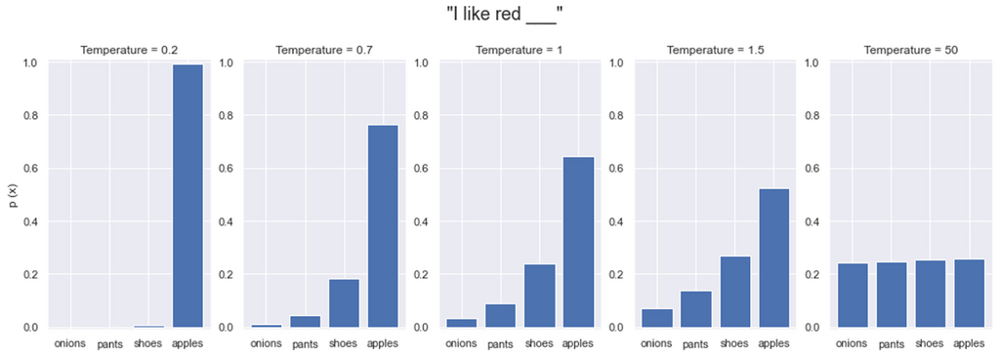
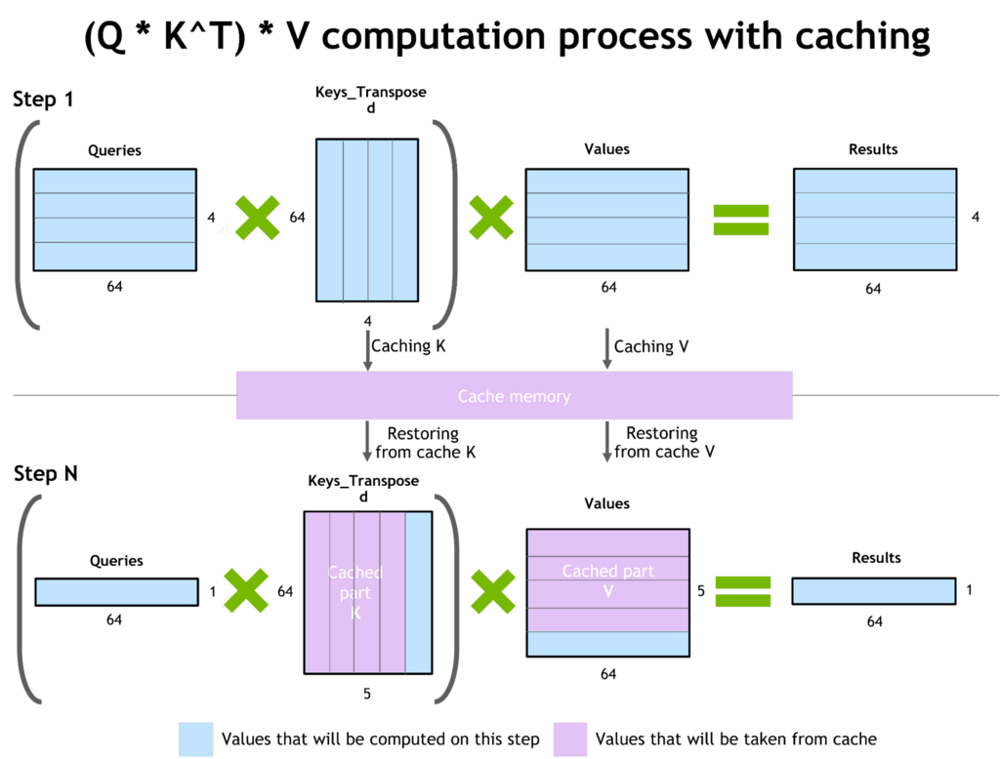
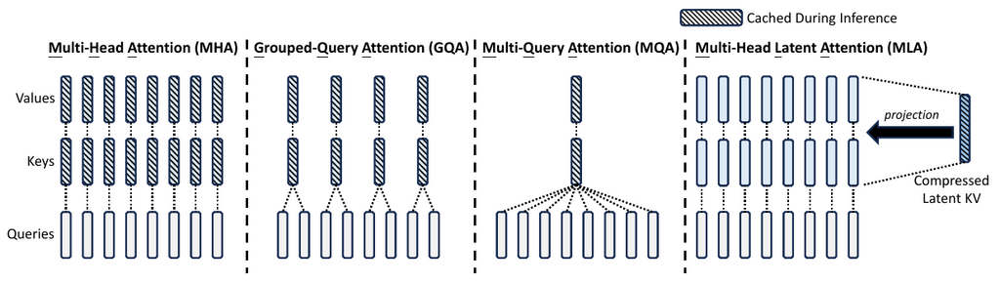
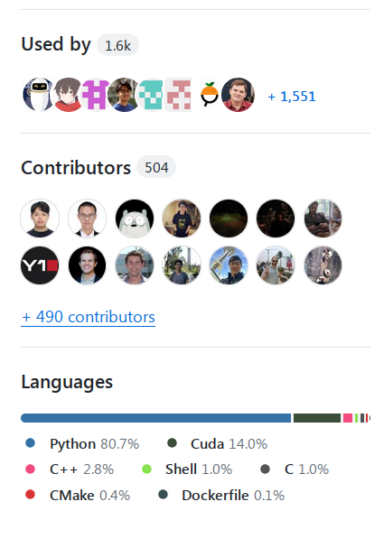

# 推理

XXX: 本章正在建设中 - 有些部分已经完成，有些部分才刚刚开始，还有许多部分有待开始，但已经有足够多的有用部分完成，可以作为一篇不错的读物。

## 术语表

- CLA: 跨层注意力 (Cross-Layer Attention)
- FHE: 全同态加密 (Fully Homomorphic Encryption)
- GQA: 分组查询注意力 (Grouped-Query Attention)
- ITL: 令牌间延迟 (Inter-Token Latency)
- KV: 键值 (Key Value)
- LPU: 语言处理单元™ (Language Processing Unit™)
- MHA: 多头注意力 (Multi-Head Attention)
- MLA: 多潜在注意力 (Multi-Latent Attention)
- MPC: 安全多方计算 (Secure Multi-Party Computation)
- MQA: 多查询注意力 (Multi-Query Attention)
- PPML: 隐私保护机器学习 (Privacy-Preserving Machine Learning)
- QPS: 每秒查询数 (Queries Per Second)
- TPOT: 每输出令牌时间 (Time Per Output Token)
- TTFT: 首个令牌时间 (Time to First Token)

更多类似术语的条目请参见[概念](#concepts)。

## 概念

### 预填充和解码

进行推理时有两个阶段：

#### 预填充

预填充：由于提示的所有令牌都是已知的 - 一次性处理整个提示长度（类似于训练）并缓存中间状态（KV 缓存）。这个阶段贡献的延迟非常小，因为即使是 1k 的提示，只要有足够的内存，也可以非常快地处理。

#### 解码

解码：新令牌的生成一次只生成一个新令牌（回归方法），基于所有先前的令牌（提示和到目前为止生成的任何新令牌）。因此，这个阶段对生成的延迟贡献最大，因为与预填充不同，解码无法并行化。

### 在线与离线推理

当您有实时发送查询的用户时 - 这就是在线推理，也称为部署或交互式推理。示例：聊天机器人、搜索引擎、通用 REST API。在这种情况下，总是运行一个推理服务器，并且可能有各种客户端查询它。

当您有一个包含数百或数千个提示的文件需要进行推理时 - 这就是离线推理，也称为批量推理。示例：基准评估和合成数据生成。在这种情况下，通常不需要推理服务器，推理直接在发送查询的同一程序中运行（客户端和服务器在同一个应用程序中）。

这两种主要用例通常针对不同的性能指标进行优化 - 在线推理用例要求非常低的 TTFT 和低延迟，而离线推理要求高吞吐量。组合的预填充和解码令牌处理吞吐量是任何类型推理的关键指标，因为它定义了推理服务的总成本。在在线推理的情况下，组合吞吐量越好，可以用相同的硬件为更多的用户提供服务。对于离线推理，很明显，推理完成得越快，计算成本就越小。

### 植根

这是为预训练模型提供其训练期间不可用的额外信息的过程。
例如，[输入植根任务](#input-grounded-tasks)在提示中为模型提供了大量额外信息。非零样本提示通过示例来植根模型，从而改变模型的默认行为。提示工程完全是为了植根模型，使其在推理过程中以某种方式行事。

检索增强生成（RAG）是植根模型的主要技术之一，因为它为推理过程提供了与提示相关的额外数据。其意图是让模型比其训练时压缩的大量信息更重视这些信息。

微调到不同的知识领域是另一种植根方法，我们更新模型，使其植根于一个可能与基础模型训练的原始数据领域截然不同的新数据集。

植根可以被认为是提供上下文。正如任何人都可以证明的那样，当一个人理解问题的上下文时，回答问题就更容易了。这同样适用于模型生成。上下文越好，生成的输出就越相关。

在多模态用例中，与文本提示一起提供的图像或视频可以是这种植根或上下文。

### 任务

#### 输入植根任务

输入植根任务是指生成的响应主要来源于提示的任务，即知识的主要来源包含在提示中。这些任务包括：

- 翻译
- 摘要
- 文档问答
- 多轮聊天
- 代码编辑
- 语音识别（音频转录）

### 批处理

一次处理一个令牌的解码阶段对加速器的效率极低。将多个查询批处理在一起可以提高加速器的利用率，并能一次处理多个请求。

最大可能的批处理大小取决于加载模型权重和用中间状态填充 KV 缓存后还剩下多少内存。

#### 静态批处理

这是简单直接的批处理，将前 N 个查询批处理在一起 - 这里的问题是，如果许多查询已经生成完毕，它们将不得不等待最长的查询生成完成才能返回给调用者 - 这大大增加了延迟。

#### 连续批处理或动态批处理

连续批处理或动态批处理是一个过程，生成引擎在完成结果后立即将其删除，并用新的查询替换它们，而无需等待整个批次完成。因此，批次中位置 0 的序列可能正在生成其第 10 个令牌，而批次中位置 1 的序列可能才刚刚开始其第一个令牌的生成，而位置 3 正在生成其最后一个令牌。

这改善了响应时间，因为不需要让已经完成的序列不立即返回，也不需要让新的提示等待下一个批次可用。当然，如果所有的计算都完全繁忙，并且批次中没有新的空位，那么一些请求将不得不等待计算开始处理它们。

### 分页注意力

分页注意力在推理服务器中非常流行，因为它通过像操作系统内存一样使用分页来处理加速器内存，从而实现了非常高效的加速器内存利用，这允许动态内存分配并防止内存碎片化。

### 解码方法

主要的解码方法有：[贪婪解码](#greedy-decoding)、
[束搜索](#beam-search)和[采样](#sampling)。

#### 贪婪解码

贪婪解码是指模型总是选择概率最高的令牌。这是最快的解码方法，但它并不总是能产生最好的结果，因为它可能会选择一个不太理想的令牌路径，从而错过一个很好的未来令牌序列。

这种方法的主要问题之一是会产生循环，即同一句话会一遍又一遍地重复。

#### 束搜索

束搜索通过同时生成多个输出来克服贪婪解码的局限性，因此它不是遵循最高概率 - 对于束大小为 3 的情况，它在每个新令牌处遵循前 3 个概率，然后从 9 个（`3*3`）子路径中丢弃所有路径，只保留导致链中所有令牌总概率最高的那 3 个子路径。然后在最后选择所有令牌中概率最高的路径。

这种方法比贪婪解码慢，因为它必须生成 n 倍多的令牌，并且需要 n 倍多的内存。

#### 采样

基于采样的解码引入了随机性。

但是，当然，选择随机的词不会带来好的结果，所以我们仍然希望像贪婪解码那样具有确定性，但通过添加可控的随机性使其更有趣/生动。

最常见的采样方法是：

- **Top-K 采样** 方法根据其 logit 概率选择前 k 个令牌，然后随机选择其中一个令牌。
- **Top-p 采样**（也称为 **核心采样**）类似于 Top-K 采样，但 K 对于每个下一个令牌是变化的，并且通过将顶部令牌概率相加直到达到阈值 `p` 来计算。因此，如果模型对某些预测更有把握，那么只有这些预测才会被考虑。

#### 温度

温度是 [Top-p](#sampling) 采样策略的另一个组成部分，其值对结果有以下影响：

- `t==0.0:` 最终选择概率最高的令牌 - 这里没有随机性 - 与贪婪解码相同 - 用于精确用例。
- `0.0<t<1.0`: 概率被进一步拉开，所以越接近 0.0，随机性越小 - 用于介于精确和平衡之间的用例。
- `t==1.0`: 对采样没有影响 - 保留了原始训练分布 - 用于平衡相关性和多样性的用例。
- `t>1.0`: 概率被推得更近，产生更多的随机性 - 用于创造性用例。

下面这组图应该能让这一点变得非常清晰：



([来源](https://www.hopsworks.ai/dictionary/llm-temperature))

为了真正理解其影响，温度因子通常在 Softmax 操作之前或作为其一部分应用于对数概率。

```
scaled_logits = logits / temperature
probs = softmax(scaled_logits)
```
softmax 操作将 logit 差异转换为概率比 - 当我们除以 t<1.0 时，我们使这些差异更大，导致更极端的概率比和更尖锐的分布。当我们除以 t>1.0 时，我们使这些差异更小，导致更相似的概率比和更均匀的分布。在 t=0 时，这实际上使最高的 logit 比其他的无限大（尽管在实践中避免了除以零）。

温度对贪婪解码、束搜索和 Top-K 采样策略没有影响，因为它影响的是 logit 概率之间的距离，而所有这些策略都是根据概率的顺序使用最高概率，温度不改变概率的顺序。而 Top-p 采样允许更多或更少的竞争者根据它们的总概率进入随机采样将从中抽取的子集 - 所以概率越接近（高温），随机性就越大。

除了 `t==0.0` 和 `t==0`，没有硬性规定的值可以复制，您将不得不为每个用例进行实验，以找到最适合您需求的值 - 尽管如果您在互联网上搜索，肯定会找到人们为不同用例提供的良好基线。

有关解码方法的更多信息，请参阅这篇 [Huggingface 博客](https://huggingface.co/blog/how-to-generate)。

### 引导式文本生成

也称为结构化文本生成和辅助生成。

如果模型能够以特定格式返回其生成的输出，而不是不受限制的格式，您不希望模型幻化出无效的格式。例如，如果您希望模型返回一个 JSON 字典，它就应该这样做。

这是通过使用引导式文本生成来实现的。该技术不是选择概率最高的生成令牌，而是使用符合下一个预期令牌子集的次佳令牌。举个例子来说明：如果您希望模型生成一个 JSON 字符串列表，如 `["apples", "oranges"]`，那么我们期望：

```
["字符串", "字符串", ..., "字符串"]
123...
```

第一个生成的令牌必须是 `[`。如果模型得到的是 `"`，例如，而不是 `[`，作为最高概率，而 `[` 的概率较低 - 我们希望选择概率较低的那个，以便它是 `[`。

然后下一个生成的令牌必须是 `"`。如果不是，则搜索概率较低的令牌，直到找到 `"` 并选择它。

第三个令牌必须是一个有效的字符串（即不是 `[` 或 `"`）。

依此类推。

基本上，对于每个下一个令牌，我们需要知道允许的令牌子集，并从该子集中选择概率最高的令牌。

这是一项非常酷的技术。我们不是试图修复生成的输出（这并不总是可能匹配预期的格式），而是让模型首先生成正确的输出。

这项技术有几个成本：
- 它会减慢生成速度 - 它必须遵守的模式越复杂，生成令牌的速度就越慢。通过测量生成速度，我发现一些结构化文本生成库的性能比其他库快得多。
- 它可能会导致模型产生幻觉。

这项技术有多种实现方式，截至本文撰写时，两个流行的库是：
- https://github.com/outlines-dev/outlines
- https://github.com/noamgat/lm-format-enforcer

理想情况下，您希望使用已经集成到 vLLM 等推理框架中的实现。

#### 使用引导生成进行更快的推理

也可以使用模式来加速推理。例如，考虑这个简单的"个人资料"模式：

```
{
  "type": "object",
  "properties": {
    "name": { "type": "string"},
    "age": { "type": "integer"}
  },
  "required": ["name", "age"]
}
```

由于模式具有特定的键 `name` 和 `age`，一旦模型预测了：`{"n` 或 `{"a`，它就不需要执行自回归生成来得出 ``{"name": ` 和 `{"age": `，因为这两者都必须导致一个特定的、明确的单一结果 - 所以在这里它可以执行预填充而不是解码，并节省一些缓慢的步骤，因为它 100% 知道接下来的几个令牌将分别是 `ame": ` 或 `ge":`。显然，当模式有许多预先确定的键和短的生成值时，这种方法将最为有益。

### 推测性解码

也称为推测性推理或辅助生成。

因为一次生成一个令牌非常慢，有时可以通过使用一个更小更快的草稿模型来作弊并加速。例如，您的正常推理使用 Llama-70B，这会相当慢，但我们可以使用 Llama-7b 作为草稿模型，然后我们可以一次性验证所有令牌的预测是否正确。

示例：让我们以提示 `我正在转，转，转，转，转圈，我能看到的只是一棵` 为例：

1. 使用 Llama-7b 以自回归方式预测 `另一棵柠檬树`，分 3 步，但比 Llama-70b 快得多。
2. 现在使用 Llama-70b 运行 3 个提示的批处理：

```
[...我能看到的只是一棵]
[...我能看到的只是一棵另一棵]
[...我能看到的只是一棵另一棵柠檬]
```
为了演示，我用 `...` 缩短了完整的提示 - 实际上它应该是完整的。我在这里假装每个令牌都是一个完整的词。

现在，Llama-70B 在一步内生成：

```
[...我能看到的只是一棵] 另一棵
[...我能看到的只是一棵另一棵] 柠檬
[...我能看到的只是一棵另一棵柠檬] 树
```

现在可能有多种结果：
- 如果一切都匹配 - 我们在 3 个短步骤和 1 个长步骤中生成了最终结果，而不是使用 3 个长步骤。
- 如果只有 `另一棵柠檬` 匹配 - 如果节省了时间，我们可能仍然更好。
- 如果什么都不匹配或匹配很少，我们浪费了一点时间。

显然，如果我们有更多的令牌而不是 3 个，节省的可能会更大。

另外，不要忽略我们在这里做了相同数量的计算，甚至更多，与正常使用大模型进行此生成相比，但这种方法的延迟可能会好得多 - 因此用户平均应该从您的应用程序中获得更好的响应时间 - 如果草稿模型小得多并且仍然产生良好的预测。

当出现部分不匹配时，我们可以返回到草稿模型，并将其所有匹配的令牌（在第一个不匹配的令牌之前）以及大模型预测的下一个好的令牌输入给它，让它对不匹配的尾部进行新的快速预测。

草稿模型理想情况下应该在相同的数据上进行训练（或者至少是来自相似分布的数据），并且其分词器必须与大模型相同。

推测性解码在[输入植根任务](#input-grounded-tasks)上获得最高回报，例如翻译、摘要、文档问答、多轮聊天，因为在这些任务中，可能输出的范围要小得多，草稿模型更有可能与大模型匹配。

出于同样的原因，它在[贪婪解码](#greedy-decoding)中使用时效果最好，因为在生成过程中可能的变化最少。如果不使用贪婪解码，您会希望将[温度](#temperature)值接近 0。

这里有一篇对这个主题的深入探讨：[辅助生成：一种新的低延迟文本生成方向](https://huggingface.co/blog/assisted-generation)。

对于[输入植根任务](#input-grounded-tasks)，另一个简单得多的解决方案是使用[ngram 提示查找解码](https://github.com/apoorvumang/prompt-lookup-decoding)。在这种方法中，不需要草稿模型，而是搜索提示以查找匹配的字符串来生成候选项。在某些情况下，据说可以将解码速度提高 2 倍以上。

### 隐私保护推理

大多数提供推理服务的公司都会遇到用户隐私需求。用户提交查询时应该是安全的，不会有人窥探。一种解决方案是本地解决方案，客户自己运行服务器，这样就不存在隐私问题，但这很可能会暴露提供商的知识产权——模型权重以及可能的代码/算法。因此，需要完全加密的生成——也就是说，计算要在客户端加密的数据上执行。

解决此需求的解决方案称为隐私保护机器学习 (PPML)。

其中一种解决方案称为完全[同态加密](https://en.wikipedia.org/wiki/Homomorphic_encryption) (FHE)。

看看这样一个实现，[concrete-ml](https://github.com/zama-ai/concrete-ml)，它重写了模型，使得客户端可以自己运行模型的一部分，然后将中间加密的激活发送到服务器执行注意力，然后再发送回客户端。因此，提供商保留了其部分知识产权——我想这部分知识产权可以防止客户端窃取完整的知识产权，因为部分权重不足以重建完整的模型。[这篇文章](https://huggingface.co/blog/encrypted-llm)有更详细的介绍。

还有各种其他方法，例如这篇论文：[LLM 可以理解加密提示：迈向隐私计算友好的 Transformer](https://arxiv.org/abs/2305.18396v3) 深入探讨了一种基于安全多方计算 (MPC) 和 FHE 的定制解决方案，并有很好的参考文献列表。

当前解决方案的问题是巨大的计算开销 - 这极大地影响了成本和延迟。未来，ASIC 解决方案应该可以解决这些问题。

### 模型并行

当一个模型无法装入单个加速器，或者即使勉强装入但跨多个加速器拆分模型更有效时，来自训练的相同[模型并行技术](../training/model-parallelism)也适用于推理。

#### 张量并行

大多数时候，您很可能只会遇到[张量并行](../training/model-parallelism#tensor-parallelism)，其中模型权重在 2 到 8 个加速器之间分片。理想情况下，您希望将模型放入单个加速器中，因为这样在生成过程中的开销最小。但令人惊讶的是，如果您使用张量并行，您可能会获得更高的解码吞吐量 - 这是因为它使您能够容纳更大的批次，并且还因为尽管加速器之间有额外的通信，`forward` 调用可能更快。当然，在某些情况下，您将以使用更多加速器的成本获得这种速度提升。因此最好进行实验，在某些用例中，考虑到相同数量的加速器，更高的张量并行度将提供更好的总吞吐量。

脚注：在我的实验中，与 TP>1 相比，TP=1 导致最高的 TTFT 和最低的解码吞吐量。因此，如果您被要求加快 TTFT 并且模型合适，请使用较小的 TP 或 TP=1。如果您被要求加快解码吞吐量，请使用更高的 TP 度投入更多的加速器。

#### 流水线并行

此外，虽然张量并行有助于降低延迟，但使用[流水线并行](../training/model-parallelism#pipeline-parallelism)可以帮助提高吞吐量。对于非常大的模型尤其如此，因为无论如何都必须使用许多加速器来加载模型权重。比如说，您正在使用 Llama 405B 并且使用了 TP=8，那么每个加速器都必须与另外 7 个加速器进行 all-reduce，而使用 PP=8，每个加速器只需要与另外 2 个加速器通信（从前一个阶段`接收`输入并`发送`当前输出到下一个阶段），这对网络层的压力要小得多，如果硬件支持，这可以极大地加快速度。

这里需要澄清的是，只有当你使用完整的 PP 而不是朴素的 PP 时，PP 才能优于 TP。在[朴素的 PP](../training/model-parallelism#naive-model-parallelism-vertical)中，任何给定时间只有一个 PP 阶段工作，因此它的性能会比 TP 差。要从 PP 中受益，推理框架需要并行地向所有 PP 阶段提供数据，以执行[完整的 PP](../training/model-parallelism#pipeline-parallelism)。

关于 PP 推理的另一个重要事项是，与训练不同，没有 `backward` 过程，因此不需要解决非活动气泡问题。在前几个微批次中填充 PP 阶段只会产生很小的开销。

和训练一样，您可能会发现 TP 和 PP 的某种组合会带来最好的结果（例如，对于 Llama 405B，TP=4 + PP=4）。所以一定要进行实验并测量不同的配置，然后选择满足您需求的那一个。

## 关键推理性能指标

有两种方式来看待性能指标，一种是常见的系统指标，即延迟和吞吐量，另一种是用户体验指标：首个令牌时间（TTFT）和每输出令牌时间（TPOT）。让我们看看这两对指标。

### 系统性能指标

#### 延迟

**延迟是指自发送请求以来接收到完整响应所花费的时间**。

这包括以下时间：
1. 接收请求
2. 预处理提示（预填充阶段）
3. 生成响应的新令牌（解码阶段）
4. 将响应发送回客户端。

接收请求和发送响应的时间大部分是相同的，由于提示和生成响应的长度不同，会有微小的变化。这些长度变化对总时间的影响应该可以忽略不计。

预填充阶段并行处理所有提示的令牌，所以在这里提示长度的变化也不应该产生太大差异，尽管较长的提示会消耗更多的加速器内存并影响总吞吐量。

解码阶段是受生成响应长度影响最大的阶段，因为每个新令牌都是作为单独的步骤生成的。在这里，响应越长，解码阶段就越长。

如果服务器没有足够的能力一次处理所有当前请求，而必须将其中一些排队，那么队列中的等待时间会使延迟延长那么多。

脚注：如果你把这想象成路上的汽车交通，延迟就是一个人从 A 点开车到 B 点（例如，从家到办公室）所需的时间，包括由于交通灯、堵车和法定限速导致的速度限制。

#### 吞吐量

吞吐量衡量推理服务器并行处理多个请求和有效批处理请求的能力。

吞吐量的定义可以由可以同时服务的请求数量来定义，但由于某些请求的服务速度比其他请求快得多，因此在一个长请求期间可以服务多个短请求，因此计算系统生成的令牌总速率是有意义的。

因此，一个更常见的定义是 **推理吞吐量是整个系统每秒生成的总令牌数**。

脚注：如果你把这想象成路上的汽车交通，吞吐量就是任何给定时间有多少辆汽车可以通过某条道路。道路的车道越多，限速越高，该道路的吞吐量就越高。但显然有些车辆短，有些长，所以需要某种标准化。例如，渡轮计算它们可以容纳多少米或英尺的车辆，因此长车比短车支付更多。

### 用户体验指标

虽然一个推理服务器可以从许多特性来评判——比如功耗、效率和成本，但可以说，由于系统是与人交互的——最重要的特性都在于提供流畅的用户体验。如果用户体验缓慢且不连贯，用户就会转向竞争对手。因此，关键需求是：

#### 首个令牌时间

**首个令牌时间 (TTFT) 定义为从用户点击提交按钮（或回车）到他们收到第一个单词或单词的一部分那一刻所经过的时间**。

需要非常低的首个令牌时间 (TTFT)。如今，用户习惯于期望任何应用程序的响应时间理想情况下快于 1 秒。因此，用户在开始接收第一个令牌之前等待的时间越短越好。这对于需要交互性的聊天机器人来说变得更加重要。TTFT 的长短受许多因素影响，关键因素是[预填充阶段](#prefill)的计算（预处理提示）以及请求是在收到用户请求后立即得到处理，还是必须在队列中等待。

需要注意的是，服务器无负载时的 TTFT 可能与服务器在高负载下时大不相同。如果通常服务器在 1 秒内发送第一个令牌，如果服务器已经忙于处理它能一次性处理的所有请求并且有队列，那么除了前几个请求之外，有效的 TTFT 可能很容易长得多。所以通常应该测量平均 TTFT，并与基准测试期间发送的并发请求数量一起报告。

这是一个不平凡的指标，因为根据提示大小，时间会有所不同，所以理想情况下，您希望将其归一化为提示中的令牌数。

#### 每输出令牌时间

每输出令牌时间 (TPOT) 是一个针对每个用户的指标。它衡量为给定用户生成一个新令牌需要多长时间。

期望相对较低的每输出令牌时间 (TPOT)，但不必太高。这个时间理想情况下应该接近发送请求的人的阅读速度。所以例如，如果您为一年级学生服务，TPOT 可以很低，但受教育程度越高的人，TPOT 应该越快，以实现流畅的阅读体验。

根据维基百科，有[3 种阅读类型](https://en.wikipedia.org/wiki/Speed_reading#Types_of_reading)，阅读速度以每分钟单词数 (WPM) 来衡量。

每个单词的平均令牌数因分词器而异，主要取决于它们的词汇量大小和语言。这里我们考虑一个英语分词器，每个单词约有 1.5 个令牌。现在我们可以将每分钟单词数 (WPM) 转换为每分钟令牌数 (TPM)。

现在我们只需要除以 60 就可以得到每秒令牌数 (TPS)，然后取倒数就可以得到每个输出令牌的时间 (TPOT)

所以 `TPOT = 60 / (WPM*1.5)` 秒

| 读者 | WPM | TPM | TPS | TPOT |
| :----- | --: | ---: | ----: | ----: |
| 默读 | 250 | 375 | 6.25 | 0.16 |
| 听读 | 450 | 675 | 11.25 | 0.089 |
| 视觉阅读 | 700 | 1050 | 18.75 | 0.057 |

请记住将 1.5 的系数更改为您分词器的实际单词与令牌的平均比率。例如，截至本文撰写时，据报道 OpenAI ChatGPT 的 5 万词汇量分词器每个单词约有 1.3 个令牌，而许多其他 LLM 有 3 万词汇量，这导致每个单词的令牌比率更高。

如您所见，TPOT 是一个难以在脑中跟踪和思考的尴尬值，所以**一旦您知道了您的目标 TPOT，最好将其转换为每秒令牌数 (TPS) 并跟踪它**。

因此，在这个例子中，如果您的系统每个请求可以持续生成每秒 20 个令牌，您的客户会很满意，因为该系统甚至能够跟上每分钟 700 个单词的超快阅读者。

当然，也会有用户更愿意等到生成完成后再开始阅读响应。在这种情况下，越快越好。

根据生成类型，以下情况可能适用：
1. 图像 - 一次性全部生成
2. 文本 - 与用户阅读速度一样快，或者如果他们不希望在开始阅读前看到移动的部分，则一次性全部生成
3. 音频 - 与用户听力速度一样快
4. 视频 - 与用户观看速度一样快

如果这是一个不与个人交互的离线系统，并且只处理批处理请求，那么这些指标就无关紧要了，但延迟和吞吐量是关键。

### 简化的性能指标

如您所知，上面讨论的指标有很多重叠之处。实际上，我们可以将它们全部简化为这两个指标：预填充吞吐量和解码吞吐量——以及系统每秒可能处理的并行请求数。

#### 预填充吞吐量

这是系统预处理提示的速度——以每秒令牌数为单位。

假设接收和发送请求的开销可以忽略不计，在没有队列的情况下，传入的请求会立即得到处理，[TTFT](#time-to-first-token) 实际上是提示中的令牌数除以预填充的每秒令牌数，再加上生成第一个令牌的时间（我们可以忽略它，因为它会非常快）。

如果存在队列，那么仅有预填充吞吐量是不够的，因为此时 TTFT 可能会长得多，因为必须加上请求在队列中花费的时间。

#### 解码吞吐量

这是系统生成响应令牌的速度——以每秒令牌数为单位。

这解决了吞吐量和每输出令牌时间两个指标。

响应延迟就是提示中的令牌数除以预填充吞吐量，再加上生成的令牌数除以解码吞吐量。

### 更多指标说明

#### 加速器利用率

加速器利用率——无论是百分比还是功率测量——都是一个很好的指标，可以判断您的设置是否有效地使用了加速器。例如，如果您使用 NVIDIA GPU，并且您 `watch -n 0.5 nvidia-smi`，然后看到您在 10% 的"gpu util"下，同时用大量请求大规模轰炸推理服务器，这通常意味着推理服务器非常低效（例如，花费大量时间来回复制东西），或者可能是客户端在如何接收数据方面效率低下（即，太多的 IO 阻塞）。

脚注：当我第一次使用 openai 客户端编写一个简单的基准测试时，它在低并发下运行良好，但在高并发下，推理服务器的 gpu利用率下降到 6-7%。在我将客户端替换为 `aiohttp` API 后，它上升到 75%。因此，请注意，可能是你的基准测试导致了糟糕的性能报告，而不是服务器。

这在某种程度上等同于使用 [TFLOPS 来衡量训练效率](../training/performance/README.md#tflops-as-a-performance-metric)。

在理想情况下，您希望您的加速器利用率尽可能高。请注意，至少对于 NVIDIA GPU，`gpug util` [可能不是您想象的那样](../compute/accelerator/nvidia/debug.md#how-to-get-the-real-gpu-utilization-metrics)，但如果它报告一个非常低的百分比，这足以表明肯定存在效率问题。

#### 百分位数

如果您阅读基准测试并遇到诸如 p50、p75、p90、p95 和 p99 百分位数之类的内容 - 这些是统计过滤器，它们根据适合某个阈值以下（或以上）的结果百分比为您提供结果。即使是同一个请求，在多次重新运行时，其响应时间也可能略有不同。因此，例如，如果 95% 的时间吞吐量高于某个值 - 那就是 p95 百分位数。这也意味着 5% 的时间吞吐量低于该相同阈值。`p` 旁边的数字越高，实现就越困难。

例如，让我们看一下由 [k6](https://github.com/grafana/k6) 在一个推理服务器上生成的系统负载报告的部分输出：

```
http_req_duration..: avg=13.74s   min=12.54s  med=13.81s   max=13.83s   p(90)=13.79s   p(95)=13.83s
http_req_receiving.: avg=27.98µs  min=15.16µs med=21.6µs   max=98.13µs  p(90)=44.98µs  p(95)=59.2µs
http_req_sending...: avg=133.8µs  min=20.47µs med=75.39µs  max=598.04µs p(90)=327.73µs p(95)=449.65µs
```

如果我们看第一行，它报告了总的生成时间，如果我们看记录的最小值 12.54 秒，那么我们知道 90% 的响应时间在 12.54 到 13.79 秒之间，95% 的响应时间在 12.54 到 13.83 秒之间 - 在这个特殊情况下，报告的中值介于 p90 和 p95 值之间。

同样的解释也适用于报告中的其他行，但这里的关键示例是 p90 值低于 p95 值，因为正在测量时间（越低越好）。

当异常值不重要时，百分位数很有用，所以，例如，与其看测量的最慢吞吐量，不如说忽略最差的 5% 结果，突然之间系统的性能看起来好多了。但在处理用户时，必须非常小心这种丢弃坏结果的做法，因为这意味着他们中的一些人将会有糟糕的系统使用体验。此外，如果你有数百万用户，5% 意味着很多用户。

请参阅[百分位数](https://en.wikipedia.org/wiki/Percentile)以获取更深入的解释。

## 加速模型加载时间

在生产环境中提供服务时，让模型花时间加载可能是可以接受的，因为它只发生一次，然后服务器会运行数天，所以这个开销会在多天内分摊。但在进行研究、开发和测试时，推理服务器快速开始服务至关重要。

有时开销只是加载到 CPU，然后将张量移动到加速器，其他时候还需要将张量分片到多个加速器以执行 [TP](../training/model-parallelism#tensor-parallelism) 和 [PP](../training/model-parallelism#pipeline-parallelism)。

为此使用了各种方法——大多数涉及某种形式的预分片和缓存，随后直接加载到 GPU 上。

例如：

- vLLM 支持 `--load-format` 标志，可以选择 `npcache`（numpy 格式缓存）或使用 CoreWeave 的 [Tensorizer](https://github.com/coreweave/tensorizer) 的 `tensorizer` 等选项。（[配方](https://docs.vllm.ai/en/latest/serving/tensorizer.html)），当然，如果您使用 TP>1，您需要[一次性预分片权重](https://docs.vllm.ai/en/latest/getting_started/examples/save_sharded_state.html)。
 - TensorRT-LLM 要求用户为每个特定用例构建一个模型引擎，并在运行时加载预先制作的分片（除非您使用的是简化的 API，它会在每次服务器启动时动态构建模型引擎）。

## 基准测试

您可以按照[关键推理性能指标](#key-inference-performance-metrics)中的说明编写自己的基准测试，或者使用现有的基准测试。

目前我主要使用[预填充吞吐量](#prefill-throughput)和[解码吞吐量](#decode-throughput)基准测试。第一个只测量从发送请求到接收到第一个生成令牌的每秒令牌数，第二个是接收到第一个和最后一个生成令牌之间的吞吐量。以下是使用[`openai` 客户端 completions API](https://github.com/openai/openai-python)进行此类测量的相关代码片段：

```
[... 创建客户端、数据等 ...]
prefill_tokens_len = len(prompt)
start_time = time.time()
decode_text = ""
decode_started = False
completion = client.completions.create(prompt=prompt, ...)
for chunk in completion:
    if chunk.choices:
        decode_text += text
        if not decode_started:
            decode_started_time = time.time()
            prefill_time = decode_started_time - start_time
            decode_started = True

end_time = time.time()
decode_time = end_time - decode_started_time
decode_tokens = tokenizer.encode(decode_text)
decode_tokens_len = len(decode_tokens)

# tokens/per sec
prefill_throughput = prefill_tokens_len / prefill_time
decode_throughput  = decode_tokens_len  / decode_time
```

这里的 `prefill_throughput` 不是非常精确，因为客户端只知道它何时发送了请求并收到了第一个令牌，所以这个阶段除了纯粹的提示预处理之外还有一些其他开销，但它应该足够接近。

当然，像任何严肃的基准测试一样，您需要多次运行以获得真实的数字，因为单次运行之间的差异可能很大。

注意：我发现当我使用 openAI 客户端时，它不能很好地扩展，在许多并发请求下，openAI 客户端会成为瓶颈，并且无法测量真实的服务器性能 - 我还没有弄清楚这是我的代码问题、openAI 客户端问题还是它与 vLLM 服务器交互的方式问题 - 我正在这里调查 https://github.com/vllm-project/vllm/issues/7935 - 我发现[这个版本](https://github.com/vllm-project/vllm/blob/f842a7aff143a4a1ddc59e1fb57109cb377f5475/benchmarks/backend_request_func.py#L223-L301)的客户端，重写为使用 `aiohttp`，扩展得非常好 - 所以我转而使用它。

以下是一些用于负载测试的良好起点：

- https://github.com/vllm-project/vllm/blob/main/benchmarks/benchmark_throughput.py - 到目前为止我最喜欢的工具
- https://github.com/grafana/k6 - 用于负载测试以模拟多个并发客户端 - 使用 JavaScript 客户端。
- https://github.com/bentoml/llm-bench - 基准测试推理负载（尚不确定是否仅适用于 BentoML）

我现在缺少的是一个可以测量服务器能处理的最高并发量的工具。

## 模型内存使用分析

推理内存使用与[训练](../training/performance#anatomy-of-models-memory-usage)有很大不同。这里我们有：

1. 模型权重
2. KV 缓存 - 对于每个新生成的令牌，不需要重新计算过去的令牌至关重要
3. 激活内存 - 这是临时的处理内存，取决于批处理大小和序列长度

### 模型权重

- 4 字节 * 参数数量，用于 fp32
- 2 字节 * 参数数量，用于 fp16/bf16
- 1 字节 * 参数数量，用于 fp8/int8
- 0.5 字节 * 参数数量，用于 int4

脚注：当您阅读本文时，正在开发更紧凑的格式，例如[微缩放格式 (MX)](https://fpga.org/category/microscaling-mx-formats/)，也称为块浮点，其中指数位在张量的多个元素之间共享（MXFP6、MXFP4 等）

示例：Meta-Llama-3.1-8B in bf16 将需要 `2 (bf16 字节) * 8B (参数数量) = 16GB` (大约)

### KV 缓存

在生成每个新令牌之前重新计算所有先前的 KV（键值）值将非常昂贵，因此它们被缓存在加速器的内存中。新计算的 KV 值被附加到现有缓存中。



([来源](https://developer.nvidia.com/blog/accelerated-inference-for-large-transformer-models-using-nvidia-fastertransformer-and-nvidia-triton-inference-server/))

KV 缓存大小与输入序列长度和批量大小成正比。过去的查询值不用于注意力机制，因此不需要缓存。

1 个令牌的 KV 缓存需要 `dtype_bytes * 2 * num_hidden_layers * hidden_size * num_key_value_heads / num_attention_heads` 字节

注意：
- `dtype_bytes` 是每个数据类型的字节数：fp32 为 4 字节，bf16/fp16 为 2 字节，等等。
- `2` 代表键 + 值，因为有两个。
- `num_key_value_heads / num_attention_heads` 是一个因子，将取决于是否使用多查询 (MQA)、分组查询 (GQA) 或多头注意力 (MHA)。对于 MHA，它将是 1，对于 MQA，它将是 `1/num_attention_heads`，对于 GQA，它将取决于每个组使用多少个查询，即 `num_key_value_heads / num_attention_heads`，这是 MHA 和 MQA 的一般情况。

您可以从模型文件夹内的 `config.json` 或其他等效文件中获取这些维度。
例如 [meta-llama/Meta-Llama-3.1-8B](https://huggingface.co/meta-llama/Meta-Llama-3.1-8B/blob/main/config.json)。

示例：

1 个令牌的 Meta-Llama-3.1-8B 在 bf16 中需要：`2 (bf16 字节) * 2 (键+值) * 32 (隐藏层数) * 4096 (隐藏层大小) * 8 (键值头数) / 32 (注意力头数) / 10**6 = 0.131MB`。该模型使用 GQA，因此它使用的内存是普通 MHA 的 1/4。

一个批量大小为 1 的 1024 个令牌将需要 `0.131*1024 = ~134MB`。

一个批量大小为 128 的 1024 个令牌将需要 `0.131*1024*128 / 10**3 = ~17.2GB`。

如果 Meta-Llama-3.1-8B 使用 MHA，其 KV 缓存每个令牌将多占用 4 倍的内存；如果使用 MQA，则少占用 8 倍的内存。从这张图中很容易看出为什么：

在这种情况下，模型有 `num_key_value_heads=8` 和 `num_attention_heads=32`，因此 MQA 和 GQA 分别比 MHA 少用 32 倍和 4 倍的内存。

[DeepSeek v3](https://arxiv.org/abs/2412.19437) 引入了多潜在注意力 (MLA)，它将键和值压缩成一个潜在向量，进一步减小了 KV 缓存的大小。有关具体细节，请参阅该论文的第 2.1.1 节。

下图显示了 MHA/GQA/MQA/MLA 之间的区别：



[来源](https://arxiv.org/abs/2405.04434)

[SwiftKV](https://arxiv.org/abs/2410.03960) 的发明是为了处理常见的 10:1 预填充与解码用例比率，在提示处理期间减少推理计算，而不仅仅是压缩内存。通过结合模型重布线和知识保留自蒸馏，SwiftKV 在推理过程中大幅减少了计算开销，而准确性损失极小，从而为企业 LLM 工作负载带来了吞吐量、延迟和成本效益方面的变革性改进，最高可达 2 倍。

KV 缓存在节省重计算的同时，对推理性能有很大的负面影响。以下是[动态内存压缩：为加速推理改造 LLM](https://arxiv.org/abs/2403.09636) 中的一段引述：

> 2.3. 内存受限和计算受限的操作
>
> 使用 GPU 加速器执行的每个操作，例如通用矩阵乘法 (GEMM)，要么是内存受限的，要么是计算受限的。在前一种情况下，总体运行时间由高带宽内存 (HBM) 访问主导，而在后一种情况下，由实际计算主导。使用 Transformer LLM 进行自回归生成，其中每个前向传递的序列长度为 n = 1，往往是内存受限的，而不是计算受限的。前向传递的绝大部分时间都花在处理线性层（在 MHSA、前馈和输出词汇表投影中）或根据等式 (4) 计算注意力分数和输出上。对于线性层，FLOPS 与内存访问的比率随着批量大小的增加而提高，并且使用从 HBM 检索的层权重集执行更多的 FLOPS。最终，批量足够大时，线性层就变得计算受限。另一方面，对于自回归推理期间 MHSA 层内等式 (4) 的计算，FLOPS 与输入大小的比率保持不变，并且 MHSA 层无论批量大小如何都是内存受限的。因此，对于那些层，延迟与 KV 缓存的大小成线性比例。

* 方程式 (4) 是通常的自注意力机制方程式 `Softmax(Q,K)V`

一个更小的 KV 缓存将导致更快的生成和更高的 GPU 利用率。因此，各种技术如 gisting、上下文蒸馏、键值驱逐策略（令牌丢弃）、内存压缩、多查询注意力、分组查询注意力、跨层注意力、基于锚点的自注意力、量化和许多其他技术被用来实现这一点。

在小批量的情况下，您应该检查禁用 KV 缓存是否不会提供更好的整体性能。

## 推理框架

有几十个推理框架，而且每周都在涌现更多，所以很难全部列出。所以在这里你会找到一个入门级的少数推理框架列表，它们可能很适合你的需求，但如果这里列出的框架不能满足你的需求，请务必查看其他框架。

本节努力保持中立，不推荐任何特定的框架，因为即使我能全部试用，也不可能猜出哪个框架最适合哪个用户/公司。

### vLLM

[vLLM](https://github.com/vllm-project/vllm)

### DeepSpeed-FastGen

来自 [DeepSpeed 团队](https://github.com/deepspeedai/DeepSpeed) 的 [DeepSpeed-FastGen](https://github.com/deepspeedai/DeepSpeed/tree/master/blogs/deepspeed-fastgen)。

### TensorRT-LLM

[TensorRT-LLM](https://github.com/NVIDIA/TensorRT-LLM)（也集成了以前的 `FasterTransformer`）

仅支持 NVIDIA GPU。

### TGI

[TGI](https://github.com/huggingface/text-generation-inference)

### SGLang

[SGLang](https://github.com/sgl-project/sglang)

### OpenPPL

[OpenPPL](https://github.com/OpenPPL/ppl.nn)

### LightLLM

[LightLLM](https://github.com/ModelTC/lightllm)

### LMDeploy

[LMDeploy](https://github.com/InternLM/lmdeploy)

### MLC-LLM

[MLC-LLM](https://github.com/mlc-ai/mlc-llm)

如果您最喜欢的推理框架没有列出，请提交一个 PR 并添加它。

### 特定于加速器的框架

大多数推理框架显然都支持 NVIDIA CUDA。有些支持 AMD ROCm 和 Intel Gaudi。

但是有一些特定于加速器的框架：

### Intel Gaudi, MAX 等.

-  https://github.com/intel/intel-extension-for-transformers

### 如何选择推理框架

要选择最合适的推理框架，您至少需要回答以下问题：

1. 该框架是否具有您需要的功能？这里要小心，一些框架列出它们支持功能 A，但当您尝试使用它时，它没有很好地集成或运行得非常慢。
2. 该框架是否具有满足您当前和未来需求的宽松许可证？在实践中，我们看到，反对商业用途的许可证的框架很可能会被社区拒绝。例如，HF 的 TGI 曾试图对商业用途收费，结果适得其反 - 因此其许可证被恢复为原始的 Apache 2.0 许可证，现在他们正试图从被社区回避的困境中恢复过来。
3. 该框架是否有一个蓬勃发展的贡献者社区？去框架的 github 仓库看看它有多少贡献者——如果很少，我会担心，因为蓬勃发展的框架通常会邀请贡献，这意味着即使核心贡献者没有时间做某个功能，一些贡献者也可能为你做。
4. 该框架的采用率高吗？github 星星通常是一个很好的指标，但有时它可能通过巧妙的营销手段被炒作起来。所以要寻找其他信号——例如，框架仓库主页上的 `Used by` 计数——这些是真实的数字。大量的 PR 和 Issue 是另一个标志。然后在网上搜索关于该框架的文章有多少。
5. 框架维护者对 Issue 和 PR 的响应是否及时？一些框架会忽略许多 Issue 甚至 PR。检查有多少 PR 和 Issue 没有被处理。一个高的未解决的开放 Issue 是一个困难的信号——一方面这意味着这是一个受欢迎的项目，另一方面这意味着开发团队和贡献者无法满足其用户的需求。
6. 虽然大多数 ML 推理框架都是用 Python 编写的，带有一些 C++ 或 Triton 用于融合内核，但有些不是用 Python 编写的。（例如，NVIDIA 的 TensorRT-LLM 是 99% 的 C++，TGI 的很大一部分是用 Rust 编写的）。如果某些东西不能按您需要的方式工作，而您提交了一个 Issue 并且没有得到解决，您是否能够亲自动手修改框架以满足您的需求？
7. 你可能遇到的另一个问题是，一些框架不希望你提交你实现缺失功能或进行改进的 PR，然后你最终会维护一个分支，如果你想继续与上游同步，这可能会非常困难，并给你的开发人员带来很多痛苦。
8. 对所需的工作负载运行某种负载[基准测试](#benchmarks)，以了解性能是否足够。
9. 您是想将来选择[最具成本效益的加速器](../compute/accelerator#high-end-accelerators-for-ml-workloads)，还是可以接受被锁定在特定供应商中？例如，来自 NVIDIA 的框架不太可能支持除 NVIDIA 之外的任何其他加速器。AMD 和 Intel 也是如此。

例如，这里是截至 2024-08-24 [vLLM](https://github.com/vllm-project/vllm) 的统计数据快照，这是截至本文撰写时最流行的推理框架之一。



你可以看到它被许多 github 仓库使用，它有很多贡献者，而且它主要是用 Python 编写的。所以你应该很容易找到你可能考虑的任何推理框架的这些信息。这只是一个例子，而不是对 vLLM 的认可。

## 推理芯片

除通用加速器外，一些供应商一直在研究专门用于推理的 ASIC。

### Groq

- [Groq](https://groq.com/)

## 资源

- [大型语言模型高效推理综述 (2024)](https://arxiv.org/abs/2404.14294)
