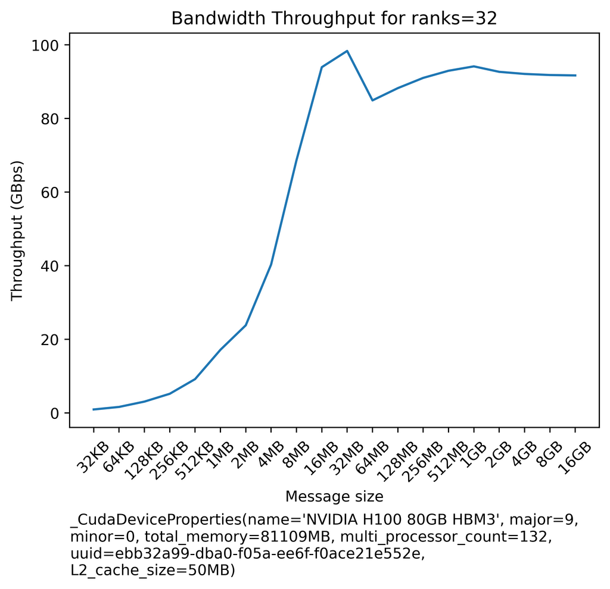
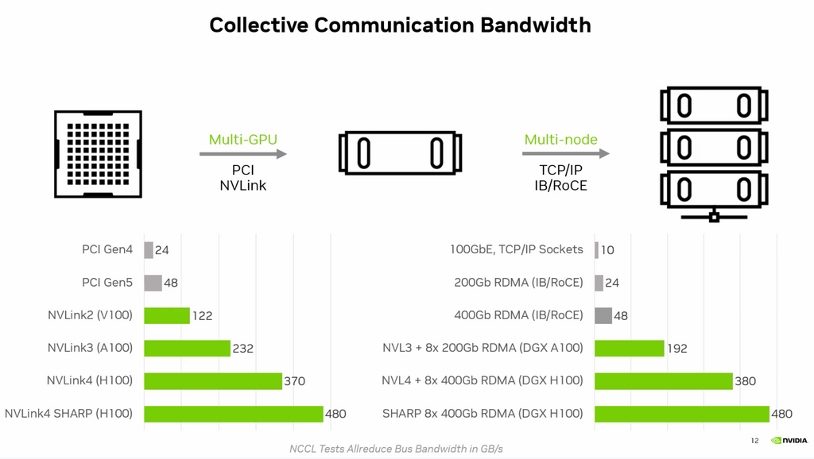

# 网络基准测试

## 工具

### all_reduce 基准测试

[all_reduce_bench.py](all_reduce_bench.py) - 一个在大量数据上执行 `all_reduce` 时对实际网络带宽进行基准测试的工具。这对于了解与宣传规格相比，实际情况如何很有用。有点类似于 `nccl-tests`，但只需要 PyTorch 即可运行。

它会生成如下输出：
```
| 有效载荷 |    busbw   |    algbw   |
| ------: | ---------: | ---------: |
|    32KB |   0.92GBps |   0.48GBps |
|    64KB |   1.61GBps |   0.83GBps |
|   128KB |   3.05GBps |   1.58GBps |
|   256KB |   5.18GBps |   2.67GBps |
|   512KB |   9.17GBps |   4.73GBps |
|     1MB |  17.13GBps |   8.84GBps |
|     2MB |  23.79GBps |  12.28GBps |
|     4MB |  40.30GBps |  20.80GBps |
|     8MB |  68.62GBps |  35.42GBps |
|    16MB |  93.93GBps |  48.48GBps |
|    32MB |  98.34GBps |  50.76GBps |
|    64MB |  84.90GBps |  43.82GBps |
|   128MB |  88.23GBps |  45.54GBps |
|   256MB |  91.01GBps |  46.97GBps |
|   512MB |  92.95GBps |  47.98GBps |
|     1GB |  94.15GBps |  48.59GBps |
|     2GB |  92.66GBps |  47.83GBps |
|     4GB |  92.09GBps |  47.53GBps |
|     8GB |  91.80GBps |  47.38GBps |
|    16GB |  91.69GBps |  47.32GBps |
```

它还会创建一个图：



有关启动示例和说明，请参阅 [all_reduce_bench.py](all_reduce_bench.py) 的顶部。

下表应该能让您很好地了解在调整良好的网络上对 all-reduce 集合的预期得分（左侧是节点内，右侧是节点间）：


[来源](https://www.nvidia.com/en-us/on-demand/session/gtc24-s62129/)

如果您正在对不同的集合进行基准测试，预期的带宽可能与上述 all-reduce 结果有很大不同。[此演示文稿](https://www.nvidia.com/en-us/on-demand/session/gtc24-s62129/)也给出了点对点通信带宽的预期。


### all_gather_object vs all_reduce

[all_gather_object_vs_all_reduce.py](all_gather_object_vs_all_reduce.py) - 一个快速基准测试，显示当从进程组收集完成状态时，从 `all_gather_object` 移动到 `all_reduce` 时速度提高了 23 倍。例如，在实现某种所有进程都完成的标志时。此技术通常用于同步 gpu，当它们可能在不同数量的迭代中完成时 - 这对于在多个 DP 通道上进行推断是必需的，或者当人们想要同步 `DataLoader` 中的 `StopIteration` 事件时。另请参阅 [all_gather_object_vs_all_gather.py](./all_gather_object_vs_all_gather.py)。

### all_reduce 延迟比较

[all_reduce_latency_comp.py](all_reduce_latency_comp.py) - 举例说明了 1 次 4GB 的规约比 1000 次 4MB 的规约快得多。


## 关键的可复现性要求

一系列成功实验的最重要要求是能够一次又一次地重现实验环境，同时只改变一个或几个设置变量。

因此，当您试图弄清楚某个更改是否会提高性能或使其恶化时，您必须找出如何保持稳定。

例如，您需要找到一种方法来防止网络使用波动。当我们为 [108B pre-BLOOM 实验](https://github.com/bigscience-workshop/bigscience/tree/master/train/tr8-104B-wide) 进行性能优化时，几乎不可能执行，因为我们使用的是共享的节点间网络，完全相同的设置会根据使用网络的用户数量而产生不同的吞吐量。这是行不通的。在 BLOOM-176B 期间，我们获得了一个专用的 SLURM 分区，该分区具有隔离的网络，其中唯一的流量是我们的。在这种环境下进行性能优化是完美的。


## 网络吞吐量

了解您的特定模型大小和框架对网络带宽、吞吐量和延迟的要求至关重要。如果您为网络支付不足，您最终将拥有空闲的 GPU，从而浪费金钱和时间。如果您为非常快的网络支付过多，但您的 GPU 很慢，那么您同样浪费了金钱和时间。

如果您的网络非常慢，您的训练很可能会受网络限制，训练设置中的许多改进将无助于提高性能。

注意：[EAI cookbook](https://github.com/EleutherAI/cookbook) 包含一组[通信基准测试](https://github.com/EleutherAI/cookbook/tree/main/benchmarks/communication)，您可以用来快速测量节点间或节点内网络的吞吐量。

这是一个简单的全归约基准测试，您可以用它来快速测量节点间网络的吞吐量：

[all_reduce_bench.py](all_reduce_bench.py)

在启用了 [SLURM Pyxis Container Plugin](https://github.com/NVIDIA/pyxis) 的 CSP（例如 CoreWeave、Crusoe、AWS、Oracle、Azure、GCP 等）上，可以通过以下命令轻松运行和重现 `all_reduce_bench.py`：
```bash
sbatch -n <num_of_nodes> ./all_reduce_bench_pyxis.sbatch
```

通常建议至少对 4 个节点进行基准测试，但是，当然，如果您已经可以访问训练期间将要使用的所有节点，请使用所有节点进行基准测试。


如果您无权访问 pyxis SLURM 环境，要在 4 个节点上运行它：

```
GPUS_PER_NODE=8
NNODES=4
MASTER_ADDR=$(scontrol show hostnames $SLURM_JOB_NODELIST | head -n 1)
MASTER_PORT=6000
python -u -m torch.distributed.run \
    --nproc_per_node $GPUS_PER_NODE \
    --nnodes $NNODES \
    --rdzv_endpoint $MASTER_ADDR:$MASTER_PORT \
    --rdzv_backend c10d \
    --max_restarts 0 \
    --role `hostname -s`: \
    --tee 3 \
    all_reduce_bench.py
```

注意：
- 如果不是 SLURM 环境，其中 `MASTER_ADDR` 是自动派生的，则将其调整为 rank 0 主机名。

以下是如何在具有 4 个节点的 SLURM 环境中启动它：
```
salloc --partition=mypartition --nodes=4 --ntasks-per-node=1 --cpus-per-task=48 --gres=gpu:8 --time=1:00:00 bash
srun --gres=gpu:8 --nodes=4 --tasks-per-node=1 python -u -m torch.distributed.run --nproc_per_node=8 --nnodes 4 --rdzv_endpoint $(scontrol show hostnames $SLURM_JOB_NODELIST | head -n 1):6000 --rdzv_backend c10d all_reduce_bench.py
```

注意：
- 您可能需要调整 `--cpus-per-task` 和 `--partition` 参数。
- 您只需执行一次 `salloc`，然后可以在同一分配上多次重复 `srun`。

您可能会得到介于 5Gbps 和 1600Gbps 之间的结果（截至本文撰写之时）。防止受网络限制的最低速度将取决于您的特定训练框架，但通常您需要至少 400Gbps 或更高。不过，我们在 50Gbps 上训练了 BLOOM。

像 [Deepspeed](https://github.com/deepspeedai/DeepSpeed) w/ ZeRO Stage-3 这样分片权重和优化器阶段的框架比像 [Megatron-Deepspeed](https://github.com/bigscience-workshop/Megatron-DeepSpeed) 这样的框架产生更多的流量，后者除了数据并行之外还进行张量和流水线并行。后者只在各处发送激活，因此不需要那么多带宽。但它们的设置和运行要复杂得多。

当然，一个高效的框架会重叠通信和计算，这样当一个阶段在获取数据时，另一个阶段并行运行计算。因此，只要通信开销小于计算，网络要求就得到满足，不必非常出色。

在使用 DeepSpeed ZeRO Stage 3 和 V100 进行大规模训练（64+ GPU）时，要获得合理的 GPU 吞吐量

1. 100Gbps 不够
2. 200-400 Gbps 可以
3. 800-1000 Gbps 是理想的

[完整详情](https://github.com/deepspeedai/DeepSpeed/issues/2928#issuecomment-1463041491)

当然，对于 A100 GPU 节点的要求更高，对于 H100 甚至更高（但目前还没有共享这样的基准测试信息）。


### 从几个节点外推基准测试结果到多个节点

由于通常很难对数百个节点进行基准测试，我们通常会尝试使用，比如说，4 个节点来对互连性能进行基准测试。我不确定这是否能为使用 40 或 400 个节点时提供正确的指示，所以我在这里问了这个问题：[此处](https://github.com/NVIDIA/nccl/issues/790)，得到的答案是：

> 在规模上进行外推对于环形和树形来说并不那么难（我们在 `tuning.cc` 中有一个函数可以预测它，基于环形线性延迟和树形对数延迟以及减少的带宽）。现在，随着您的扩展，有许多因素可能会导致您的实际性能与预测相差甚远，例如路由。还要注意，在 IB 网络上，您将能够使用 SHARP；这样，您的延迟在扩展时基本保持不变，您的带宽也不会下降太多，并且您总是比环形和树形都好。


## 禁用访问控制服务

用于 IO 虚拟化（也称为 VT-d 或 IOMMU）的 PCI 访问控制服务（ACS）强制 P2P PCIe 事务通过 PCIe 根复合体，这使得 GDS 无法在包含 PCIe 交换机的系统中绕过 CPU 在网络适配器或 NVMe 与 GPU 之间的路径。

为了获得最佳的 GDS 性能，请按照以下说明禁用 ACS：[此处](https://docs.nvidia.com/deeplearning/nccl/user-guide/docs/troubleshooting.html#pci-access-control-services-acs)。这里有一些[附加说明](https://docs.nvidia.com/gpudirect-storage/best-practices-guide/index.html)

请注意，如果您使用的是虚拟机，则无法禁用 ACS，因为它是必需的功能。要在虚拟机内以最高性能运行，需要在网络适配器中启用地址转换服务 (ATS)。


## 面向性能的 NCCL 环境变量

虽然 NCCL 在自动为任何给定网络找出最佳性能方面非常出色，但有时它需要一些帮助，在这种情况下，使用以下 NCCL 环境变量来调整性能。让我们看几个您可能想了解的常见变量，完整的列表可以在[这里](https://docs.nvidia.com/deeplearning/nccl/user-guide/docs/env.html)找到。 e

请注意，一些 `NCCL_IB_*` 环境变量也适用于 RoCEv2 网络。

### `NCCL_ALGO`

这个定义了 NCCL 将使用哪些算法。通常是以下之一：

1. Tree
2. Ring
3. CollnetDirect 和 CollnetChain (IB SHARP)
4. NVLS (NVLink SHARP)

我曾询问用户如何进行优化，并在[这个 NCCL 问题](https://github.com/NVIDIA/nccl/issues/790)中被告知，基本上用户不应该尝试优化任何东西，因为 NCCL 内部有大量智能算法，会根据具体情况自动从一种算法切换到另一种算法。

Sylvain Jeaugey 分享道：

> 过去有一个静态阈值，但现在已经被一个更复杂的调整系统所取代。新系统会为每个算法/协议组合（组合非常多）建立一个延迟和带宽模型，并根据大小决定哪个应该表现最好。所以不再有环境变量和静态值了，这很好，因为每个算法的性能取决于节点数量和每个节点的 GPU 数量，因此我们需要在一个不容易导航的 2D 算法/协议空间中导航。你总是可以用 `NCCL_ALGO=TREE` 和 `NCCL_ALGO=RING` 强制使用一种算法，看看你得到的性能如何，以及 NCCL 是否在正确的点切换。我知道这很难理解，但这也是我们在所有平台和用户中获得最佳性能的最佳解决方案，而无需用户手动调整切换点。缺点是，如果你想手动调整，你做不到。

如果您使用 `NCCL_ALGO`，您需要列出要考虑的算法，但除此之外您无法控制它。所以，实际上，这只有在您想确保不使用其中一种算法时才有用。

当问到哪种算法更好时，我收到了：

> 粗略地说，环形在峰值带宽方面更优越（除了在 2 个节点上），树形在基本延迟方面更优越（尤其是在我们扩展时）。`带宽 = 大小 / 时间`，所以无论您是看给定大小的时间还是带宽，它都是峰值带宽和基本延迟的组合。对于固定大小，随着您的扩展，环形的基本延迟将变得普遍，树形将更好。

还有一种新的算法，名为 `NVLS`，如果 NVLink SHARP 可用，它的运行速度会比 NVLink 本身更快，例如，使用 NVLink 4.0 (450GBps)，在进行 all-reduce 基准测试时可以达到 480GBps。他们正在开发该算法的节点间版本，这[需要 IB 或 RoCE](https://github.com/NVIDIA/nccl/issues/1031#issuecomment-1773965518) - 截至本文撰写之时，这种新算法尚未在任何地方记录。

最后，如果您想知道正在使用哪种算法 - 您无法知道 - 请参阅[此答案](https://github.com/NVIDIA/nccl/issues/754#issuecomment-1346163469)。因此，如果您想知道哪种算法提供哪种吞吐量，您将必须通过设置 `NCCL_ALGO` 环境变量来明确地尝试所有算法，然后您就会知道选择了哪种算法。或者您可以像在同一答案中建议的那样编辑和重新编译 NCCL，但您不希望在生产环境中使用它。


### `NCCL_CROSS_NIC`

`NCCL_CROSS_NIC` 变量控制 NCCL 是否应允许环/树使用不同的 NIC，从而导致节点间通信在不同节点上使用不同的 NIC。

为了在使用多个 NIC 时最大化节点间通信性能，NCCL 会尝试在节点之间使用相同的 NIC 进行通信，以允许网络设计，其中每个节点的每个 NIC 连接到不同的网络交换机（网络轨道），并避免任何流量干扰的风险。因此，NCCL_CROSS_NIC 设置取决于网络拓扑，特别是取决于网络结构是否针对轨道进行了优化。

这对于只有一个 NIC 的系统没有影响。

接受的值：

- 0：始终为同一个环/树使用同一个 NIC，以避免跨越网络轨道。适用于每个 NIC 都有交换机（轨道）且轨道间连接速度慢的网络。请注意，在某些极端情况下，NCCL 仍可能导致跨轨道通信，因此轨道仍需要在顶部连接。
- 1：不尝试为同一个环/树使用同一个 NIC。这适用于一个节点的所有 NIC 都连接到同一个交换机的网络，因此尝试跨同一个 NIC 进行通信无助于避免流冲突。
- 2：（默认）尝试为同一个环/树使用同一个 NIC，但如果这样做能带来更好的性能，则仍然允许。


### `NCCL_IB_QPS_PER_CONNECTION`

如果您在多层 Infiniband 或 RoCEv2 网络上，这很重要。

`NCCL_IB_QPS_PER_CONNECTION` 定义了用于两个 rank 之间每个连接的 IB 队列对的数量。这在需要多个队列对才能获得良好路由熵的多级结构上可能很有用。换句话说，当您的作业跨越主干或超级主干交换机时。

默认情况下，它设置为 `1`，但更大的数字可能有利于吞吐量。

取决于网络的大小。对于任何超过 64 个 GPU 的集群（即任何大于其 IB 交换机基数（端口数）的集群，例如 IB NDR 交换机基数为 64），您可以从 4 开始。

理想情况下，您应该询问您的云提供商他们是否已经研究过最佳值，但如果他们没有，您可以自己做，尽管这可能是特定于用例的。

另一个需要注意的问题是，当该值高于 `1` 时，会消耗额外的 GPU 内存。


### `NCCL_MIN_CTAS` 和 `NCCL_MAX_CTAS`

协作线程阵列（CTA）实现了 CUDA 线程块 - 您可以在[此处](https://docs.nvidia.com/cuda/parallel-thread-execution/#thread-hierarchy)阅读相关信息。

过去，这两个环境变量被称为 `NCCL_MIN_NCHANNELS` 和 `NCCL_MAX_NCHANNELS`。

因为在 CUDA 世界中，计算和通信操作共享每个 GPU 有限数量的 SM，如果过多的 SM 用于计算，通信将被阻塞，反之亦然。由于理想情况下计算和通信应该重叠而不是相互阻塞，因此找到正确的平衡很重要。

CTA 值由 NCCL 通过算法推导得出，但可以通过环境变量设置上下限来覆盖默认行为：[`NCCL_MIN_CTAS`](https://docs.nvidia.com/deeplearning/nccl/user-guide/docs/env.html?highlight=nccl_max_ctas#nccl-min-ctas) 和 [`NCCL_MAX_CTAS`](https://docs.nvidia.com/deeplearning/nccl/user-guide/docs/env.html?highlight=nccl_max_ctas#nccl-max-ctas)。然后 NCCL 的调谐器将被限制在用户施加的范围内选择最佳值。同样可以通过在 [`torch.distributed.init_process_group`](https://pytorch.org/docs/stable/distributed.html#torch.distributed.init_process_group) 中使用 `pg_options` 通过 [`ncclConfig_t`](https://docs.nvidia.com/deeplearning/nccl/user-guide/docs/api/types.html#ncclconfig-t) 的 `minCTAs` 和 `maxCTAs` 从程序中实现（其他进程组创建函数也有 `pg_options`）。后一种方法允许您为不同的进程组设置不同的 CTA 设置，而环境变量将全局应用于所有进程组。

这是一个直接为每个进程组将两个值都设置为 `32` 的示例：

```
import torch
nccl_options = torch.distributed.ProcessGroupNCCL.Options()
nccl_options.config.min_ctas = 32
nccl_options.config.max_ctas = 32
torch.distributed.init_process_group(..., pg_options=nccl_options)
```

为了找到针对特定基准测试的最佳性能，以模拟预期的工作负载，您可以将两个配置选项设置为相同的值，然后在 1 到 64 或类似的范围内进行二分查找。


## Infiniband

### Infiniband 自适应路由

确保您的云提供商启用 IB 自适应路由，这可以极大地提高性能。

有关细微差别，请参阅本文：[Infiniband 硬件中的自适应路由](https://web-backend.simula.no/sites/default/files/publications/files/adaptive_routing_in_infiniband_hardware.pdf)。
