# 通信模式

本章的目的不是展示代码示例和解释 API（相关的教程已经很多），而是通过出色的可视化来解释各种通信模式的工作原理。

## 点对点通信

点对点通信是最简单的通信类型，它总是只有一个发送方和一个接收方。

例如，[流水线并行](../training/model-parallelism#pipeline-parallelism) 执行的就是点对点通信，其中当前垂直阶段的激活值被发送到下一个阶段。因此，当前 GPU 执行 `send`，而持有下一个阶段的 GPU 执行 `recv`。

PyTorch 提供了用于阻塞式点对点通信的 `send` 和 `recv`，以及用于非阻塞式点对点通信的 `isend` 和 `irecv`。[更多信息](https://pytorch.org/tutorials/intermediate/dist_tuto.html#id1)。

## 集体通信

集体通信包括多个发送方和一个接收方、一个发送方和多个接收方，或多个发送方和多个接收方。

在 PyTorch 的世界里，通常每个进程都与一个加速器绑定，因此加速器通过进程组执行集体通信。同一个进程可以属于多个进程组。

### 广播 (Broadcast)

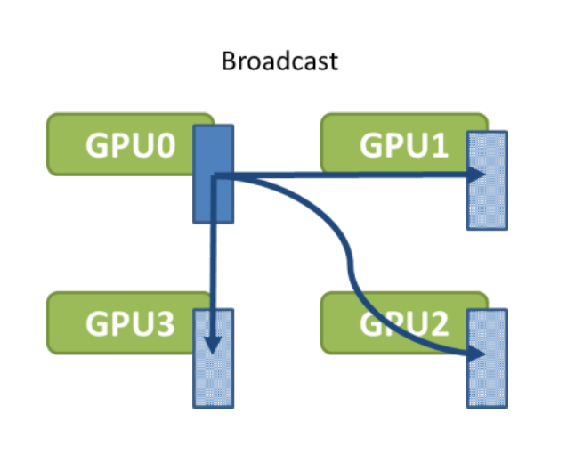
[来源](https://images.nvidia.com/events/sc15/pdfs/NCCL-Woolley.pdf)

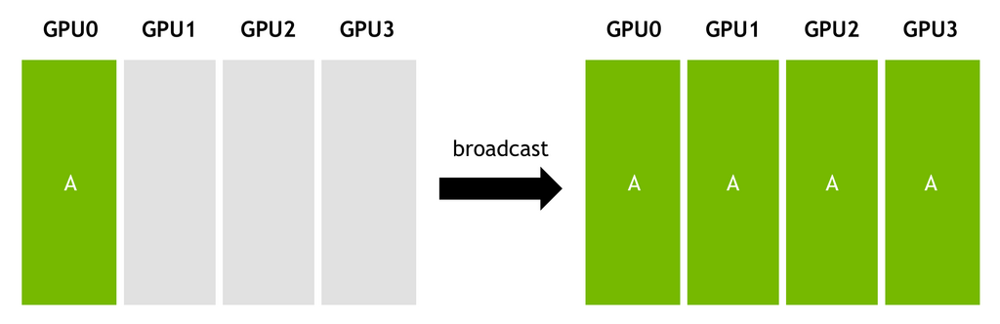
[来源](https://images.nvidia.com/events/sc15/pdfs/NCCL-Woolley.pdf)

PyTorch API 示例：

`dist.broadcast(tensor, src, group)`: 将 `tensor` 从 `src` 复制到所有其他进程。[文档](https://pytorch.org/docs/stable/distributed.html#torch.distributed.broadcast)。

### 收集 (Gather)

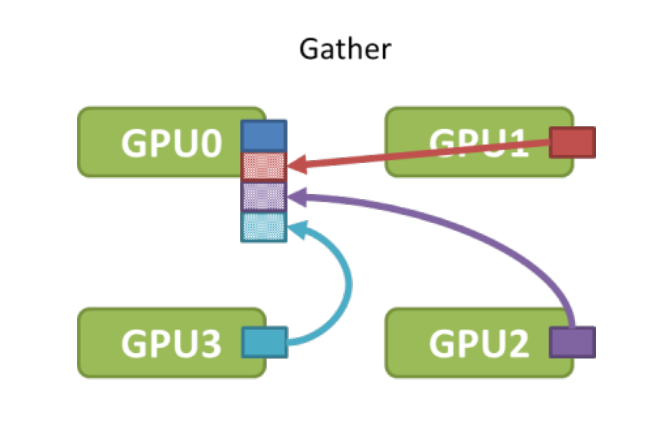
[来源](https://images.nvidia.com/events/sc15/pdfs/NCCL-Woolley.pdf)

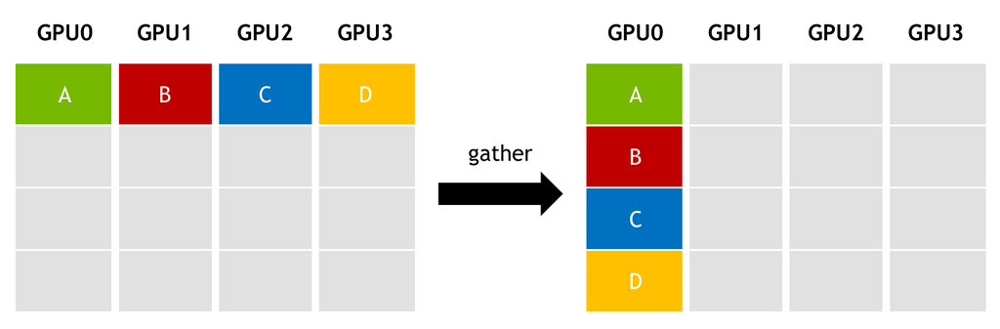
[来源](https://images.nvidia.com/events/sc15/pdfs/NCCL-Woolley.pdf)

PyTorch API 示例：

`dist.gather(tensor, gather_list, dst, group)`: 将 `tensor` 从所有进程复制到 `dst` 中。[文档](https://pytorch.org/docs/stable/distributed.html#torch.distributed.gather)

### 全局收集 (All-gather)

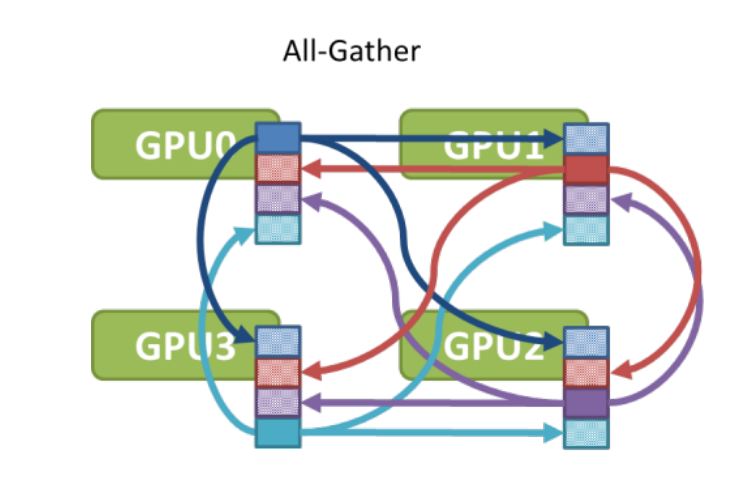
[来源](https://images.nvidia.com/events/sc15/pdfs/NCCL-Woolley.pdf)

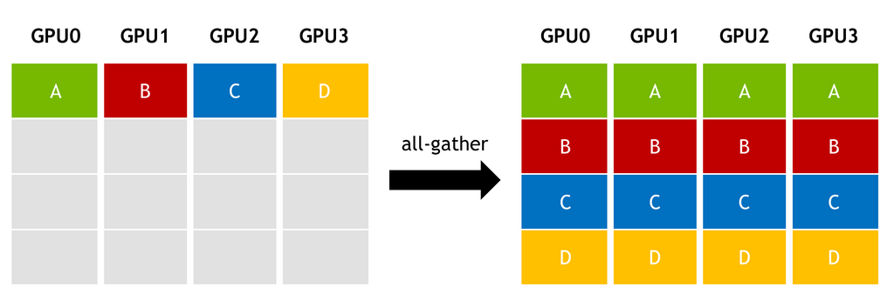
[来源](https://images.nvidia.com/events/sc15/pdfs/NCCL-Woolley.pdf)

例如，这个集体操作在 [ZeRO](../training/model-parallelism#zero-data-parallelism) (Deepspeed 和 FSDP) 中用于在 `forward` 和 `backward` 调用之前收集分片的模型权重。

PyTorch API 示例：

`dist.all_gather(tensor_list, tensor, group)`: 将 `tensor` 从所有进程复制到所有进程的 `tensor_list` 中。[文档](https://pytorch.org/docs/stable/distributed.html#torch.distributed.all_gather)

### 规约 (Reduce)

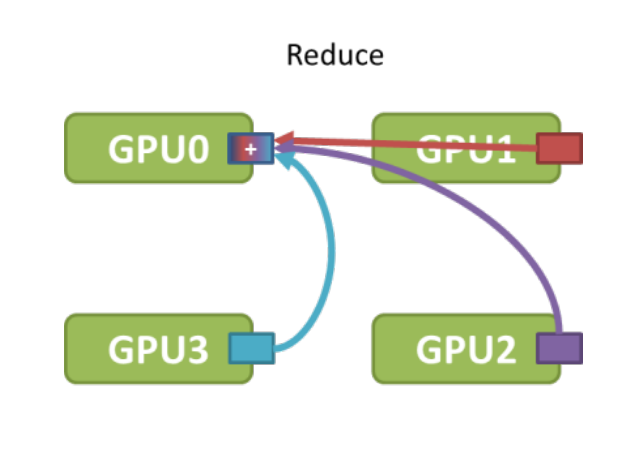
[来源](https://images.nvidia.com/events/sc15/pdfs/NCCL-Woolley.pdf)

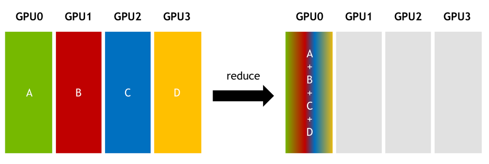
[来源](https://images.nvidia.com/events/sc15/pdfs/NCCL-Woolley.pdf)

PyTorch API 示例：

`dist.reduce(tensor, dst, op, group)`: 对每个 `tensor` 应用 `op` 操作，并将结果存储在 `dst` 中。[文档](https://pytorch.org/docs/stable/distributed.html#torch.distributed.reduce)

PyTorch 支持多种规约操作，如：`avg`, `sum`, `product`, `min`, `max`, `band`, `bor`, `bxor` 等 - [完整列表](https://pytorch.org/docs/stable/distributed.html#torch.distributed.ReduceOp)。

### 全局规约 (All-reduce)

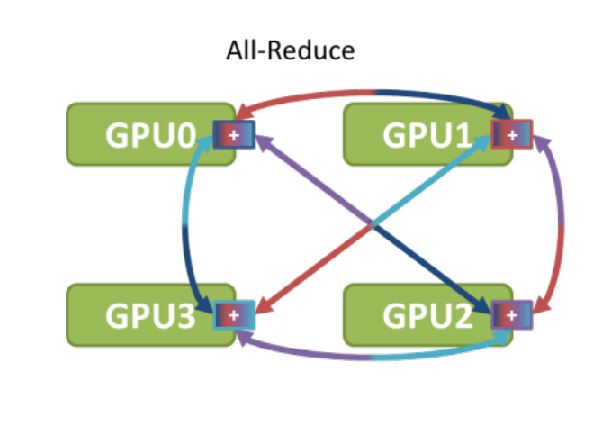

[来源](https://images.nvidia.com/events/sc15/pdfs/NCCL-Woolley.pdf)
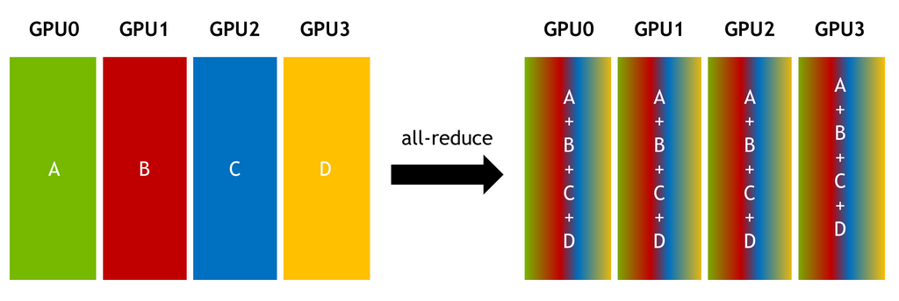
[来源](https://images.nvidia.com/events/sc15/pdfs/NCCL-Woolley.pdf)

例如，这个集体操作在 [DDP](https://pytorch.org/docs/stable/generated/torch.nn.parallel.DistributedDataParallel.html) 中用于在所有参与的 rank 之间规约梯度。

PyTorch API 示例：

`dist.all_reduce(tensor, op, group)`: 与 reduce 相同，但结果存储在所有进程中。[文档](https://pytorch.org/docs/stable/distributed.html#torch.distributed.all_reduce)

### 分散 (Scatter)

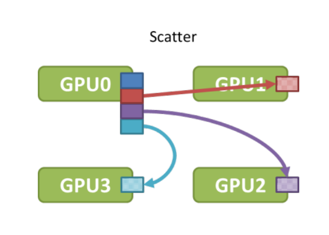
[来源](https://images.nvidia.com/events/sc15/pdfs/NCCL-Woolley.pdf)

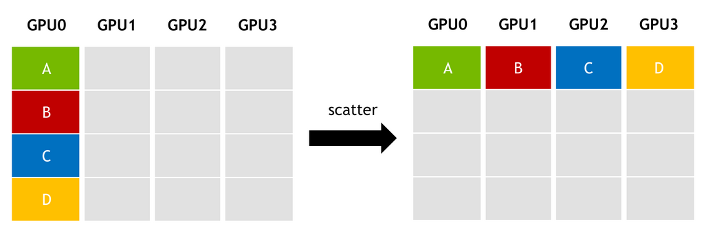
[来源](https://images.nvidia.com/events/sc15/pdfs/NCCL-Woolley.pdf)

PyTorch API 示例：

`dist.scatter(tensor, scatter_list, src, group)`: 将第 `i`-个张量 `scatter_list[i]` 复制到第 `i`-个进程。[文档](https://pytorch.org/docs/stable/distributed.html#torch.distributed.scatter)

### 规约-分散 (Reduce-Scatter)

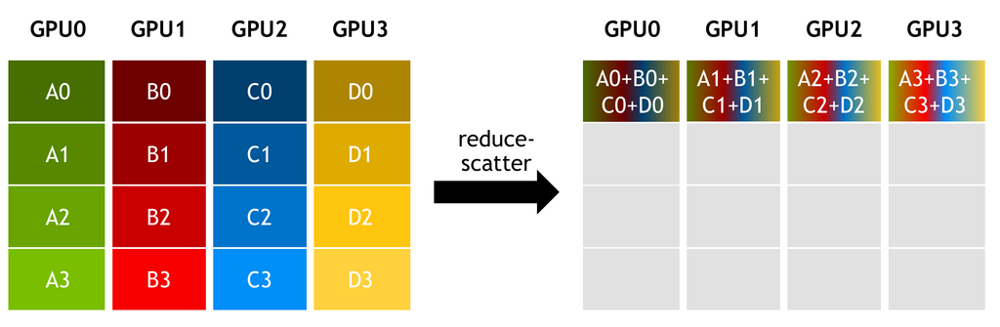
[来源](https://images.nvidia.com/events/sc15/pdfs/NCCL-Woolley.pdf)

例如，这个集体操作在 [ZeRO](../training/model-parallelism#zero-data-parallelism) (Deepspeed 和 FSDP) 中用于高效地在所有参与的 rank 之间规约梯度。这比 [all-reduce](#all-reduce) 效率高 2 倍。

PyTorch API 示例：

`reduce_scatter(output, input_list, op, group, async_op)`: 归约，然后将张量列表分散到组中的所有进程。[文档](https://pytorch.org/docs/stable/distributed.html#torch.distributed.reduce_scatter)

### 全局到全局 (All-to-all)

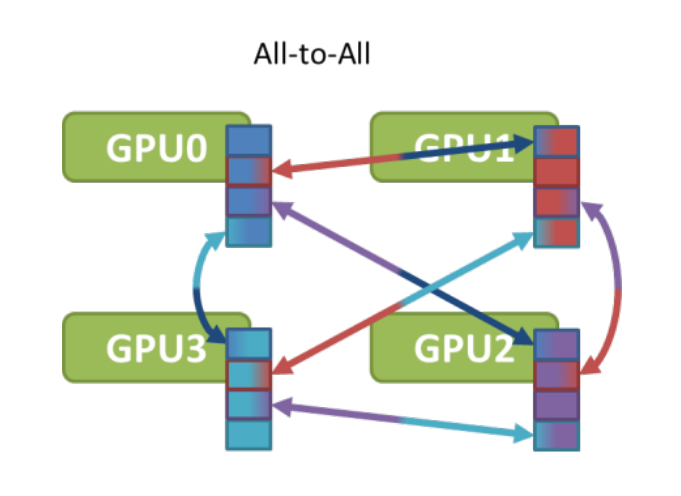
[来源](https://images.nvidia.com/events/sc15/pdfs/NCCL-Woolley.pdf)

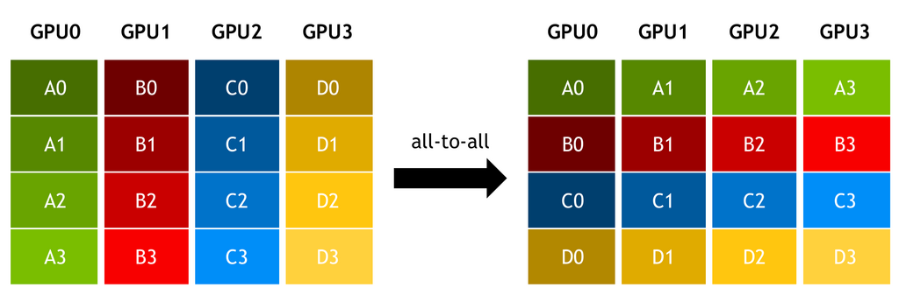
[来源](https://images.nvidia.com/events/sc15/pdfs/NCCL-Woolley.pdf)

例如，这个集体操作在 [Deepspeed 序列并行](../training/model-parallelism#deepspeed-ulysses-sp) 中用于注意力计算，以及在 MoE [专家并行](../training/model-parallelism#expert-parallelism) 中使用。

PyTorch API 示例：

`dist.all_to_all(output_tensor_list, input_tensor_list, group)`：将输入张量列表分散到组中的所有进程，并在输出列表中返回收集的张量列表。[文档](https://pytorch.org/docs/stable/distributed.html#torch.distributed.all_to_all)

## 算法

集体通信可以有多种不同的实现方式，像 `nccl` 这样的通信库可能会根据内部启发式方法在不同算法之间切换，除非用户覆盖了这些设置。

### 环形 (Ring)

#### 使用单向环的广播

给定：

- N: 要广播的字节数
- B: 每个链接的带宽
- k: GPU 的数量

一个朴素的广播在每一步会发送 `N/B`。广播到 `k` 个 GPU 的总时间将是：`(k-1)*N/B`

这是一个基于环的广播如何执行的示例：

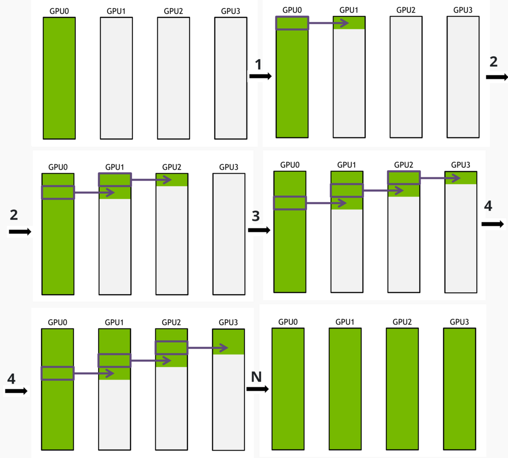
[来源](https://images.nvidia.com/events/sc15/pdfs/NCCL-Woolley.pdf)

该算法将 `N` 分成 `S` 条消息。

在每一步，发送 `N/(S*B)`，这比朴素算法每步发送的数据量少 `S` 倍。

广播 `N` 字节到 `k` 个 GPU 的总时间将是：

`S*N/(S*B) + (k − 2)*N*/(S*B) = N*(S + k − 2)/(S*B)`

如果分割的消息非常小，以至于 `S>>k`，那么 `S + k - 2` 约等于 `S`，总时间就大约是 `N/B`。

#### 使用单向环的全局规约

基于环的 `all-reduce` 与[广播](#broadcast-with-unidirectional-ring)类似。消息被分割成许多小消息，每个 GPU 与其他 GPU 并行地将一个小消息发送到下一个 GPU。`all-reduce` 需要执行比 `broadcast` 多一倍的步骤，因为它执行规约操作——因此消息的大小需要在网络上传输两次。

此外，整个消息可以首先被分割成块，以使过程更加高效。这是第一个块的规约过程：

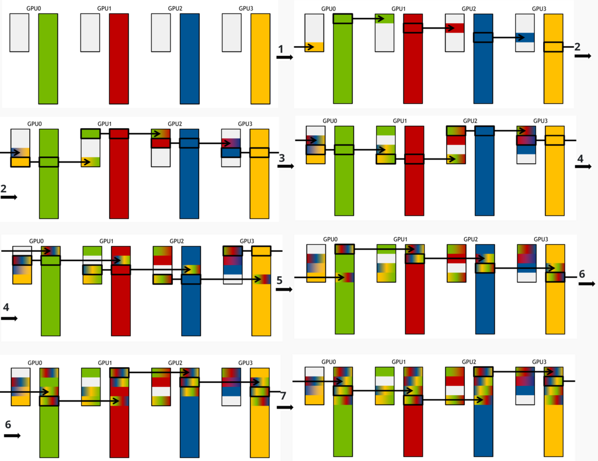
[来源](https://images.nvidia.com/events/sc15/pdfs/NCCL-Woolley.pdf)

然后处理下一个块，直到所有较小的消息都被规约：

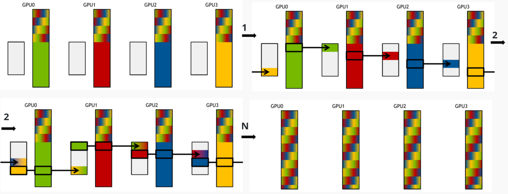
[来源](https://images.nvidia.com/events/sc15/pdfs/NCCL-Woolley.pdf)

## 更多指南

以下是一些带有良好可视化的额外指南：

- [UvA 深度学习教程](https://uvadlc-notebooks.readthedocs.io/en/latest/tutorial_notebooks/DL2/High-performant_DL/Multi_GPU/hpdlmultigpu.html#Communication-Primitives)
