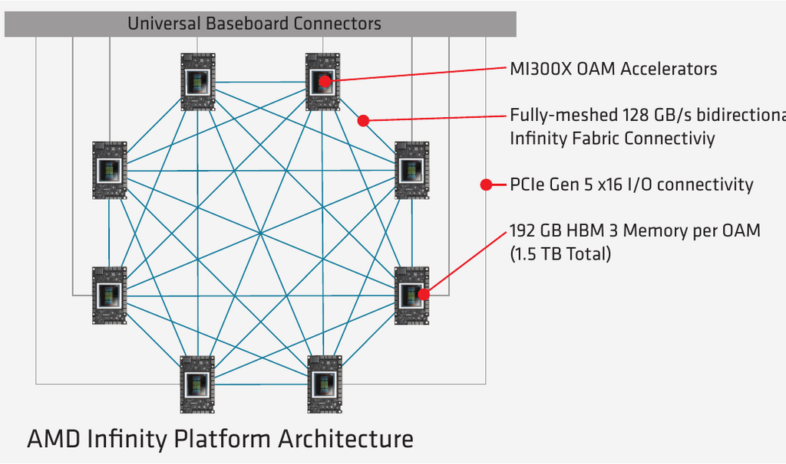
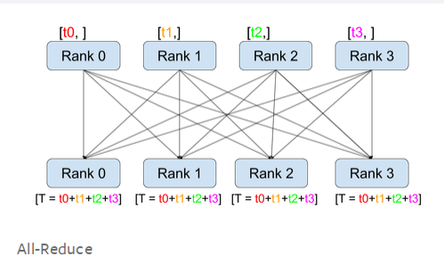
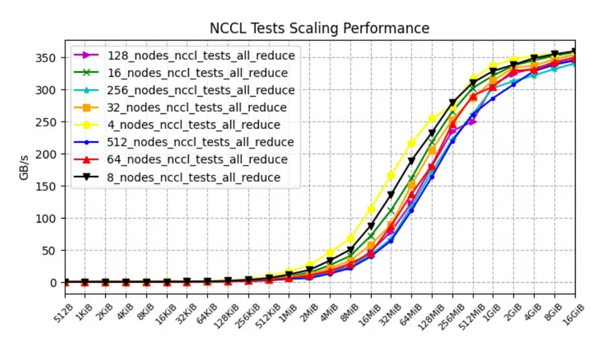
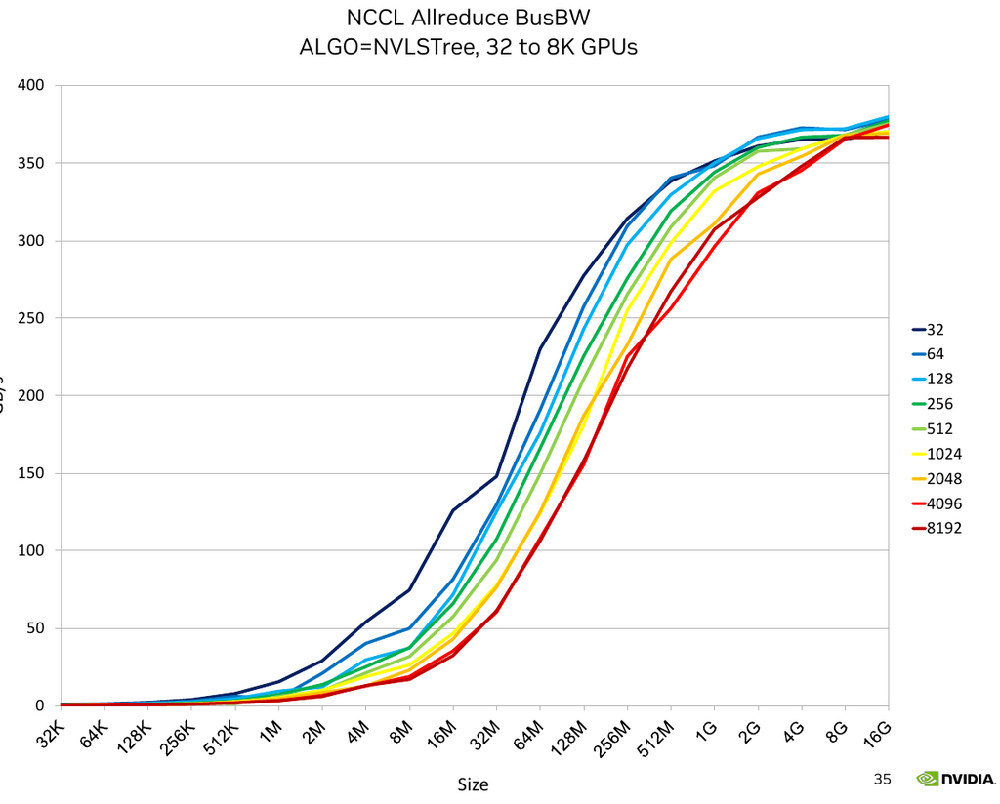
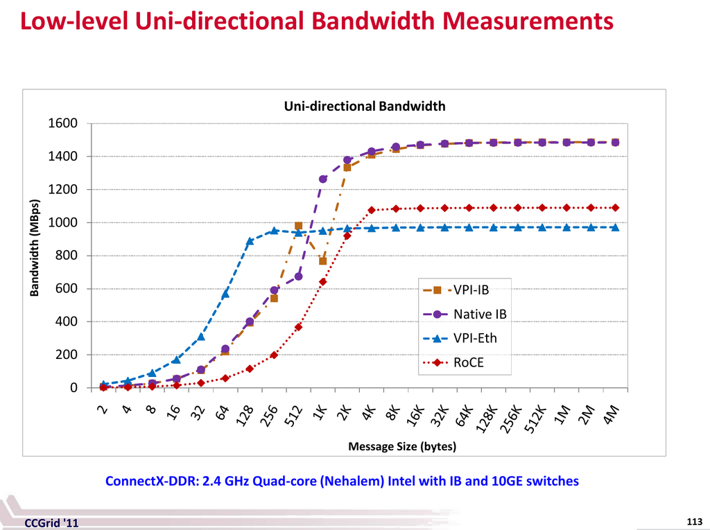
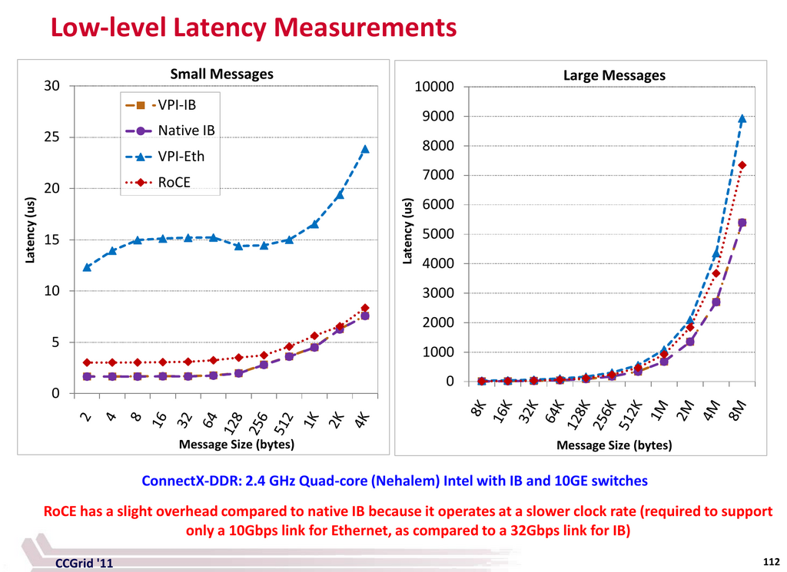

# 节点间和节点内网络硬件

**小节**:

- [通信模式](comms.md)
- [网络调试](debug)
- [网络基准测试](benchmarks)

## 引言

仅仅购买/租用昂贵的加速器来快速训练和推断模型是不够的。您需要确保您的[存储 IO](../storage)、[CPU](../compute/cpu)和网络足够快，以"喂饱加速器这个熔炉"。如果不能确保这一点，那么昂贵的加速器将被低效利用，从而导致金钱损失、训练时间变慢和推理吞吐量降低。虽然也可能是其他提到的组件问题，但在训练期间，网络通常是瓶颈（假设您的 DataLoader 足够快）。

如果您的模型可以放在单个加速器上，您就无需担心太多。但如今，大多数模型需要多个加速器来加载，而 LLM/VLM 模型需要多个计算节点进行训练，有些甚至需要多个节点进行推理。

大多数计算节点包含 8 个加速器，有些是 4 个，另一些是 16 个，甚至更多，最近还有一些每个节点只有一个超级加速器。

当模型跨越多个加速器且不离开单个节点时，您需要担心的只是快速的[节点内网络](#intra-node-networking)。一旦模型需要多个节点，这在训练中通常是这种情况，因为可以使用多个副本来并行化和加速训练，那么快速的[节点间网络](#inter-node-networking)就成为关键。

本文涵盖了两种类型的网络硬件，报告了它们的理论和有效带宽，并解释了它们如何相互作用。

## 术语和概念

您可以安全地忽略此处列出的许多概念和缩写，直到您需要它们时再返回此处。

- ALU：算术逻辑单元
- AR：自适应路由（但也可能是聚合路由器）
- DMA：直接内存访问
- EFA：弹性光纤适配器
- HCA：主机通道适配器
- IB：Infiniband
- MFU：模型 FLOPs 利用率（例如，在 A100 上半精度 `mfu=0.5` 来自于获得 156TFLOPs，因为峰值半精度规格为 312TFLOPS，因此 `156/312=0.5`）
- NIC：网络接口卡
- OPA：Omni-Path 架构
- OPX：Omni-Path Express
- OSFP：八通道小型可插拔（收发器）
- RDMA：远程直接内存访问
- RoCE：RDMA over Converged Ethernet
- RoE：RDMA over Ethernet
- SHARP：可扩展分层聚合归约协议
- VPI：虚拟协议互连
- xGMI：套接字到套接字全局内存接口

速度相关：
- 单向：从一点到另一点的单向传输 A -> B
- 双向，双工：从一点到另一点的双向传输 A <-> B，通常是单向速度的 2 倍
- GBps, GB/s：千兆字节每秒（1GBps = 8Gbps）在一个通道中传输
- GT/s：每秒千兆传输次数 - 每秒发生的数据传输操作数。
- Gbps, Gb/s：千兆比特每秒（1Gbps = 1/8GBps）在一个通道中传输
- 对分宽度：将网络分成两部分（不一定相等）所需切割的最小链路数。这些链路的带宽称为对分带宽 - 通常用作真实网络带宽的度量。有时它被称为最坏情况下的网络容量。这里有一个[很好的答案](https://networkengineering.stackexchange.com/a/29662/93656)解释了这个和相关的概念，但你不太可能需要理解这个，除了知道它的意思，因为你的集群拓扑很可能已经由提供商完成了。
- 自适应路由改进了静态路由，以在网络上启用乱序数据包。数据包在每个交换机上进行负载均衡，以更好地分配网络工作负载。
- [远程直接内存访问](#rdma-networking)

脚注：在以下部分中，请密切注意 1GBps = 8Gbps。

### 单向与双向（双工）

大多数基准测试/带宽测量工具将报告单向带宽。因此，当您查看单向与双向（双工）速度时要小心。通常后者快约 2 倍。

如果您在您的设置上测量带宽，发现它大约是宣传速度的 40%，请仔细检查宣传的速度是否为双工，如果是，则将其减半，然后您测量的带宽现在应该约为 80%，这是预期的。

案例研究：有一段时间我无法理解为什么当我在一个宣传有 600GBps 节点内速度的 A100 节点上运行 nccl-tests all_reduce 基准测试时，我只得到 235GBps (40%)，直到 Horace He 友好地指出我应该看单向速度，即 300GBps，然后我得到了理论规格的 80%，这就说得通了。

## 集群网络

集群的每个节点都有 3 个网络，每个网络以非常不同的速度运行。

1. [前端网络](#frontend-networking)
2. [后端网络](#backend-networking)
3. [带外网络](#out-of-band-networking)

### 前端网络

前端网络通常用于互联网连接（例如下载 python 包和卸载到云存储）、分布式网络存储（例如检查点和数据集）和编排（例如 SLURM 和 Kubernetes）。截至本文撰写时，典型节点可能具有单个 100-400Gbps 连接。

脚注：并非所有集群都提供外部互联网连接，例如，许多 HPC 环境仅通过特殊的仅 CPU 节点提供外部访问。

### 后端网络

后端网络用于执行 GPU 到 GPU 的连接，这使得训练和推理能够扩展到多个加速器（例如，all-reduce、all-gather 和其他集合通信）。这是 AI 集群中最重要的部分。通常这会是 [Infiniband](#infiniband) 或 [RoCEv2 Ethernet](#rdma-networking)。然后它分解为[节点内网络](#intra-node-networking)和[节点间网络](#inter-node-networking) - 同一节点上的 GPU 通常可以比其他节点上的 GPU 以更快的速度相互通信。在此，截至本文撰写时，典型的最高速度对于节点内网络约为 5600Gbps，对于节点间网络每个节点约为 3200Gbps。每个加速器至少会有一个后端连接，有时每个加速器可以有多个连接，特别是如果使用低带宽 NIC。

脚注：并非所有提供商都会匹配行业的标准网络速度 - 在某些提供商上，节点间网络速度可能会慢 10 倍。所以一定要检查你得到的是什么。

### 带外网络

带外（OOB）网络用于引导后端网络、监控节点健康状况、远程重装节点镜像等。它通常使用单个慢速 1Gbps 以太网连接。

## RDMA 网络

远程直接内存访问类似于节点上的 DMA（直接内存访问），但是跨节点的。它允许在没有使用本地处理器、操作系统内核和缓存的开销的情况下在节点之间交换数据，而这正是 TCP/IP 所使用的。3 种主要实现是：

1. Infiniband
2. RDMA over Converged Ethernet (RoCE) (基于 IB 或 UDP 的 RDMA)
3. iWARP (基于 TCP 的 RDMA)

这里有一篇[很好的概述文章](https://community.fs.com/article/roce-vs-infiniband-vs-tcp-ip.html)。

## 节点内网络

这也称为纵向扩展网络。

有多个平台/解决方案提供节点内网络：

1. 通用: [PCIe](#pcie)
2. NVIDIA: [NVLink](#nvlink) 和 [NVSwitch](#nvswitch)
3. AMD: [Infinity Fabric](#infinity-fabric--xgmi)
4. Intel: [Gaudi2](#gaudi2), [Gaudi3](#gaudi3)

### 全连接带宽

以下是当前解决方案按带宽排序的节点内单向理论全连接峰值带宽交叉比较：

| 互连 | 加速器 | GBps |
| :-------------- | :---------- | ----: |
| NVIDIA NVLink 5 | B200, B* | 900.0 |
| Intel | Gaudi3 | 600.0 |
| NVIDIA NVLink 4 | H100, H* | 450.0 |
| AMD XGMI | MI325X | 448.0 |
| AMD XGMI | MI300X | 448.0 |
| AMD XGMI | MI250X | 350.0 |
| NVIDIA NVLink 3 | A100 | 300.0 |
| Intel | Gaudi2 | 300.0 |
| PCIe 5 | | 63.0 |
| PCIe 4 | | 31.0 |

注意：

* NVSwitch 的运行速度与该代 NVLink 相同。请参阅 [NVSwitch](#nvswitch)。
* 请密切关注规格说明是单向速度还是双向（双工）速度 - 如果您阅读在线规格但未明确说明方向性 - 请查找答案。在下面的某些表格中，我不得不研究许多文档以找出答案，因为一些供应商在发布的规格中省略了这一关键信息。我甚至不得不编辑一些维基页面以添加缺失的信息。请记住，对于供应商来说，数字越大越好，所以他们几乎总是会使用双工数字，这通常是单向数字的 2 倍。

### 点对点带宽

一些供应商的全连接和点对点（GPU-to-GPU）带宽相同，而另一些则不同。例如，AMD MI3* 的 GPU-to-GPU（点对点）带宽为 64GBps，但在 8 个加速器的板上总带宽为 448GBps，因为 `64*7=448`。

以下是当前解决方案按带宽排序的节点内单向理论点对点峰值带宽交叉比较：

| 互连 | 加速器 | GBps |
| :-------------- | :---------- | ----: |
| NVIDIA NVLink 5 | B200, B* | 900.0 |
| Intel | Gaudi3 | 600.0 |
| NVIDIA NVLink 4 | H100, H* | 450.0 |
| NVIDIA NVLink 3 | A100 | 300.0 |
| Intel | Gaudi2 | 300.0 |
| AMD XGMI | MI325X | 64.0 |
| AMD XGMI | MI300X | 64.0 |
| AMD XGMI | MI250X | 50.0 |

当点对点带宽远低于全连接带宽时，这意味着如果您不将节点上的所有加速器用于同一个应用程序，您最终会得到低得多的带宽，如果加速器之间必须通信，您的应用程序性能将受到影响。

为了验证这一点，在 8x GPU AMD MI300X 节点上使用 4GB 有效载荷运行了 [all_reduce_bench.py](benchmarks/all_reduce_bench.py)，`busbw` 测量值为：

- 2 个 GPU：47.671 GBps
- 8 个 GPU：312.912 GBps

即 2 个 GPU 的性能比 8 个 GPU 慢 6.5 倍。

所以如果你必须部署 TP=2, TP=4, 或者 ZeRO-DP/FSDP 在 2 个或 4 个 GPU 上，无论是训练还是推理，网络都会成为瓶颈。如果你使用 TP=1 或 TP=8 或者 ZeRO-DP/FSDP 在 8 个 GPU 上，或者 DP 在 1-GPU 的副本上，就没有问题。（如果你不确定 TP/ZeRO-DP/DP 是什么意思，请看 [模型并行](../training/model-parallelism)）。

你将在以下章节中找到每种技术的详细分析。

### PCIe

[PCIe](https://en.wikipedia.org/wiki/PCI_Express) 是一种高速串行计算机扩展总线标准，即使在最便宜的台式电脑上也可以找到。

| 互连 | 通道/方向 | 通道数 | 单向 | 双工 |
| :---------- | -------------: | ---: | ----------: | ------: |
| PCIe 4 | ~2.0 GBps | 16 | 31 GBps | 62 GBps |
| PCIe 5 | ~4.0 GBps | 16 | 63 GBps | 126 GBps |
| PCIe 6 | ~7.5 GBps | 16 | 121 GBps | 242 GBps |
| PCIe 7 | ~15.0 GBps | 16 | 242 GBps | 484 GBps |

如果将最新一代的不同节点内网络技术进行比较（参见以下部分）PCIe 通常要落后一个数量级。

### NVLink

- [NVLink](https://en.wikipedia.org/wiki/NVLink) 是由 Nvidia 开发的一种基于线的串行多通道近距离通信链路。这里是 [什么是 NVLink](https://blogs.nvidia.com/blog/what-is-nvidia-nvlink/) 的博文，其中有更多背景信息。

我发现 NVLink 的维基页面很难理解，所以我会试着帮助理清思路。而且我很确定在撰写本文时，那个维基页面上的一些数字是错误的，而且看起来 NVIDIA 并没有维护那个页面。

节点内 GPU-to-GPU 通信硬件的有效载荷速率：

| 互连 | 通道/方向 | 通道数 | 链路数 | 单向 | 双工 | GPU |
| :----------- | -------------: | ----: | ----: | -----------: | ---------: | :---------------- |
| NVLink 1 | 2.50 GBps | 8 | 4 | 80 GBps | 160 GBps | P100 |
| NVLink 2 | 3.125 GBps | 8 | 6 | 150 GBps | 300 GBps | V100 |
| NVLink 3 | 6.25 GBps | 4 | 12 | 300 GBps | 600 GBps | A100 |
| NVLink 4 | 12.50 GBps | 2 | 18 | 450 GBps | 900 GBps | H100, H200, GH200 |
| NVLink 5 | 25.00 GBps | 2 | 18 | 900 GBps | 1800 GBps | B200, B\*, GB\* |

这里有一篇很好的关于 NVLink（1 到 4）演变的概述文章[这里](https://www.naddod.com/blog/unveiling-the-evolution-of-nvlink)。

最大的 PCIe 16x 插槽有 16 个通道。较小的插槽通道较少，1x == 1 个通道。

NVIDIA Hopper 节点通常配备 PCIe 5 和 NVLink 4。因此，NVLink 比 PCIe 快 7 倍。

NVIDIA Blackwell 节点将配备 PCIe 5 和 NVLink 5。因此，那里的 NVLink 将比 PCIe 快 14 倍。

让我们看几个节点的例子，并将理论与现实联系起来。

如果您使用多个 GPU，卡的互连方式会对总训练时间产生巨大影响。如果 GPU 在同一个物理节点上，您可以运行：

```
nvidia-smi topo -m
```

它会告诉你 GPU 是如何互连的。

在一台双 GPU 并用 NVLink 连接的机器上，你很可能会看到类似这样的东西：

```
        GPU0    GPU1    CPU Affinity    NUMA Affinity
GPU0     X      NV2     0-23            N/A
GPU1    NV2      X      0-23            N/A
```

在另一台没有 NVLink 的机器上，你可能会看到：
```
        GPU0    GPU1    CPU Affinity    NUMA Affinity
GPU0     X      PHB     0-11            N/A
GPU1    PHB      X      0-11            N/A
```

报告包括此图例：

```
  X    = Self
  SYS  = Connection traversing PCIe as well as the SMP interconnect between NUMA nodes (e.g., QPI/UPI)
  NODE = Connection traversing PCIe as well as the interconnect between PCIe Host Bridges within a NUMA node
  PHB  = Connection traversing PCIe as well as a PCIe Host Bridge (typically the CPU)
  PXB  = Connection traversing multiple PCIe bridges (without traversing the PCIe Host Bridge)
  PIX  = Connection traversing at most a single PCIe bridge
  NV#  = Connection traversing a bonded set of # NVLinks
```

所以第一个报告 `NV2` 告诉我们 GPU 通过 2 个 NVLink 互连，第二个报告 `PHB` 我们有一个典型的消费级 PCIe+桥接设置。

检查您的设置上有什么类型的连接。其中一些会使卡之间的通信更快（例如 NVLink），另一些则会更慢（例如 PHB）。

根据所使用的可伸缩性解决方案的类型，连接速度可能会产生主要或次要影响。如果 GPU 很少需要同步，如 DDP，那么较慢连接的影响将不那么显著。如果 GPU 需要经常互相发送消息，如 ZeRO-DP，那么更快的连接对于实现更快的训练变得至关重要。

现在，让我们看看 A100 和 H100 节点的拓扑结构：

- A100 拓扑：

```
$ nvidia-smi topo -m
      GPU0  GPU1  GPU2  GPU3  GPU4  GPU5  GPU6  GPU7  CPU Affinity  NUMA Affinity
GPU0   X    NV12  NV12  NV12  NV12  NV12  NV12  NV12   0-23         0
GPU1  NV12   X    NV12  NV12  NV12  NV12  NV12  NV12   0-23         0
GPU2  NV12  NV12   X    NV12  NV12  NV12  NV12  NV12   0-23         0
GPU3  NV12  NV12  NV12   X    NV12  NV12  NV12  NV12   0-23         0
GPU4  NV12  NV12  NV12  NV12   X    NV12  NV12  NV12  24-47         1
GPU5  NV12  NV12  NV12  NV12  NV12   X    NV12  NV12  24-47         1
GPU6  NV12  NV12  NV12  NV12  NV12  NV12   X    NV12  24-47         1
GPU7  NV12  NV12  NV12  NV12  NV12  NV12  NV12   X    24-47         1
```
你可以看到有 12 个 NVLink 和 2 个 NUMA 组（2 个 CPU，每个有 24 个核心）

- H100 拓扑：
```
$ nvidia-smi topo -m
      GPU0  GPU1  GPU2  GPU3  GPU4  GPU5  GPU6  GPU7  CPU Affinity  NUMA Affinity
GPU0   X    NV18  NV18  NV18  NV18  NV18  NV18  NV18   0-51         0
GPU1  NV18   X    NV18  NV18  NV18  NV18  NV18  NV18   0-51         0
GPU2  NV18  NV18   X    NV18  NV18  NV18  NV18  NV18   0-51         0
GPU3  NV18  NV18  NV18   X    NV18  NV18  NV18  NV18   0-51         0
GPU4  NV18  NV18  NV18  NV18   X    NV18  NV18  NV18  52-103        1
GPU5  NV18  NV18  NV18  NV18  NV18   X    NV18  NV18  52-103        1
GPU6  NV18  NV18  NV18  NV18  NV18  NV18   X    NV18  52-103        1
GPU7  NV18  NV18  NV18  NV18  NV18  NV18  NV18   X    52-103        1
```
您可以看到有 18 个 NVLink 和 2 个 NUMA 组（2 个 CPU，每个有 52 个核心）

当然，其他 A100 和 H100 节点报告可能会有所不同，例如，cpu 核心数可能不同。

### NVSwitch

[NVSwitch](https://www.nvidia.com/en-us/data-center/nvlink/) 能够以 [NVLink](#nvlink) 的速度连接超过 8 个 GPU。据宣传，在未来几代的交换机中，它能够连接多达 256 个 GPU。

以 NVLink 的速度连接超过 8 个 GPU 的好处是，它允许所有 GPU 之间的通信速度远快于任何节点内硬件所能提供的速度。随着计算速度的不断提高，网络很可能成为瓶颈，导致超昂贵的 GPU 利用率不足。

例如，在张量并行（Megatron）的世界里，人们不会使用超过 8 的 TP 度，因为 TP 只有在 NVLink 速度下才高效。如果整个集群使用 NVLink 速度并且不涉及缓慢的节点间连接，ZeRO-DP (Deepspeed/FSDP) 也会运行得快得多。

NVSwitch 用于节点内连接。

NVSwitch 第一代随 V100 推出，第二代随 A100，第三代随 H100，第四代随 B200 - 速度对应于相同技术的 NVLink 版本。

[NVIDIA DGX H100](https://developer.nvidia.com/blog/upgrading-multi-gpu-interconnectivity-with-the-third-generation-nvidia-nvswitch/) 拥有 3.6 TBps 的全双工 NVLink 网络带宽，由 72 个 NVLink (NVLink 4) 提供。普通的 NVLink 4 有 18 个 NVLink (0.9 TBps 双工)。所以这个设置有 4 个交换机 (`18*4=72`)，因此 `0.9*4=3.6` TBps。注意，这个服务器有 8 个 GPU，所以这里我们得到了比标准 NVLink 4.0 更快的节点内通信，后者只为 8 个 GPU 提供 0.9 TBps 的全连接。

NVIDIA DGX A100 有 6 个交换机，每个交换机有 12 个 NVLink，总共 72 个。

[DGX H100 SuperPOD](https://developer.nvidia.com/blog/upgrading-multi-gpu-interconnectivity-with-the-third-generation-nvidia-nvswitch/) 结合了 32 台 DGX H100 服务器，总共 256 个 GPU。看起来他们只用了一半用于单个 DGX H100 的 NVLink，所以每个节点只有 1.8 TBps，总共 57.6 TBps。

此外，NVSwitch gen3 及更高版本配备了 [NVIDIA 可扩展分层聚合归约协议 (SHARP)](#sharp)，可以提升节点内和节点间的速度。例如，NCCL 正在开发 `NCCL_ALGO=NVLS`，它已经将节点内带宽提升到正常规格之上，截至本文撰写时，正在进行提升节点间带宽的工作。

最近 [GB200 NVL72](https://www.nvidia.com/en-us/data-center/gb200-nvl72/) 被引入，它使用 NVSwitch 将 72 个 Blackwell GPU 放入一个节点，全部以 NVLink 5 900GBps 单向速度互连。因此，我们现在有一个 72-gpu 节点，而不是 8-gpu 节点（尽管物理上它们并不都在同一块板上）。

### Infinity Fabric / xGMI

AMD MI* 加速器节点内通信由 AMD Infinity Fabric 执行，也称为 xGMI（Socket to Socket Global Memory Interface）。

这是 AMD 对 [NVLink](#nvlink) 的回应。

以下是全连接带宽。

| 互连 | 链接/方向 | 链接数 | 单向 | 双工 |
| | 点对点 | | 全连接 | 全连接 |
| :------------ | -------------: | ----: | -----------: | ---------: |
| MI325X | 64 GBps | 7 | 448 GBps | 896 GBps |
| MI300X | 64 GBps | 7 | 448 GBps | 896 GBps |
| MI250X | 50 GBps | 7 | 350 GBps | 700 GBps |
| | | | | |
| MI355X | ?? | | | |

点对点带宽就是单个链路/方向的带宽（第二列）。这意味着除非您在单个进程组中使用整个 8-GPU 节点，否则您的通信性能将慢 7 倍。有关详细信息，请参阅[点对点带宽](#peer-to-peer-bandwidth)。

其他节点内解决方案通常具有相同的全连接和点对点节点内带宽，因此 Infinity Fabric 似乎要慢得多。我想这是因为这些主要是为推理而创建的，因为这些慢速会极大地减慢 LLM 的训练。



平台规格：
- [MI250X](https://www.amd.com/en/products/accelerators/instinct/mi200/mi250x.html)
- [MI300x](https://www.amd.com/en/products/accelerators/instinct/mi300/platform.html)
- [MI325X](https://www.amd.com/en/products/accelerators/instinct/mi300/mi325x.html)
- MI355X ??

### Gaudi2

根据 [Gaudi2 规格](https://habana.ai/wp-content/uploads/2023/10/HLS-Gaudi2_Datasheet_10_23.pdf)，这些节点为节点间和节点内连接提供相同的 100GbE RoCE v2 RDMA 硬件（每卡 24x 100Gbps）。

- 节点内：8x 7x3 NICs - 卡到卡 300Gbps
- 节点间：8x 1x3 NICS - 总计 2.4Tbps (300GBps)

### Gaudi3

根据 [Gaudi3 规格](https://www.intel.com/content/www/us/en/content-details/817486/intel-gaudi-3-ai-accelerator-white-paper.html)，这些节点提供与 Gaudi2 相同的设置，只是卡的 RoCE v2 RDMA 速度是原来的 2 倍，达到 200GbE，用于节点间和节点内连接（每卡 24x 200Gbps）。

- 节点内：8x 7x3 NICs - 卡到卡 600Gbps
- 节点间：8x 1x3 NICS - 总计 4.8Tbps (600GBps)

### NeuronLink v3

NeuronLink v3 ([规格](https://awsdocs-neuron.readthedocs-hosted.com/en/latest/general/arch/neuron-hardware/trn2-arch.html)) 是 AWS Trainium2 的 NVLink 的节点内等效物，但它是一种点对点架构，就像 AMD MI* 一样，因此除非它们参与同一个进程组，否则无法利用其他 Trainium2 芯片的 NeuronLink v3。该技术基于 PCIe-5.0（因此每通道单向 32Gbps）。

NeuroLink v3 除了 EFA v3 之外，还具有节点间用途。

每个节点的 Trainium2 芯片数量和节点内网络速度：
- Trainium2：16 个芯片以 128GBps 点对点单向（32 个 PCIe 通道）互连，每个 Trainium2 连接到 3 个其他芯片
- Trainium2 Ultra：64 个芯片 - 16 个芯片组与非 Ultra 相同，此外这 4 个组以 64GBps 相互互连。

像 TPU 一样，它用于 3D Torus 结构。这里不同的轴以不同的速度连接，因此每个芯片的总全连接带宽为 640GBps 单向（`128GBps * 4 个节点内邻居 + 64GBps * 2 个节点间邻居`）

当他们的规格建议 1024GBps/芯片实例内带宽时，它是双向的，所以只有 512GBps/芯片单向 - 它来自 `128GBps * 4 个节点内邻居`（并且只有当所有 4 个芯片都参与时）。

## 节点间网络

这也称为横向扩展网络。

由于节点间硬件过去比节点内硬件慢一个数量级，因此在这个领域使用 Gbps 而不是 GBps。（1 GBps = 8 Gbps）（尽管最近节点间速度几乎和[节点内网络](#intra-node-networking)一样快）

在节点间网络硬件方面，有来自 NVIDIA 和其他一些厂商的成熟的 [InfiniBand](#infiniband)，各种基于 NVLink 的 NVIDIA 产品，还有许多新来者，主要来自计算云提供商，他们无法在租用他人硬件的微薄利润上竞争，因此他们构建了自己的硬件（AWS EFA，GCP GPUDirect-TCPX），还有 HPE 和 Cornelis Networks 最近更新了产品。

以下是当前技术按常见节点设置的总带宽排序的节点间单向理论峰值带宽交叉比较：

| 互连 | NICs x Gbps | 总 GBps | 备注 |
| :------------------- | ----------: | ---------: | :------ |
| Intel Gaudi3 | 24x200 | 600 | |
| AWS EFA v3 | 16x200 | 400 | Tranium 2 |
| NVIDIA Quantum-2 IB | 8x400 | 400 | H100 |
| AWS EFA v2 | 32x100 | 400 | H100 |
| Intel Gaudi2 | 24x100 | 300 | |
| InfiniBand XDR1600 | 8x200 | 200 | |
| GCP GPUDirect-TCPXO | 8x200 | 200 | |
| GCP GPUDirect-TCPX | 4x200 | 100 | |
| HPE Slingshot | 4x200 | 100 | |
| Omni-Path CN100 | 8x100 | 100 | |
| AWS EFA v1 | 4x100 | 50 | |
| InfiniBand NDR400 | 4x100 | 50 | |
| | | | |
| 未来： | | | |
| | | | |
| Omni-Path CN5000 | 8x400 | 400 | 2025年第二季度 |
| InfiniBand GDR3200 | 8x400 | 400 | 2025 |
| Omni-Path CN6000 | 8x800 | 800 | 2026 |

注意：

* 这些是常见/流行的节点设置 - 一些自定义节点可能有不同的配置，通常 NIC 较少，很少有更多 NIC。而且，是的，AWS EFA v2 在每个节点上放置 32 个 NIC - 那肯定有很多线缆。
* 注意，节点间和[节点内带宽](#intra-node-networking)之间曾经的数量级差异正在开始消失 - 我最近将这里的速度从 Gbps 重新调整为 GBps。

您将在以下部分找到每种技术的详细分析。

### InfiniBand

[InfiniBand](https://en.wikipedia.org/wiki/InfiniBand) (IB) 已经存在几十年了，所以有很多可用的配置。因此，如果有人说他们有 InfiniBand，那是不够的信息。你需要知道的是信令速率和 IB 链路的数量。

InfiniBand 是一个完整的网络协议，实现了 RDMA（绕过 TCP/IP）。

以下是您可能在当前硬件产品中看到的最新的信号速率：

单向链路的信号速率（Gbps）：
| 链路数 | EDR | HDR | NDR | XDR | GDR | LDR |
| ----: | --: | --: | --: | --: | --: | --: |
| 1 | 25 | 50 | 100 | 200 | 400 | 800 |
| 4 | 100 | 200 | 400 | 800 | 1600 | 3200 |
| 8 | 200 | 400 | 800 | 1600 | 3200 | 4800 |
| 12 | 300 | 600 | 1200 | 2400 | 4800 | 9600 |

注意：
* GDR 计划于 2025 年推出，LDR 几年后推出

延迟（微秒）：
| EDR | HDR | NDR | XDR | GDR | LDR |
| --: | --: | --: | --: | --: | --: |
| 0.5 | 0.6 | ?? | ?? | ?? | ?? |

`??` = NDR 及更高版本未发布延迟数据

InfiniBand 提供 [RDMA](https://en.wikipedia.org/wiki/Remote_direct_memory_access)。

以下是一些配备最快 IB 的 NVIDIA 设备示例：

- NVIDIA DGX H100 的一种配置配备了 8 个 NVIDIA ConnectX-7 (CX7) 以太网/InfiniBand 端口，每个端口 200Gbps，总共 1.6 Gbps 用于与其他 DGX 服务器连接。
- 对于 DGX H100 SuperPOD，所有 32 个 DGX 服务器和相关的 InfiniBand 交换机上的 ConnectX-7 提供 25.6 TBps 的全双工带宽，用于 pod 内或扩展多个 SuperPOD - 这相当于每个节点 0.8 TBps (6.4Tbps!)。
- 基于 NVIDIA GB200 的解决方案将通过 Quantum-2 InfiniBand 800G 交换机（2x400G NDR 接口）提供 400Gbps 或 800Gpbs NDR

根据维基百科，虽然[InfiniBand](https://en.wikipedia.org/wiki/InfiniBand)过去有多个制造商 - 目前只有 Intel（收购了 QLogic）和 NVIDIA（收购了 Mellanox）。另请参阅[InfiniBand 贸易协会](https://www.infinibandta.org/)。

实用链接：
- [InfiniBand 实用程序](https://docs.nvidia.com/networking/display/ofedv512580/infiniband+fabric+utilities)（链接可能已过时，因为它有版本） - 这些在调试 IB 设置时很有用。

### NVIDIA Quantum-2 InfiniBand

[NVIDIA Quantum-2 InfiniBand 平台](https://www.nvidia.com/en-us/networking/quantum2/) 支持每链路 400Gbps 带宽，提供 RDMA，包括使用 [SHARP](#sharp) 的网络内计算，支持 PCIe-5。

交换机可以以 400Gbps 的速度连接 64 个设备。

### EFA

[弹性光纤适配器 (EFA)](https://aws.amazon.com/hpc/efa/) 是 AWS 最近创建的一种节点间网络技术。

- EFA v1 0.4 Tbps（all_reduce 测试的有效速度为 340 Gbps）（P4 AWS 实例）
- EFA v2 3.2 Tbps（自 2023 年第三季度起，P5 AWS 实例 - 32 个 100GbE (4x28G) NICs！）
- EFA v3 3.2 Tbps（自 2025 年第一季度起，P5en AWS 实例 - 16 个 200GbE (4x56G) NICs！和 Trn2 AWS 实例） - 理论速度与 v2 相同，但在实际消息大小下应提供更好的实际速度。

### Gaudi2 (节点间)

根据 [Gaudi2 规格](https://habana.ai/wp-content/uploads/2023/10/HLS-Gaudi2_Datasheet_10_23.pdf)，这些节点提供 `3*8=24` 个 100GbE RoCE v2 RDMA NIC，用于与其他 Gaudi2 节点进行总计 2.4Tbps 的节点间连接。

### Gaudi2 (节点间)

根据 [Gaudi3 规格](https://www.intel.com/content/www/us/en/content-details/817486/intel-gaudi-3-ai-accelerator-white-paper.html)，这些节点提供 `3*8=24` 个 200GbE RoCE v2 RDMA 网卡，用于与其他 Gaudi2 节点进行总计 4.8Tbps 的节点间连接。

根据 [Gaudi2 规格](https://habana.ai/wp-content/uploads/2023/10/HLS-Gaudi2_Datasheet_10_23.pdf)，这些节点提供 `3*8=24` 个 100GbE RoCE v2 RDMA 网卡，用于与其他 Gaudi2 节点进行总计 2.4Tbps 的节点间连接。

### HPE Slingshot 互连

[HPE Slingshot 互连](https://www.hpe.com/ca/en/compute/hpc/slingshot-interconnect.html) 似乎被 HPC 使用。截至本文撰写时，它提供每链路 200Gbps 的速度。一些 HPC 使用 4 个这样的链路来构建 800Gbps 的互连，当然，更多的链路将提供更高的总带宽。

### GPUDirect-TCPX

GPUDirect-TCPX 是 Google 为 A3 实例开发的 RDMA-over-TCP 软件解决方案。GPUDirect-TCPXO 是 TCPX 的硬件加速扩展，仅在 A3 Mega 上可用。文档很少，但这里有一些关于 [TCPX](https://cloud.google.com/compute/docs/gpus/gpudirect) 和 [TCPXO](https://cloud.google.com/cluster-toolkit/docs/machine-learning/a3-mega-enable-gpudirect-tcpxo) 的信息。

这项技术没有流行起来，将逐步淘汰，从 GCP 的 Blackwell 实例开始，将被 RoCE 取代。

### Omni-Path

[Omni-Path 架构](https://en.wikipedia.org/wiki/Omni-Path) (OPA)。最初由英特尔开发，该技术后被出售给 Cornelis Networks。它也被称为 Omni-Path Express (OPX)。

案例研究：我于 2022 年在法国的 JeanZay HPC 上使用了这项技术。当时的速度只有 135Gbps，尽管一年后供应商试图修复它，但速度仍然一样。希望这个问题现在已经解决，速度快了很多。因为它太慢了，我们不得不使用 [Megatron-Deepspeed](https://github.com/bigscience-workshop/Megatron-DeepSpeed) 来训练 BLOOM-176B，而不是使用更容易使用的 DeepSpeed ZeRO。

截至本文撰写时，我看到该产品的带宽为 100 或 200Gbps。因此，除非他们能安装很多网卡，否则你不太可能看到有人为 ML 工作负载提供这个解决方案。

[CN-100](Cornelis Omni-Path 加速主机光纤适配器 CN-100HFA) 100Gbps NIC 已经存在很多年了。

[CN5000](https://www.cornelisnetworks.com/solutions/cornelis-cn5000/) 400Gbps NIC 将由 Cornelis Networks 于 2025 年第二季度推出。一个即将推出的 MI300X 设置使用 8 个这样的 NIC，总共提供 3200Gbps 的单向节点间带宽。

Omni-Path 提供 [RDMA](https://en.wikipedia.org/wiki/Remote_direct_memory_access)。

### 超级加速器链路 (UALink)

[UALink 倡议](https://www.google.ca/search?q=Ultra+Accelerator+Link) 是一项旨在创建开放标准以与 [NVLink](#nvlink) 竞争的尝试。据称它将基于 AMD 的 [Infinity Fabric](#infinity-fabric--xgmi)。截至本文撰写时，还没有实际的硬件可言。

## 其他重要的网络技术

### SHARP

NVIDIA [可扩展分层聚合和归约协议 (SHARP)](https://docs.nvidia.com/networking/display/sharpv300) - 允许在网络本身上执行数据归约和聚合（网络内计算）。如果您进行大量的 MPI、NCCL 和其他支持 SHARP 的网络集合通信，这将非常有用，因为这些通信的延迟应该会得到很大改善。

为了理解这项技术的重要性 - 对于 all-reduce 操作，它只需要 N+1 次发送，而不是 2N 次发送 - 所以对于大的 N - 它几乎将有效的 all-reduce 吞吐量提高了一倍。（N 是通信的 rank/gpu 的数量）。有关详细信息，请参阅 [all-reduce 操作兼容性](https://developer.nvidia.com/blog/upgrading-multi-gpu-interconnectivity-with-the-third-generation-nvidia-nvswitch/)（您必须向下滚动才能到达该部分）。

最近的 NCCL 版本如果可用，将自动使用此技术。

作为 NVSwitch 或 Infiniband 交换机一部分的 SHARP 硬件包括算术逻辑单元 (ALU)，它们直接执行计算而不是使用 GPU。据说它可以在 FP64、FP32、FP16 和 BF16 数据类型中执行数学运算。

案例研究：我是在一次 H100 节点内 NVLink 4.0 [all-reduce](benchmarks/all_reduce_bench.py) 基准测试中偶然发现 SHARP 的，该测试报告 4GB 负载的带宽为 480GBps，而理论规格仅为 450GBps！我们发现这是因为 NCCL 开启了新的 `NVLS` 算法，因为它检测到了 Infiniband SHARP。我仍然不明白它如何能达到比物理介质允许的更快的速度。我很确定需要将 `busbw` 计算算法从 2N 调整为 N+1 才能获得真实速度。这里有一个关于这个问题的详细讨论[这里](https://github.com/NVIDIA/nccl-tests/issues/153#issuecomment-1628415956)。底线是：`busbw` 可能给也可能不给你真实的带宽数字，这取决于 NCCL 选择使用的 `algo`，只有当使用 `Ring` 算法时，`busbw` 才是正确的。

## 理解为什么节点间网络速度至关重要

这可能是最重要的多段部分之一，您真的需要很好地理解它。虽然它旨在展示节点间速度的重要性，但在构建案例的过程中，它将教授许多重要的训练相关概念。

### 基础知识

首先，让我们对所有这些 Gbps/GBps 在实践中意味着什么有一点感觉。

如果您的模型有 80B 参数，并且您需要在网络上以 float32 (fp32) 格式传输每个参数或梯度一次，每个参数需要 4 个字节，那么您需要发送 `80*4` 320GB 的数据，或 2560Gb (`*8`)。如果您的网络带宽是 200Gbps，传输将需要 12.8 秒 (`2560/200`)。如果您有 1600Gbps 的网络，那么只需要 1.6 秒。为什么这很重要？

### 1-GPU 训练

让我们从一个更小的模型开始，比如 2B 参数，要训练它，你至少需要[每个参数 18 字节](../training/performance/README.md#anatomy-of-models-memory-usage) 在混合半精度下。所以 `18*2` 36GB 的内存仅用于模型权重、优化器状态和梯度。此外，你还需要额外的内存用于激活，这将取决于批量大小和序列长度。但是使用 80GB A100 GPU，我们肯定可以在单个 GPU 上训练这个模型。

然后我们暂时假设 DataLoader 足够快，与计算时间相比其持续时间可以忽略不计。因此我们得到了接近完美的 MFU（模型 FLOPs 利用率）：

```
[DL][  计算  ][DL][  计算  ][DL][  计算  ]
---------------------------------------------------> 时间
|<--迭代-->||<--迭代-->||<--迭代-->|
```

这意味着 GPU 只需要做很多矩阵乘法，而且会做得非常快。在这种情况下，你可以获得最高的投资回报率 (ROI)。

### 单节点训练

之前的情况非常棒，因为 MFU 接近完美，但你意识到在单个 GPU 上训练需要相当长的时间，因为我们处于 AI 竞赛中，你可能希望尽快完成训练。所以你会问 - 我可以在 8 个 GPU 上训练模型吗？答案是 - 当然可以。但有一个警告 - 在每次迭代结束时，你需要在 8 个进程（每个进程对应一个 GPU）之间同步梯度，这样训练的每个参与进程都可以从其他 7 个进程在上次迭代中学到的东西中受益。

脚注：当然，你可以使用少于 8 个 GPU，只是现在大多数基于 NVIDIA GPU 的计算节点都有 8 个 GPU，所以为什么不获得最佳的投资回报呢。

脚注：在理想世界中，在 1 个 GPU 上训练 8 个时间单位，应该与在 8 个 GPU 上训练 1 个时间单位的成本相同。也就是说，人们期望花费相同的钱，并且快 8 倍完成。但由于数据同步的要求，情况并非如此。

如果实验模型仍然像上一节那样包含 2B 参数，并且梯度是 fp32 格式，那么训练程序需要在每次迭代中发送 8GB (`2B * 4B`) 的数据。此外，由于同步梯度需要一个 [`all_reduce` 集合](https://pytorch.org/tutorials/intermediate/dist_tuto.html#collective-communication) 操作 - 它需要传输数据两次 - 第一次由每个 GPU 发送梯度数据，计算梯度总和，并将此值发送回每个参与的 GPU，以便每个训练过程都能从其同行在最后一次迭代中取得的学习进步中受益。

这是 all-reduce 集合的可视化：



([来源](https://pytorch.org/tutorials/intermediate/dist_tuto.html#collective-communication))

所以我们需要发送两次 8GB，这意味着我们需要发送 16GB 的数据。

脚注：确切地说，all-reduce 的 2 倍通信量实际上是 `2*(n-1)/n`，其中 n 是参与的 GPU 数量。所以如果 n=2，系数就是 1，因为 `2*(2-1)/2=1`；对于 n=8，系数是 1.75，因为 `2*(8-1)/8=1.75`；当 n=64 时，它已经非常接近 2 了。

脚注：还有一个重要问题是网络延迟 - 由于数据从所有参与的 GPU 收集的方式，延迟会乘以好几倍。但是，考虑到我们在这里移动的是非常大的有效载荷，延迟贡献的开销非常小，为了简单起见可以忽略。

发送 16GB 数据需要多长时间？

- A100 @ 300GBps: `16/300` = 0.053 秒
- H100 @ 450GBps: `16/450` = 0.035 秒

这快得令人难以置信！

这是我们的时间线将会是什么样子：

```
[DL][  计算  ][通信][DL][  计算  ][通信][DL][  计算  ][通信]|
-----------------------------------------------------------------------> 时间
|<---- 迭代 ---->||<---- 迭代 ---->||<---- 迭代 ----->|
```

哦，整个同步协议在 PyTorch 的术语中称为 DDP ([DistributedDataParallel](https://pytorch.org/docs/stable/generated/torch.nn.parallel.DistributedDataParallel.html))。

#### 通信和计算重叠

即使有这种非常快的通信，网络仍然会造成瓶颈并导致 GPU 短暂空闲。为了解决这个问题，高级算法实现了通信和计算的重叠。到目前为止，我们都将问题视为单次传输，但实际上每个模型都由许多层组成，每一层都可以传输它计算出的梯度，而下一层正在计算它的梯度。所以如果你从模型的层面来看，`backward` 路径中发生的事情是：

```
[   计算   ][   计算   ][   计算   ]
               [通信]        [通信]        [通信]
---------------------------------------------> 时间
<- 层 -1 ->|<- 层 -2 ->|<- 层 -3 ->|
```

因此，一旦最后一层（-1）计算出其梯度，它就会对它们进行 all-reduce，而倒数第二层则执行其 `backward`，依此类推，直到第一层完成梯度计算并最终将其梯度发送出去。

所以现在你理解了重叠是如何工作的，所以我们现在可以更新我们更大的图表：

现在我们的时序图变得与我们为单个 GPU 设计的图表非常相似：

```
[DL][  计算  ][DL][  计算  ][DL][  计算  ]
[  通信 ]       [  通信]        [  通信]
---------------------------------------------------> 时间
|<--迭代-->||<--迭代-->||<--迭代-->|
```

我们希望通信比 DL+计算更快，因为如果它们不快，我们就会有以下 GPU 空闲间隙：

```
[DL][  计算  ][空闲][DL][  计算  ][空闲][DL][  计算  ][空闲]
[         通信       ][         通信       ][         通信       ]
----------------------------------------------------------------------> 时间
|<---  迭代  --->||<---  迭代  --->||<---  迭代  --->|
```

当通信时间比计算时间长时，不重叠的通信部分称为"暴露通信"。在这里，计算被阻塞，等待它需要的数据到达才能继续。

#### 计算 TFLOPS

计算 TFLOPS 回答了执行一次计算需要多长时间的问题。

这里存在一点术语上的混淆，因为 TFLOPS 的最后一个 `s` 有时表示 `秒`，有时只表示 `操作`。

例如，当您阅读 [A100 规格](https://www.nvidia.com/en-us/data-center/a100/#specifications)时，那里的 TFLOPS 表示每秒 TeraFloatingPointOperations。

所以我们来精确定义这些缩写：

- TFLOPS - 每秒万亿次浮点运算（另一种说法是 TFLOP/s）
- TFLOP - 万亿次浮点运算（或 TFLOPs - 小写 `s` 但已经很混乱了）

更多说明请参阅[维基百科页面](https://en.wikipedia.org/wiki/FLOPS)。

对于 GPT 系列的解码器 Transformer 模型，我们可以使用这篇 [BLOOM-176 文档](https://github.com/bigscience-workshop/bigscience/tree/master/math#calculate-tflops)中描述的数学方法：

以下是每秒处理的 TFLOP 数：
```
tflops = 模型大小(B) * 4 * 2 * seqlen * global_batch_size / (time_in_sec_per_interation * total_gpus * 1e3)
```

这个公式假设使用了[激活重计算](../training/performance/README.md#gradient-checkpointing)，这可以在节省 GPU 内存的同时引入少量开销。如果 one doesn't use it then replace `4` with `3` as the model has to do only 1x compute per `forward` and 2x per `backward` (since the grads are calculated twice - once for inputs and once for weights). With activation recomputation the `forward` is done twice and thus you have an additional path which leads to a multiplier of `4` instead of `3`

脚注：激活重计算和梯度检查点都指的是相同的技术。

so let's remove the time component, which will give us the total TFLOP

```
tflop = model_size_in_B * 4 * 2 * seqlen * global_batch_size / (total_gpus * 1e3)
```

So let's say we have:
- `seqlen=2048` (sequence length)
- `global_batch_size=16`

and we already defined:
- `total_gpus=8`
- `model_size_in_B=2`

This gives us:

```
tflops = 2 * 4 * 2 * 2048 * 16 / (8 * 1e3) = 65.536 TFLOP
```

So if we do a mixed half-precision training and most of the operations are done in half-precision then we can roughly say that we do [312 TFLOPS on A100](https://www.nvidia.com/en-us/data-center/a100/#specifications) and usually a well optimized framework on a well-tuned hardware will do at least 50% MFU - that is it'll be able to compute at about 1/2 peak performance.

footnote: It's a ~3x [989 TFLOPS on H100](https://www.nvidia.com/en-us/data-center/h100) (scroll to the end) and also it shows a misleading 2x numbers for sparsity so you have to mentally divide it by 2.

So continuing this train of thought it means that the setup will have about 156TFLOPS - and so it'll take 0.42 secs to process a single iteration (2x `forward` and 2x `backward` compute) if we ignore the overhead of the DataLoader (which we hope is close to instant).

Earlier we said that a typical A100 node has an intra-node NVLink connection of 300GBps, and thus we said that to send 16GB of grads will take `16/300` = 0.053 secs.

And we measured our compute to be 0.42 secs, so here the network isn't a bottleneck as `0.42 > 0.053` so the compute will be slower than communication.

You can now do several thought experiments - for example if you halve the batch size or the sequence length you will halve the compute time.

footnote: this is a very rough suggestions since GPUs work the fastest when the matrices they multiple are huge. But this is good enough for a simplified thought experiment we are having here. In reality halving the dimension will not halve the compute time.

OK, but hopefully at this point it's quite clear that if you remain at the boundaries of a single node, you don't need to worry about your GPUs idling.

But what if you want to speed up the training even more and throw say 4x 8-GPU nodes at it. (and of course you don't have a choice but to use multiple nodes if you have a much larger model). Suddenly, the comms can become an even bigger bottleneck.

### Multiple node training

So here we are continuing with the idea of 2B param model and we will now use 32 GPUs across 4 nodes to speed up the training even more.

While each group of 8 GPUs is still connected with super-fast NVLink technology, the inter-node connections are usually in an order of magnitude slower.

Let's say you have a 200Gbps connection. Let's repeat the math from the previous section of how long it'll take to reduce 16GB of gradients.

16GB is 128Gb, and so at 200Gbps this will take 0.64 seconds.

And if stick to the compute taking 0.42 seconds, here we end up with comms taking longer than compute since `0.64 > 0.42`.

Let's bring both use cases together:

| nodes | comms | compute | comms is a bottleneck |
|-------|-------|---------|-----------------------|
|     1 | 0.027 |    0.42 | no                    |
|     4 |  0.64 |    0.42 | yes                   |

on this 200Gbps inter-node setup the comms are 23x slower than the same performed on an intra-node NVLink connections.

In this case even though we still have the much faster NVLink connection, we don't really benefit from it, since the whole ensemble communicates at the speed of the slowest link. And that slowest link is the inter-node connection.

So in this particular situation if you were able to get a 400Gbps inter-node the speed would double and the comms will finish in 0.32 secs and thus will be faster than that 0.42 secs the compute would take.

footnote: you will never be able to get the advertised speed fully on the application level, so if it's advertised as 400Gbps in the best case expect to get 320Gbps (about 80%). So make sure to take this into the account as well. Moreover, depending on the payload of each collective - the smaller the payload the smaller the actual network throughput will be.

And remember this was all handling a pretty tiny as considered these days 2B param model.

Now do the same math with 20B and 200B parameter model and you will see that you need to have a much much faster inter-node connectivity to efficiently scale.

### Large model training

Of course, when we train large models we don't use DDP, because we simply can't fit the whole model on a single GPU so various other techniques are used. The details are discussed in a dedicated chapter on [Model Parallelism](../training/model-parallelism), but the only important thing to understand immediately is that all scalability techniques incur a much larger comms overhead, because they all need to communicate a lot more than just gradients. and therefore the amount of traffic on the network can easily grow 3x and more as compared to the DDP protocol overhead we have been exploring so far.

It can be difficult to do even approximate math as we did in this chapter, because the actual compute time depends on the efficiency of the chosen framework, how well it was tuned, how fast the DataLoader can feed the batches and many other things, therefore there is no standard MFU that one can use in the math and you will discover your MFU when you configure and run the first few steps of the large model training. and then you will read the [Performance chapters](../training/performance) and improve your MFU even more.

As I have shown in these sections it should be possible to be able to do a back-of-envelope calculations once you understand the specific scalability technique and its networking costs, so that you could know ahead of time which Inter-node network speed you need to require from your acquisition manager. Of course, you also need to understand the particular model architecture and calculate how many TFLOP it will take to do a single iteration.

## Important nuances

### Real network throughput

The network throughput in the advertised spec and the actual throughput will never be the same. In the best case you can expect about 80-90% of the advertised spec.

Then the network throughput will depend on the size of payload being sent during each communication. The higher the payload the higher the throughput will be.

Let's demonstrate this using [nccl-tests](https://github.com/NVIDIA/nccl-tests) on a single A100 node
```
$ ./build/all_reduce_perf -b 32k -e 16G -f 2 -g 8 -n 50
[...]
           size    time   algbw   busbw
            (B)    (us)  (GB/s)  (GB/s)
         32_768   43.83    0.75    1.31
         65_536   46.80    1.40    2.45
        131_072   51.76    2.53    4.43
        262_144   61.38    4.27    7.47
        524_288   80.40    6.52   11.41
       1048_576   101.9   10.29   18.00
       2097_152   101.4   20.68   36.18
      4_194_304   101.5   41.33   72.33
      8_388_608   133.5   62.82  109.93
     16_777_216   276.6   60.66  106.16
     33_554_432   424.0   79.14  138.49
     67_108_864   684.6   98.02  171.54
    134_217_728  1327.6  101.10  176.92
    268_435_456  2420.6  110.90  194.07
    536_870_912  4218.4  127.27  222.72
  1_073_741_824  8203.9  130.88  229.04
  2_147_483_648   16240  132.23  231.41
  4_294_967_296   32136  133.65  233.88
  8_589_934_592   64074  134.06  234.61
 17_179_869_184  127997  134.22  234.89
```

footnote: I massaged the output to remove unwanted columns and made the size more human readable

This benchmark run an `all_reduce` collective for various payload sizes from 32KB to 16GB. The value that we care about is the `busbw` - this column tells us the real network throughput as explained [here](https://github.com/NVIDIA/nccl-tests/blob/master/doc/PERFORMANCE.md#bus-bandwidth).

As you can see for payloads smaller than 8MB the throughput is very low - and it starts saturating around payload size of 536MB. It's mostly because of latency. Reducing a single 4GB payload is much faster than 1000x 4MB payloads.

Here is a benchmark that demonstrates that: [all_reduce_latency_comp.py](benchmarks/all_reduce_latency_comp.py). Let's run it on the same A100 node:

```
$ python -u -m torch.distributed.run --nproc_per_node=8 all_reduce_latency_comp.py

----------- 1x 4.0GB ----------------
 busbw: 1257.165 Gbps

----------- 1000x 0.004GB ----------------
 busbw: 374.391 Gbps
```

It's easy to see that it's about 3x slower in this particular case to send the same payload but in 1000 smaller chunks.

So when you calculate how long does it take to `all_reduce` a given payload size, you need to use the corresponding `busbw` entry (after of course you have run this benchmark on your particular hardware/environment).

Figuring out the payload can be tricky since it'd depend on the implementation of the framework. Some implementations will reduce each weight's gradient alone which obvious would lead to a very small payload and the network will be very slow. Other implementations bucket multiple gradients together before reducing those, increasing the payload and minimizing the latency impact.

But let's go back to the benchmark results table. This test was done on an A100 node that runs NVLink advertised as
uni-directional 300GBs so we get about 78% of the theoretical speed with 17GB payload and more than that the benchmark crashes. It can be seen from the last few rows of the table that not much more can be squeezed.

We can also run [p2pBandwidthLatencyTest](https://github.com/NVIDIA/cuda-samples/tree/master/Samples/5_Domain_Specific/p2pBandwidthLatencyTest) which performs a low-level p2p benchmark:

```
./p2pBandwidthLatencyTest
[...]
Unidirectional P2P=Enabled Bandwidth (P2P Writes) Matrix (GB/s)
   D\D     0      1      2      3      4      5      6      7
     0 1581.48 274.55 275.92 272.02 275.35 275.28 273.62 273.20
     1 274.70 1581.48 275.33 272.83 275.38 273.70 273.45 273.70
     2 274.81 276.90 1594.39 272.66 275.39 275.79 273.97 273.94
     3 273.25 274.87 272.12 1545.50 274.38 274.37 274.22 274.38
     4 274.24 275.15 273.44 271.57 1584.69 275.76 275.04 273.49
     5 274.37 275.77 273.53 270.84 274.59 1583.08 276.04 273.74
     6 275.61 274.86 275.47 273.19 272.58 275.69 1586.29 274.76
     7 275.26 275.46 275.49 273.61 275.50 273.28 272.24 1591.14
[...]
```

As you can see in the Unidirectional section of the report we do get 274 GBps out of the advertised 300GBps (~91%).

Please note that when I re-run this same test on H100s (NVLink 4.0) I got a much worse efficiency:

```
Unidirectional P2P=Enabled Bandwidth (P2P Writes) Matrix (GB/s)
   D\D     0      1      2      3      4      5      6      7
     0 2494.51 364.13 375.99 378.03 376.77 376.71 374.85 375.66
     1 375.18 2533.95 376.08 374.98 376.21 375.96 375.76 375.12
     2 363.43 393.28 2532.67 376.35 377.14 376.47 375.76 375.48
     3 369.90 375.92 393.63 2525.38 376.58 375.88 376.13 377.01
     4 376.20 376.28 375.20 393.52 2526.02 375.82 375.05 376.10
     5 376.26 376.60 375.54 375.52 376.81 2521.18 376.37 376.60
     6 374.31 376.19 376.80 376.32 376.83 376.44 2529.85 376.39
     7 376.17 376.49 376.53 374.95 376.30 376.82 375.71 2519.78
```

So 376GBps out of 450GBps is 83% (not very good).

Bottom line - in this particular setup:
1. if you have huge payloads you will be able to use about 80% of the advertised 300GBps
2. if the payload of each communication is smallish it could be far far lower.

The following plot demonstrates how the actual bandwidth changes for all-reduce with the size of the message and the number of participating nodes (4 to 512 nodes):


([source](https://arxiv.org/abs/2411.13055))

And here is a similar plot, but using NVLSTree algo, which helps to reach an even better performance on H100s (4 to 1024 nodes):


[source](https://www.nvidia.com/en-us/on-demand/session/gtc24-s62129/)

Here is another similar plot but it compares the message sizes and several networks:


([source](https://ieeexplore.ieee.org/document/5238655))

That last plot is from 2011, and the former ones are from 2024 - comparing these you can appreciate how much faster the networks have become and how much bigger messages are being sent.

Another tool for bandwidth measurements on NVIDIA GPUs is [NVIDIA/nvbandwidth](https://github.com/NVIDIA/nvbandwidth).

### Latency

Latency tells us how long it takes to send or receive a message. It has an inverse relationship with throughput - the faster is the throughput the lower is the latency.

Here is an old but good plot demonstrating how the latencies change with message size and the type of the network:


([source](https://ieeexplore.ieee.org/document/5238655))

Typically the more "hops" the message has to travel, the bigger the latency. 2 accelerators residing on the same node and connected directly to each other (e.g., NVLink) will have the least amount of latency. If their communication path traverses a PCIe switch the latency will be bigger. 2 accelerators residing on 2 different nodes sharing a single switch will have a bigger latency because there is a switch to traverse. The further they get away from each other, the more switches the message has to travel through, the bigger the latency.

### Proprietary network hardware and NCCL

Proprietary network hardware vendors like AWS (EFA) don't disclose their secrets and therefore the public libraries like [nccl](https://github.com/NVIDIA/nccl) cannot support those out of the box. These vendors have to supply their own versions of the network collective libraries to be used by users of their hardware.

Originally proprietary hardware vendors used the trick of telling the users to use `LD_LIBRARY_PATH` and/or `LD_PRELOAD` to dynamically overload `libnccl.so` to get their custom version loaded into PyTorch or another framework. But recently NCCL developed a [NCCL Net Plugin](https://github.com/NVIDIA/nccl/tree/master/ext-net) which should be used now instead. This feature was added in NCCL v2.12.

Now, when NCCL is initialized, it will look for a `libnccl-net.so` library and dynamically load it, then look for symbols inside the library. That's where proprietary hardware vendors should now put their custom APIs. This library, of course, should still be either in `LD_LIBRARY_PATH` or the `/etc/ld.so.conf` config.

For more information about dynamic library loading see [this section](https://github.com/stas00/the-art-of-debugging/tree/master/compiled-programs#shared-libraries-ldsoconf-nm-unresolved-symbols-ldd-ld_library_path-ld_preload).

### Node Proximity

If you get 2 random nodes from the cloud they may not reside on the same subnet and there will be an additional latency incurred for all transmissions.

You want to make sure that the nodes used for a single training all reside on the same subnet/spine so they are all one hop away from each other.

When you plan to eventually have a large cluster but starting small make sure that your provider can expand the cluster while keeping all the nodes close to each other.

Here are the cloud-specific ways of accomplishing node proximity:

- Azure: [availability set](https://learn.microsoft.com/en-us/azure/virtual-machines/availability-set-overview?source=recommendations)
- GCP: [compact placement policies](https://cloud.google.com/compute/docs/instances/use-compact-placement-policies)

Depending on the type of package you have or what type of machines you rent - you may or may not be able to use those.

### Shared internode network

If you use a shared HPC environment, or even if you have your own cluster but sharing it with your colleagues expect the network bandwidth to be unreliable and fluctuate at different times of the day.

This situation unfortunately makes it extremely difficult to finetune the performance of your training setup. Since every time you run a test the TFLOPs will vary, so how do you do the optimization? This is at least the situation with SLURM-based clusters. Apparently when Kubernetes is used, one can use cluster namespaces to segregate the network.

case study: we had this issue at JeanZay HPC when we were doing preliminary experiments before we started training BLOOM-176B. As that HPC has many users it was pretty much impossible to do speed optimizations, as even running the exact same setup again and again gave different throughput results. Luckily just before we launched BLOOM-176B training we were given an exclusive access to the new at that time A100 partition so we were the only users and we were able to greatly optimize the throughput.

## Parallelism network collectives

See [Parallelism network collectives](../training/model-parallelism#parallelism-network-collectives).
