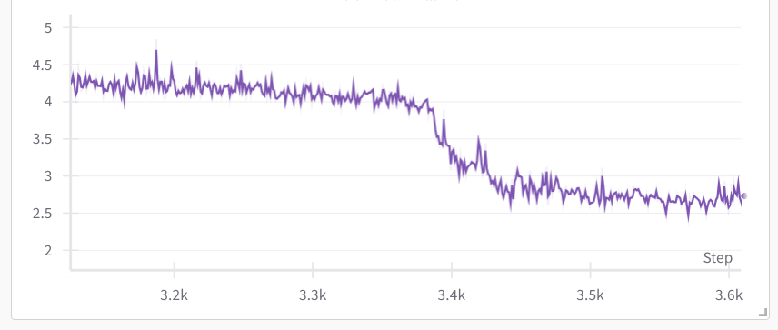
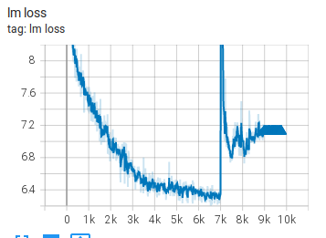
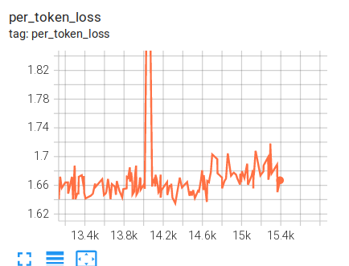
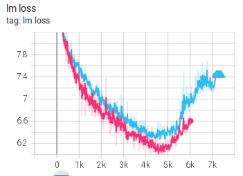
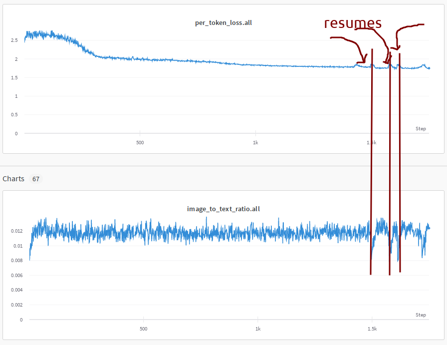
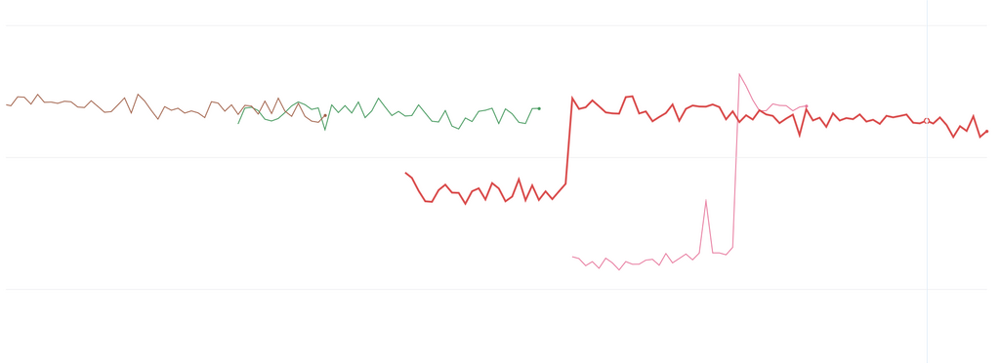

# 理解训练损失模式

训练损失图类似于心跳模式 - 有好的、坏的和你应该担心的。在研究了许多训练损失轨迹之后，人们会形成一种直觉来解释自己训练过程中的各种损失行为以及如何应对这些行为。

我提醒您，本节标题中的"理解"是多义的，因为很多时候我们并不真正理解为什么会发生某些类型的尖峰。在这里，"理解"指的是识别各种模式。然后我们通常有技术来克服坏的模式，并成功地将训练带到终点线。

因此，您会在这里找到一个训练损失模式的画廊，有时附有真实的解释，但更多时候是对可能发生的事情的有根据的猜测。

请原谅这些情节快照看起来彼此大相径庭，因为它们来自多年来的许多来源。

## 好的、坏的和意想不到的

让我们看一些好的、坏的和不寻常的模式。

### 一次非常失败的训练

在开始 BLOOM-176B 训练之前，我们使用 [104B 模型](https://github.com/bigscience-workshop/bigscience/tree/master/train/tr8-104B-wide) 进行了多次实验。我们未能弄清楚如何避免很早就发散。

如您所见，我们进行了多次尝试，应用了许多技术（请参阅[编年史](https://github.com/bigscience-workshop/bigscience/blob/master/train/tr8-104B-wide/chronicles.md)）。我们认为两个主要障碍是使用 fp16 和包含大量垃圾的数据。对于 BLOOM-176B，我们切换到 bf16，使用了更干净的数据，并添加了嵌入层归一化，这带来了天壤之别。

### 一次近乎完美的训练

[BLOOM-176B](https://github.com/bigscience-workshop/bigscience/tree/master/train/tr11-176B-ml) 训练的训练损失轨迹接近完美，只有一个在 200 步内恢复的尖峰。

您可以检查 [TB](https://huggingface.co/bigscience/tr11-176B-logs/tensorboard) 以放大并检查其他图。

这确实是一次近乎完美的训练。为了实现这一目标，我们付出了大量的努力。

### 顿悟时刻

最近，我在进行一些性能测试，并在从头开始训练的 llama-2-7b 上，在 8 个 A100 节点上运行了一个很小的全局批次大小为 8 的测试。（使用 HF Transformers [Llama](https://github.com/huggingface/transformers/tree/main/src/transformers/models/llama) 实现的 Deepspeed ZeRO-3 DP）

在这里，我们可以观察到，在经过非常稳定的缓慢改进后，损失在仅 480 个样本内从 4 迅速改善到 2.5。我的同事 [Gautam Mittal](https://github.com/gmittal) 称之为[顿悟](https://en.wikipedia.org/wiki/Grok)时刻。在短短几个步骤中，模型突然泛化到能更好地预测被掩盖的标记。

通常，在使用更大的批次大小时，不会看到如此巨大的改进。

如果我们放大，它大约需要 60 个每次迭代 8 个样本的步骤：

## 损失尖峰的主要类型

通常有 3 种类型的损失尖峰：

1. 快速恢复的尖峰
2. 缓慢恢复的尖峰
3. 未完全恢复的尖峰

尖峰通常是由于一个坏的数据包造成的，要么是由于数据洗牌不当，要么是因为它没有从网站上抓取的一些垃圾中清除。

虽然人们可能会怀疑尖峰前的批次是触发器，但如果您要研究该批次的内容，您很可能不会发现任何异常 - 通常问题在许多步骤之前就开始发展，然后突然发生。但研究该批次也可能不容易，因为当全局批次大小和序列长度巨大时，它的大小可能相当于一本书。

### 快速恢复尖峰

损失尖峰可能经常发生，只要它们迅速反弹回原来的位置，训练通常就会像什么都没发生一样继续：

这是[13B pre-BLOOM 训练实验](https://github.com/bigscience-workshop/bigscience/tree/master/train/tr1-13B-base)的一个例子：

如您所见，有许多尖峰，其中一些幅度很大，但它们都很快恢复了。

### 缓慢恢复的尖峰

这是来自 [IDEFICS-80B](https://github.com/huggingface/m4-logs/blob/master/tr-190-80b/chronicles.md) 训练的一个缓慢恢复的尖峰：

### 未完全恢复的尖峰

这个 [104B 模型尝试](https://github.com/bigscience-workshop/bigscience/tree/master/train/tr8-104B-wide) 出现了尖峰，开始恢复，但决定不完全恢复，而是开始发散

这是来自 [IDEFICS-80B](https://github.com/huggingface/m4-logs/blob/master/tr-190-80b/chronicles.md) 训练的另一个例子：

### 非尖峰发散

以下是一些没有经过尖峰就发散的例子

还有一些：

如您所见，每次重新启动都会取得一些进展，然后模型就会发散。

所有这些都来自 [104B 模型尝试](https://github.com/bigscience-workshop/bigscience/tree/master/train/tr8-104B-wide)。

### 多数据集尖峰

在 [IDEFICS-80B](https://github.com/huggingface/m4-logs/blob/master/tr-190-80b/chronicles.md) 训练期间，我们混合使用了两种不同的数据集类型：

图例：cm4（高）、平均值（中）和 pmd（低）

您可以看到，损失尖峰有时会同时出现在两个数据集上，而其他时候只有一个数据集的损失会飙升。

在这里，模型正在学习两种不同的数据分布，正如您所看到的，它没有报告相同的损失，并且两种数据分布上的尖峰行为也不同。对于模型来说，pmd 数据集的损失要比 cm4 数据集容易得多。

## 与恢复相关的尖峰

由于硬件崩溃或由于遇到分歧而需要回滚到较早的检查点而导致的训练恢复几乎肯定会发生。如果您的训练软件不能完美地恢复，以至于模型没有注意到有恢复，则可能会遇到各种问题。

恢复最复杂的挑战是恢复各种 RNG，到达先前训练恢复的 DataLoader 索引，以及如果您使用特定于您的设置的复杂 DataLoader，则处理各种其他要求。

### 数据采样器相关问题

在 [IDEFICS-80B](https://github.com/huggingface/m4-logs/blob/master/tr-190-80b/chronicles.md) 训练期间，我们有一个非常复杂的 DataLoader，当 DataLoader 在恢复时恢复时，它会遭受图像与文本比例波动的影响，所以我们最终在每次恢复时都会出现一个小尖峰，然后会恢复：

您可以在这里看到损失和比率图的相关性。由于我们不得不恢复大约十几次，我们看到了很多这样的尖峰。

### 重复数据的影响

我正在训练一个 Llama2 的变体，看到了这个超级不寻常的尖峰，它没有发散或恢复，而是切换到了一个新的更高的损失水平：

我回滚到奇怪行为发生之前并重新启动。损失训练在相同的损失水平上进行了一段时间，然后再次飙升并转移到更高的损失。

我以前从未见过这种类型的分歧。我挠了一会儿头，然后决定看看更大的图景。

截至本文撰写之时，[Wandb](https://wandb.ai/) 如果执行了回滚，则无法正确处理恢复数据绘图，也就是说，在克服旧数据的步骤之前，它会忽略回滚后的所有新数据。这迫使我们为每次带回滚的恢复启动一个新的 wandb 图，以便显示新数据。如果您需要查看整个图，则必须将它们拼接起来，其中包括不再为真的死数据点。所以我做了拼接，看到了这个谜题：

在前两次运行中没有真正的尖峰。损失首先就没有上升。在两次恢复中，由于完全重复的数据，它都低估了损失，然后它到达了它以前没有见过的数据，并开始正确报告。换句话说，它正在过拟合并报告一个虚假的损失。

问题的原因是数据重复，并且由于它清楚地记住了其中一些数据，因此它报告了更好的损失。

问题来自 [pytorch-lightning](https://github.com/lightning-ai/lightning) 没有正确地自动处理 DataSampler 的恢复 - 基本上每次你恢复时，你都是从头开始你的数据流。当然，这需要用户以某种方式解决这种情况。你可以改变种子来在一定程度上改善情况，避免完全相同的数据序列，但这仍然会让你有重复的数据，这对于任何严肃的训练（或消融实验，如果它们假设[IID 数据分布](https://en.wikipedia.org/wiki/Independent_and_identically_distributed_random_variables)）来说都不是你想要的。

脚注：我与 [PTL 开发人员讨论了这个问题](https://github.com/Lightning-AI/lightning/issues/18780)，他们说他们曾努力想出一个通用的解决方案，但没有成功。所以用户需要自己解决。

请务必检查您的训练框架文档，看它是否正确处理了 DataSampler 的恢复。确保您没有在训练完成后才发现这个问题，结果您只训练了计划的 300B 令牌中的 50B 令牌 6 次，而每个令牌应该只看到一次。

在开始真正的训练之前进行几次恢复也应该能暴露是否存在问题。尽管如此，如果数据在每次恢复时都重新洗牌，您不太可能看到它。只有在种子相同的情况下才能看到。
