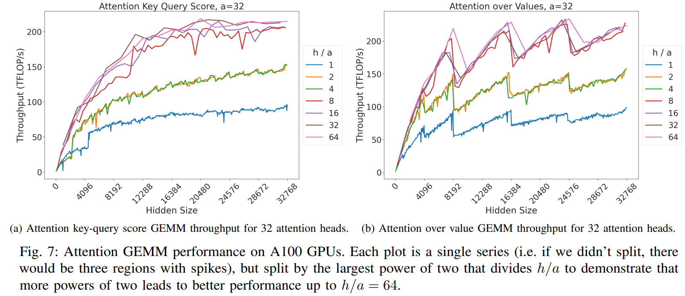
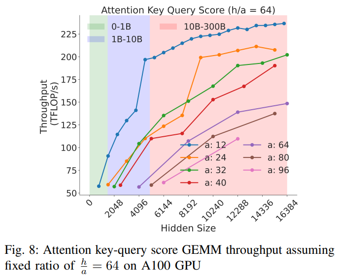
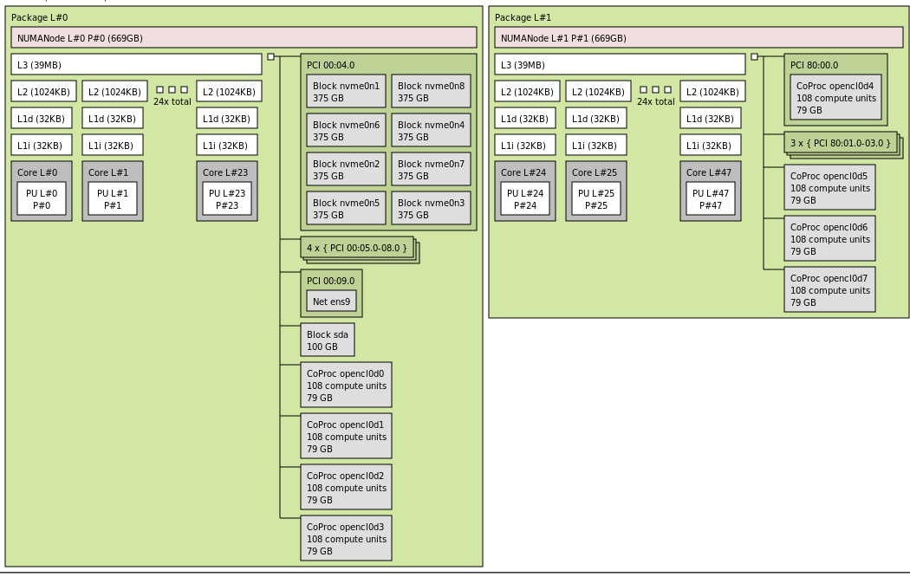

# 软件调优以获得最佳性能

您训练模型的速度越快，模型完成训练的时间就越早，这不仅对于第一个发布某些东西很重要，而且还可能节省大量资金。

总的来说，最大化吞吐量就是进行许多实验并测量结果，然后选择最优的那个。

在某些情况下，您的建模团队可能会要求您选择一些对吞吐量不利但对模型整体成功有利的超参数。


## 术语表和概念

- HFU: 硬件 FLOPS 利用率
- MFU: 模型 FLOPS 利用率

### MACs vs FLOP vs FLOPS vs FLOP/s

本节旨在尝试消除常见性能指标定义及其相互关系之间的歧义。

**MAC vs FLOP**:

- 1 FLOP（浮点运算）可以是加法、减法、乘法或除法运算之一。

- 1 次 MAC（乘法累加）运算是一次乘法后跟一次加法，即：`a * b + c`

因此 1 MAC = 2 FLOPs。现代硬件在一个时钟周期内执行 1 次 MAC 也很常见。

请注意，要计算 MAC 与 FLOP 的关系，反向逻辑适用，即 MACs = 0.5 FLOPs - 这有点令人困惑，因为我们刚刚说过 1 MAC = 2 FLOPs，但它是成立的 - 请看：100 FLOPs = 50 MACs - 因为每个 MAC 中有 2 个 FLOP。

此外，虽然 1 MAC = 2 FLOPs，但反过来不一定成立。也就是说，2 FLOPs 不一定等于 1 MAC。例如，如果您执行 `.5*.6` 100 次，那就是 100 FLOPs，这里等于 100 MACs，因为这里只执行了 MAC 的乘法部分。

**FLOP vs FLOPS vs FLOP/s**

- 1 FLOP（浮点运算）是任何浮点加法、减法、乘法或除法运算。

- 1 FLOPS（每秒浮点运算次数）是 1 秒内执行的浮点运算次数 - 请参阅 [FLOPS](https://en.wikipedia.org/wiki/FLOPS)

此外，您还会发现以下缩写：GFLOPS = Giga FLOPS，TFLOPS = Tera FLOPS 等，因为 150TFLOPS 比 150000000000000FLOPS 更容易快速掌握。

在写作中使用 FLOPS 时存在歧义 - 有时人们用它来表示操作的总量，有时它指的是每秒的操作数。后者是最常见的用法，也是本书中使用的定义。

在科学写作中，通常使用 FLOP/s 来清楚地告诉读者这是每秒的操作数。尽管这种特殊的方法很难转换为变量名，因为在删除非法字符后它仍然是 `flops`。

在某些地方，您可能还会看到 FLOPs，这又可能意味着任何一种，因为大小写 `s` 太容易翻转了。

如果定义不明确，请尝试搜索上下文，这应该有助于推断其含义：

- 如果是数学方程式，并且有时间除法，您就知道这是每秒的操作数。
- 如果正在讨论速度或性能，它通常指的是每秒的操作数。
- 如果它谈论的是做某事所需的计算量，它指的是操作的总量。


### TFLOPS 作为性能指标

在您开始优化训练设置的性能之前，您需要一个可以用来查看吞吐量是否在提高的指标。您可以测量每次迭代的秒数，或每秒的迭代次数，或其他类似的计时，但有一个更有用的指标可以测量 TFLOPS。

测量 TFLOPS 更优越，因为没有它，您不知道自己是否接近可以达到的最佳性能。这个测量值可以让您了解自己距离硬件制造商报告的峰值性能有多远。

在本节中，我将使用 BLOOM 的训练作为示例。我们使用了 80GB A100 NVIDIA GPU，并在混合 bf16 模式下进行训练。所以让我们看一下 [A100 规格](https://www.nvidia.com/en-us/data-center/a100/)，它告诉我们：

```
BFLOAT16 Tensor Core 	312 TFLOPS
```

因此，我们现在知道，如果我们只在巨大的、具有非常特定维度的 bf16 矩阵上运行 `matmul`，而不从设备复制数据，我们应该最多获得约 312 TFLOPS。

然而，实际上，由于磁盘 IO、通信和从 GPU 内存复制数据到其计算单元的开销，以及因为我们不能在 bf16 中完成所有操作，有时必须在 fp32 (或 tf32) 中进行数学计算，我们实际上期望得到的远低于此。实际值会因加速器而异，但对于 A100，在 2022 年，对于复杂的 384 GPU 训练设置，获得超过 50% (155 TFLOPS) 是一个惊人的可持续吞吐量。

脚注：2023 年，闪存注意力的发明和其他技术将标准推高到超过 50%。

当我们刚开始调整时，我们的 TFLOPS 低于 100，几周后我们启动训练时，我们设法达到了 150 TFLOPS。

这里需要注意的重要一点是，我们知道我们不能再进一步推进太多了，也知道没有必要再尝试进一步优化了。

因此，当您准备进行大规模模型训练时，一个通用的经验法则是 - 询问一下在给定的加速器上，在多节点设置下，使用指定的精度可以期望获得的最高 TFLOPS 是多少 - 然后进行优化，直到接近该值。一旦您做到了，就停止优化并开始训练。

脚注：对于 80GB A100，2022 年为 155，2023 年已推至约 180 TFLOPS。

脚注：在计算 TFLOPS 时，重要的是要记住，如果启用了[梯度检查点](#gradient-checkpointing)，数学计算是不同的，因为激活时会使用更多的计算，需要将其考虑在内。通常成本是额外的正向路径，但最近已经找到了更好的方法来节省一些重新计算。

对于解码器 transformer 模型，以下是一个估算公式，它会略微低估真实的 TFLOPS：

TFLOPS: `模型大小(B) * 4 * 2 * seqlen * 全局批量大小 / (每次迭代的秒数 * 总 gpu 数 * 1e3)`

如果使用激活/梯度检查点，则使用因子 4，否则将为 3。对于 100B+ 模型，激活检查点几乎总是开启的。

所以 `3*2` 通常被称为"模型 FLOPs"，`4*2` 被称为"硬件 FLOPs"，分别对应于 MFU 和 HFU（模型和硬件每秒 FLOPs 除以加速器的理论峰值 FLOPs）

```
perl -le '$ng=64; $ms=52; $gbs=1024; $sp=127; $seqlen=2048; print $ms*4*2*$seqlen*$gbs / ( $sp * $ng * 1e3)'
```
(ng = 总 gpu 数, ms = 模型大小 B, gbs = 全局批量大小, sp = 吞吐量（秒）)

这是使用 `bash` 环境变量的相同公式，它将 GBS 分解为 `MBS*DP*GAS`（在这种情况下，GAS 对应于 `pp_chunks`，即流水线中的块数，但通常 GAS 仅代表梯度累积步数）：
```
echo "($MSIZE*4*2*SEQLEN*$MICRO_BATCH_SIZE*$DP_SIZE*$GAS)/($THROUGHPUT*$NNODES*4*1000)" | bc -l
```

确切的公式在 [Efficient Large-Scale Language Model Training on GPU Clusters Using Megatron-LM](https://arxiv.org/abs/2104.04473) 论文的第 5.1 节的公式 3 中。您可以在[此处](https://github.com/bigscience-workshop/Megatron-DeepSpeed/pull/251)查看代码。

脚注：仅对于推理，每层需要 `24Bsh^2 + 4Bs^2h` 次浮点运算。


#### 自动计算 FLOP

直到最近，我们还必须依赖手动 FLOP 计算，如上一节所述——这些公式中有许多错误，而且许多模型根据各种配置设置的行为也不同。因此，正确计算 FLOP 可能很棘手（并且跨许多不同的模型架构）。但不要害怕，优秀的 PyTorch 团队开发了一种自动测量 FLOP 的方法。

```
from torch.utils.flop_counter import FlopCounterMode

flop_counter = FlopCounterMode(mods=model, display=False, depth=None)
with flop_counter:
    model(**input).sum().backward()
total_flops =  flop_counter.get_total_flops()
```
瞧，您已经为您计算好了 FLOP！

在我的代码中，我只在第二次迭代时运行它（因为第一次迭代可能有一些只运行一次的额外计算）。您不需要再重复它，只需缓存其值即可（当然，除非您遇到迭代因某种原因不相同的情况）。

所以剩下的就是测量每次特定迭代运行所花费的时间，然后将 FLOP 除以秒数和 `1e12` 以获得性能 TFLOPS。

```
tflops = total_flops / time / 1e12
```

这将在每次迭代时给您一个略有不同的值。


### MFU 与 HFU

模型 FLOPS 利用率 (MFU) 和硬件 FLOPS 利用率 (HFU) 估算在模型的前向和后向传递期间硬件的利用率（包括任何同步网络开销和可能的 DataLoader IO）。

```
MFU = 估算的已实现 FLOPS / 理论 FLOPS
HFU = 实际已实现 FLOPS / 理论 FLOPS
```

HFU 测量实际的 FLOPS。例如，[梯度检查点/激活重计算](#gradient-checkpointing)技术会第二次重复全部或部分 `forward` 传递，因此实际上使用了更多的 FLOS（浮点操作）。而 MFU 忽略了实现细节，只考虑了计算的理论需求，因此不太准确。

[在大型 Transformer 模型中减少激活重计算](https://arxiv.org/abs/2205.05198)是一篇关于这些概念的好论文。

`Theoretical_FLOPS` 是您在官方加速器规格中看到的内容。您可以在[此处](../../compute/accelerator#tflops-comparison-table)找到高端加速器的这些值的表格。让我们以 H100 为例。其 BF16 理论 TFLOPS 为 989 TFLOPS。

现在，假设您测量了实际训练循环的性能，实际实现的 FLOPS 为 400 TFLOPS。那么您的 MFU 为：
```
HFU = 400/989 = 0.40%
```

如果您没有使用激活重计算功能（不重复 `forward`），您的 HFU 和 MFU 将是相同的。如果您使用了它，您的计算将导致更少的 FLOS，从而导致更低的 FLOPS，因此 MFU 将低于 HFU。

例如 [Megatron-LM](https://github.com/NVIDIA/Megatron-LM) 发布了以下 A100-80GB 的统计数据：

| 模型大小 | 模型 FLOPs 利用率 | 硬件 FLOPs 利用率 |
| :---: | :---: | :---: |
| 22B   | 41.5% | 43.7% |
| 175B  | 51.4% | 52.8% |
| 530B  | 56.0% | 57.0% |
| 1T    | 56.3% | 57.0% |

如您所见，由于 Megatron-LM 在这些训练中使用了激活重计算，因此 MFU < HFU。

更多最近的 H100+A100 MFU/HFU 数据已在[此处](https://github.com/mosaicml/llm-foundry/tree/main/scripts/train/benchmarking#mfu-and-hfu)发布。

现在，每当您看到发布的 MFU 或 HFU 数字时，您都必须小心地将这些数字与任何其他类似的数字进行比较，直到您知道用于计算 FLOPS 的方法是相同的。由于 `HFU=Actual_Achieved_FLOPS/Theoretical_FLOPS` 并且 `Theoretical_FLOPS` 是固定的，因此这里唯一的变量是 `Actual_Achieved_FLOPS`，并且由于大多数时候是根据参数形状计算的估计值，因此存在许多计算版本，其中一些略不精确，而另一些则非常不精确。编译器也可能通过优化掉一些操作来影响有效的 FLOP。此外，您不知道迭代时间是如何测量的。

要回顾 `TFLOPS = FLOS / iteration_duration`。因此，为了进行公平的比较，需要问的两个主要问题是：
1. 总使用的浮点运算量是否以相同的方式计算？
2. 时间分量是每次迭代背靠背计算的，包括 `DataLoader` 和日志记录，还是仅包括 `fwd`+`bwd` 部分？

如果这两者中的任何一个或两个不匹配，那么您就无法进行公平的比较。

不幸的是，大多数时候论文和博客文章只报告 MFU 数字，而没有链接到它是如何计算的。

但是，不要害怕，如果您在将您的结果与竞争结果进行比较时遇到困难，请记住上面描述的测量伪影。
这些伪影不会改善底线吞吐量，因此，只要您始终使用您选择的任何方式来计算 TFLOPS，您就会立即看到您的应用程序的性能何时提高或降低，因为相对数字对您来说最重要。

#### MFU 是一个非常粗略的近似值

大多数训练/微调方案都使用混合精度，但在计算 MFU/HFU 时，却使用最快格式的计算。例如，对于 BF16 混合精度训练，部分计算在 BF16 中完成，而其他部分则在 FP32 中完成！但我们测量 FLOPS 时，就好像所有东西都在 BF16 中完成一样，这当然会导致非常不精确的测量。理想情况下，每个计算段都应单独测量，以说明何时使用了哪种格式。它之所以在某种程度上奏效，是因为较小格式的计算通常在那些混合精度训练方案中占主导地位。

此外，根据集群设置——特别是存储 IO 和网络 IO 的大量参与，相同的软件可能会提供不同的 MFU，因为并非所有集群都是生而平等的。因此，比较您特定设置优化前后的 MFU 是可以的，但很难将您的设置的 MFU 与另一个团队集群的 MFU 进行比较。


## 如何提高速度并节省内存

您为批量大小 (BS) 拥有的 GPU 内存越多，GPU 执行计算的效率就越高，您完成任务的速度也就越快，因为您能更快地处理数据。

当然，当您甚至在 BS=1 时就遇到 GPU OOM 并且不想租用/购买更多硬件时，本节至关重要。


以下是哪些功能可以帮助提高速度或节省内存的概述

| 方法                   | 速度  | 内存 |
| :----------------------  | :----  | :----- |
| 梯度累积    | 是    | 是    |
| 梯度检查点   | 否*    | 是    |
| 混合精度训练 | 是    | 否     |
| 批量大小               | 是    | 是    |
| 优化器选择         | 是    | 是    |
| DataLoader               | 是    | 否     |
| DeepSpeed Zero           | 否     | 是    |
| Flash Attention          | 是    | 是    |

* 梯度检查点会降低给定批量大小的速度，但由于它释放了大量内存，从而可以实现更大的批量大小，因此实际上提高了整体速度。


### 模型操作剖析

Transformers 架构包括 3 个主要的操作组，按计算强度分组如下。

1. **张量收缩**

    线性层和多头注意力的组件都执行批处理**矩阵-矩阵乘法**。这些操作是训练 transformer 中计算最密集的部分。

2. **统计归一化**

    Softmax 和层归一化比张量收缩的计算密集度低，并且涉及一个或多个**归约操作**，其结果然后通过映射应用。

3. **逐元素操作**

    这些是剩余的操作：**偏置、dropout、激活和残差连接**。这些是计算密集度最低的操作。

这些知识有助于在分析性能瓶颈时了解情况。

本摘要源自 [Data Movement Is All You Need: A Case Study on Optimizing Transformers 2020](https://arxiv.org/abs/2007.00072)


### 模型内存使用剖析

我们已经看到，训练模型比仅仅将模型放在 GPU 上使用更多的内存。这是因为在训练过程中有许多组件使用 GPU 内存。GPU 内存上的组件如下：

1. 模型权重
2. 优化器状态
3. 梯度
4. 为梯度计算保存的前向激活
5. 临时缓冲区
6. 特定功能的内存

一个在混合精度下使用 AdamW 训练的典型模型，每个模型参数需要 18 个字节，外加激活内存和临时内存。

我们来看一下细节。

**模型权重：**

- fp32 训练每个参数 4 字节
- 混合精度训练每个参数 6 字节（在内存中维护一个 fp32 模型和一个 fp16/bf16 模型）

**优化器状态：**

- 普通 AdamW 每个参数 8 字节（维护 2 个状态）
- 在 bf16 下运行的 AdamW 每个参数 4 字节。请参阅[此工作](https://github.com/huggingface/transformers/pull/21312)，它使用 `AnyPrecisionAdamW`。
- 像 SGD with momentum（只维护 1 个状态）或 LION 或 Adafactor（以及其他）这样的优化器每个参数 4 字节（Adafactor 除了 4 字节外还使用一些额外的内存）
- 像 [bitsandbytes](https://github.com/TimDettmers/bitsandbytes) 这样的 8 位 AdamW 优化器每个参数 2 字节

**梯度**

- 对于 fp32 精度和某些框架下的混合半精度训练，每个参数 4 字节。
- 对于非混合半精度和某些框架下的混合半精度训练，每个参数 2 字节。

**前向激活**

- 大小取决于许多因素，关键因素是序列长度、隐藏大小和批量大小。

有被前向和后向函数传递和返回的输入和输出，以及为梯度计算保存的前向激活。

**临时内存**

此外，还有各种临时变量，计算完成后会释放，但当时这些变量可能需要额外的内存，并可能导致 OOM。因此，在编码时，战略性地考虑这些临时变量至关重要，有时还需要在不再需要它们时明确地释放它们。

**特定功能的内存**

然后您的软件可能有特殊的内存需求。例如，当使用束搜索生成文本时，软件需要维护输入和输出的多个副本。


对于**推理**，数学计算与训练非常相似，只是没有优化器状态和梯度。对于模型权重，只有一个参数数量的乘数：

- 混合精度 6 字节 (4+2)
- fp32 4 字节
- 半精度 2 字节
- 量化 int8 精度 1 字节

另一个很好的资源是[Transformer Math 101](https://blog.eleuther.ai/transformer-math/)，它带您了解内存需求和其他要求。

[EAI cookbook](https://github.com/EleutherAI/cookbook) 包含一组[计算脚本](https://github.com/EleutherAI/cookbook/tree/main/calc)，可以根据您的配置和设置输出给定训练或推理计算运行的理论内存开销。

有一个非常方便的 [GPU VRAM 估算器](https://vram.asmirnov.xyz/)，由 Alexander Smirnov 提供，以及[其工作原理的说明](https://asmirnov.xyz/vram)。


### 额外的 GPU 内存使用

除了上一节中描述的内存使用情况外，还有其他 GPU 内存的消费者——所以你永远得不到模型的全部内存。

#### 预加载的 CUDA 内核内存使用

当 PyTorch 第一次使用 CUDA 时，它可能会占用 0.5-2GB 的 GPU 内存，从而减少 GPU 的总可用内存。这部分内存不会被 torch 内存分析器计算在内。

为 cuda 内核分配的内存大小因 GPU 而异，也可能因 pytorch 版本而异。让我们在 cuda 上分配一个 4 字节的张量，并检查预先占用了多少 GPU 内存。

使用 `pytorch==1.10.2`：
```
$ CUDA_MODULE_LOADING=EAGER python -c "import torch; x=torch.ones(1).cuda(); free, total = map(lambda x: x/2**30, torch.cuda.mem_get_info()); \
used=total-free; print(f'pt={torch.__version__}: {used=:0.2f}GB, {free=:0.2f}GB, {total=:0.2f}GB')"
pt=1.10.2: used=1.78GB, free=77.43GB, total=79.21GB
```

使用 `pytorch==1.13.1`：
```
$ CUDA_MODULE_LOADING=EAGER python -c "import torch; x=torch.ones(1).cuda(); free, total = map(lambda x: x/2**30, torch.cuda.mem_get_info()); \
used=total-free; print(f'pt={torch.__version__}: {used=:0.2f}GB, {free=:0.2f}GB, {total=:0.2f}GB')"
pt=1.13.1: used=0.90GB, free=78.31GB, total=79.21GB
```

旧的 pytorch"浪费"了 1.78GB 的 A100，而新的只用了 0.9GB，从而节省了高达 0.9GB 的内存，这对于 OOM 的情况来说可能是救命稻草。

如果我们要强制 cuda 内核预加载，`CUDA_MODULE_LOADING=EAGER` 在最近的 pytorch 版本中是必需的，否则它们会按需延迟加载。但不要在生产环境中使用此设置，因为它很可能比需要的使用更多的内存。延迟加载的全部意义在于只加载需要的内核。

使用 `pytorch==2.1.1`：
```
$ CUDA_MODULE_LOADING=EAGER python -c "import torch; x=torch.ones(1).cuda(); free, total = map(lambda x: x/2**30, torch.cuda.mem_get_info()); \
used=total-free; print(f'pt={torch.__version__}: {used=:0.2f}GB, {free=:0.2f}GB, {total=:0.2f}GB')"
pt=2.1.1+cu121: used=0.92GB, free=78.23GB, total=79.15GB
```
与延迟模式相比：
```
$ python -c "import torch; x=torch.ones(1).cuda(); free, total = map(lambda x: x/2**30, torch.cuda.mem_get_info()); \
used=total-free; print(f'pt={torch.__version__}: {used=:0.2f}GB, {free=:0.2f}GB, {total=:0.2f}GB')"
pt=2.1.1+cu121: used=0.47GB, free=78.68GB, total=79.15GB
```
有 450MB 的差异，但这里我们只加载了 `torch.ones` 的内核——实际运行时使用 torch API 的其他代码分配的内存将在 0.47 到 0.92GB 之间。


#### `torch.distributed` 内存使用

当使用 `torch.distributed` 时，预计会占用约 1-2GB 的 GPU 内存用于初始化——GPU 越多，使用的内存就越多。不同的后端可能会使用不同数量的内存。这部分内存不会被 torch 内存分析器计算在内。

这里是 [torch-dist-mem-usage.py](distributed/torch-dist-mem-usage.py)，它演示了实际的内存使用情况：

```
$ python -u -m torch.distributed.run --nproc_per_node=2 --rdzv_endpoint localhost:6000  --rdzv_backend c10d \
torch-dist-mem-usage.py
[...]
[0] mp: before barrier
[0] mp: MA 0.00 GB | Max_MA 0.00 GB | CA 0.00 GB | Max_CA 0.00 GB | NV 0.55 GB | CPU Virtual Memory:  used = 68.79 GB, percent = 3.4%
[0] mp: after barrier
[0] mp: MA 0.00 GB | Max_MA 0.00 GB | CA 0.00 GB | Max_CA 0.00 GB | NV 2.00 GB | CPU Virtual Memory:  used = 69.33 GB, percent = 3.5%
[0] mp: after 2nd barrier
[0] mp: MA 0.00 GB | Max_MA 0.00 GB | CA 0.00 GB | Max_CA 0.00 GB | NV 2.00 GB | CPU Virtual Memory:  used = 69.33 GB, percent = 3.5%
[0] mp: after dist destroy
[0] mp: MA 0.00 GB | Max_MA 0.00 GB | CA 0.00 GB | Max_CA 0.00 GB | NV 1.28 GB | CPU Virtual Memory:  used = 69.25 GB, percent = 3.5%
[0] mp: after dist destroy
[0] mp: MA 0.00 GB | Max_MA 0.00 GB | CA 0.00 GB | Max_CA 0.00 GB | NV 1.28 GB | CPU Virtual Memory:  used = 69.25 GB, percent = 3.5%
```

所以你可以看到 [CUDA 内核](#preloaded-cuda-kernels-memory-usage)占用了 0.55GB（第一行 `NV 0.55 GB`），但是当运行 `dist.barrier` 时，又消耗了 1.5GB。如果你在 `init_process_group` 中使用 `device_id` 参数，那么额外的内存分配将移到该调用中，而 `dist.barrier` 使用的内存会更少。


#### 内存碎片

当模型分配和释放张量时，内存可能会碎片化。也就是说，可能有足够的可用内存来分配，比如说，1GB 的连续内存，但它可能以 100 个小段的形式分散在整个内存中，因此即使内存可用，也无法使用，除非进行非常小的分配。

环境变量 `PYTORCH_CUDA_ALLOC_CONF` 可以提供帮助，并允许您用更高效的机制替换默认的内存分配机制。有关更多信息，请参阅[内存管理](https://pytorch.org/docs/stable/notes/cuda.html#memory-management)。


### 批量大小

首先，通常有两个批量大小：

1. 微批量大小 (MBS)，也称为每个 gpu 的批量大小 - 这是单个 gpu 在模型的单次 `forward` 调用期间消耗的样本数。

2. 全局批量大小 (GBS) - 这是在所有参与的 GPU 上两个优化器步骤之间消耗的样本总数。

模型副本是指容纳完整模型所需的 gpu 数量。

- 如果模型适合单个 GPU，则模型副本需要 1 个 GPU。通常，可以使用多个 GPU 执行[数据并行](../../training/model-parallelism#data-parallelism)
- 如果模型不适合单个 GPU，通常需要某种分片技术——可以是[张量并行](../../training/model-parallelism#tensor-parallelism) (TP)、[流水线并行](../../training/model-parallelism#pipeline-parallelism) (PP) 或 [ZeRO 数据并行](../../training/model-parallelism#zero-data-parallelism) (ZeRO-DP)。

您可以拥有与副本数量一样多的数据流。这与 DP 的值相同。
- 因此，在模型适合单个 GPU 的简单情况下。数据流的数量与 GPU 的数量相同。DP=N_GPUS
- 当模型不适合单个 GPU 时，在 3D 并行的情况下 `DP=N_GPUs/(TP*PP)`，在 ZeRO 并行的情况下 DP=ZeRO-DP。

回到我们的全局批量大小 (GBS)，它的计算公式是：

```
GBS = MBS*DP
```

所以，如果你有 8 个 gpu (N_GPUS=8)，你的 MBS=4，并且你做 DP，你最终会得到 GBS=32，因为：

```
GBS = MBS*DP = 4*8 = 32
```

如果您使用 TP 度为 2 (TP=2) 和 PP 度为 2 (PP=2)，这意味着每个模型副本需要 4 个 gpu (`TP*PP`)，因此对于 N_GPUS=8

```
DP = N_GPUS/(TP*PP) = 8 / (2*2) = 2
```
现在 GBS 变成：

```
GBS = MBS*DP = 4*2 = 8
```

如果您的训练设置需要[梯度累积](#gradient-accumulation)，通常会定义一个在执行梯度累积之前等待的步数间隔。该术语通常是梯度累积步数 (GAS)。如果 GAS=4（即每 4 步同步一次梯度）并且 TP=1, PP=1 和 DP=8：


```
DP = N_GPUS/(TP*PP) = 8 / (1*1) = 8
GBS = MBS*DP*GAS = 4*8*4 = 128
```

通常，您希望使微批量大小尽可能大，以便 GPU 内存接近满，但又不要太满。

对于大型模型，通常没有多少可用的 GPU 内存来容纳大的微批量大小，因此您能容纳的每个额外样本都很重要。

虽然序列长度、隐藏大小和各种其他超参数是 2 的高倍数（64、128 及更高）对于实现最高性能至关重要，但由于在大多数模型中，批量维度在计算期间与序列长度维度被展平，因此微批量大小的对齐通常对性能影响很小或没有影响。

因此，如果您尝试使用微批量大小为 8 并出现 OOM，但 7 可以容纳 - 请使用后者而不是 4。批量大小越高，您将能够在单个步骤中容纳的样本就越多。

当然，当使用数百个 GPU 时，您的全局批量大小可能会变得非常大。在这种情况下，您可能会使用较小的微批量大小或使用较少的 GPU 或切换到不同形式的数据并行，以便 GPU 更有效地工作。


### 梯度累积

梯度累积的思想是，不是一次性计算整个批次的梯度，而是分小步进行。我们这样做的方法是，通过模型的正向和反向传递，以较小的批次迭代计算梯度，并在此过程中累积梯度。当累积了足够的梯度后，我们运行模型的优化步骤。通过这种方式，我们可以轻松地将总批次大小增加到 GPU 内存永远无法容纳的数字。然而，这反过来又会因为额外的正向和反向传递而稍微减慢训练速度。

梯度累积步数 (GAS) 是在不更新模型权重的情况下执行的步数定义。

当使用流水线并行时，非常大的梯度累积是必须的，以将[流水线的气泡保持在最小](../../training/model-parallelism/README.md#naive-model-parallelism-vertical)。

由于在使用梯度累积时，优化器步骤的执行频率较低，因此这里也存在额外的速度提升。

以下基准测试演示了增加梯度累积步数如何提高整体吞吐量（20-30% 的速度提升）：

- [RTX-3090](https://github.com/huggingface/transformers/issues/14608#issuecomment-1004392537)
- [A100](https://github.com/huggingface/transformers/issues/15026#issuecomment-1005033957)

当使用[数据并行](../../training/model-parallelism#data-parallelism)时，梯度累积进一步提高了训练吞吐量，因为它减少了梯度归约调用的次数，这通常通过 `all_reduce` 集合来完成，其成本为 2 倍梯度的规约大小。因此，例如，如果在 `DistributedDataParallelism` (DDP) 中从 GAS=1 变为 GAS=8，网络开销将减少 8 倍，这在慢速的节点间网络上可以显著提高训练吞吐量。


### 梯度检查点

**梯度检查点**也称为**激活重计算**和**激活检查点**。

此方法仅与训练相关，与推理无关。

启用梯度检查点允许您用训练吞吐量换取加速器内存。当此功能激活时，不是记住，比如说，transformer 块的输出直到 `backward` 传递完成，而是丢弃这些输出。这释放了大量的加速器内存。但是，当然，没有 `forward` 传递的输出就不可能进行 `backward` 传递，因此必须重新计算它们。

当然，这可能因模型而异，但通常需要付出大约 20-25% 的吞吐量下降，但由于释放了大量的 gpu 内存，现在可以增加每个 gpu 的批量大小，从而总体上提高系统的有效吞吐量。在某些情况下，如果您已经能够使用小批量大小而没有 OOM，这可以让您将批量大小加倍或四倍。（最近的论文报告了高达 30-40% 的额外开销。）

激活检查点和梯度检查点是同一方法的两个术语。

例如，在 HF Transformers 模型中，您可以通过 `model.gradient_checkpointing_enable()` 在您的自定义 Trainer 中激活它，或者如果您使用 HF Trainer，则可以通过 `--gradient_checkpointing 1` 激活它。

XXX：扩展来自论文的新技术：[减少大型 Transformer 模型中的激活重计算](https://arxiv.org/abs/2205.05198)，该论文找到了一种避免大多数激活重计算的方法，从而节省了内存和计算。

### 内存高效的优化器

最常见的优化器是 Adam。它及其衍生品都使用每个参数 8 个字节（2 个 fp32 张量 - 每个动量一个），这占了模型、优化器和梯度内存分配的近一半。因此，有时使用其他优化器可以挽救局面，前提是它们能成功训练。并非所有优化器都适用于所有训练任务。

4 字节优化器：

- 有像 Adafactor 这样的优化器只需要 4 个字节。最近发明的 [LION 优化器](https://arxiv.org/abs/2302.06675)也是如此。

- `AnyPrecisionAdamW`。一些勇敢的人尝试在 BF16 中进行整个训练（不是混合精度！），包括优化器，因此每个参数的优化器状态只需要 4 个字节。请参阅[此工作](https://github.com/huggingface/transformers/pull/21312)。提示：此优化器需要 Kahan 求和和/或随机舍入，请参阅[重新审视 BFloat16 训练 (2020)](https://arxiv.org/abs/2010.06192)。在这里，每个参数的权重、优化器状态和梯度只需要 8 个字节！而不是 18 个！

2 字节优化器：

- 有像 `bnb.optim.Adam8bit` 这样的量化解决方案，它只使用 2 个字节而不是 8 个字节（每个动量 1 个字节）。您可以从[此处](https://github.com/TimDettmers/bitsandbytes)获取它。安装后，如果您使用 HF Trainer，只需传递 `--optim adamw_bnb_8bit` 即可启用它！

有关速度比较，请参阅[此基准测试](https://github.com/huggingface/transformers/issues/22101)
速度方面：`apex` 的 `apex.optimizers.FusedAdam` 优化器是迄今为止 Adam 的最快实现。自 pytorch-2.0 起，[torch.optim.AdamW](https://pytorch.org/docs/stable/generated/torch.optim.AdamW.html) 添加了对 `fused=True` 选项的支持，这使其几乎与 `apex.optimizers.FusedAdam` 相媲美。


## 模型执行速度

### `forward` vs `backward` 执行速度

对于卷积和线性层，后向的 flop 是前向的 2 倍，这通常转化为约 2 倍的减速（有时更多，因为后向的大小往往更尴尬）。激活通常受带宽限制，并且激活在后向读取的数据通常比在前向多（例如，激活前向读取一次，写入一次，激活后向读取两次，`gradOutput` 和前向的输出，并写入一次，`gradInput`）。


## 内存分析器工具

在本章中，我们讨论了这样或那样的功能应该消耗多少 MB 内存的理论数学。但通常在现实中，情况并不完全相同。所以你计划了某种模型大小和批量大小，但是当你来使用它时，突然发现没有足够的内存。所以你需要用你实际的代码和模型来工作，看看哪个部分占用了多少内存，哪里计算错误或者一些额外的未被考虑的开销。

为此，您需要使用某种内存分析器。有各种各样的内存分析器。

我为快速轻松地分析每行或每块代码而开发的一个有用工具是
[IPyExperiments](https://github.com/stas00/ipyexperiments)。您只需将代码加载到 jupyter notebook 中，它就会自动告诉您每个块分配/释放了多少 CPU/GPU 内存。所以，例如，如果您想查看加载一个模型占用了多少内存，然后单个推理步骤又占用了多少额外内存——包括峰值内存报告。


## 向量和矩阵大小的可分性

论文 [The Case for Co-Designing Model Architectures with Hardware](https://arxiv.org/abs/2401.14489) 研究了 transformer 尺寸对底层硬件的影响。相关的[脚本](https://github.com/EleutherAI/cookbook/tree/main/benchmarks/sizing)允许您在 NVIDIA V100/A100 以外的硬件上自己运行基准测试。

当批量大小和输入/输出神经元计数可被某个数字整除时，可以获得最有效的性能，这个数字通常从 8 开始，但也可以大得多。这个数字因所使用的特定硬件和模型的 dtype 而有很大差异。

对于全连接层（对应于 GEMM），NVIDIA 提供了关于[输入/输出神经元计数](
https://docs.nvidia.com/deeplearning/performance/dl-performance-fully-connected/index.html#input-features)和[批量大小](https://docs.nvidia.com/deeplearning/performance/dl-performance-fully-connected/index.html#batch-size)的建议。

[Tensor Core 要求](https://docs.nvidia.com/deeplearning/performance/dl-performance-matrix-multiplication/index.html#requirements-tc)定义了基于 dtype 和硬件的乘数。例如，对于 fp16，建议使用 8 的倍数，但在 A100 上是 64！

对于小参数，还应考虑[维度量化效应](https://docs.nvidia.com/deeplearning/performance/dl-performance-matrix-multiplication/index.html#dim-quantization)，这是平铺发生的地方，正确的乘数可以显著提速。

[The Case for Co-Designing Model Architectures with Hardware](https://arxiv.org/abs/2401.14489) 提供了关于平铺/波形量化和注意力头数的更详细信息，但重点是：

### 平铺和波形量化

符号：

- `a`: 注意力头的数量
- `h`: 隐藏维度大小
- `s`: 序列长度
- `b`: 微批量大小
- `t`: 张量并行大小

首先，一些背景知识。

NVIDIA GPU 将输出矩阵划分为区域或瓦片，如下图所示，并将它们调度到 GPU 上的可用流式多处理器 (SM) 之一（例如，A100 GPU 有 108 个 SM）。每个瓦片或线程块在 Tensor Core 中处理，这是 NVIDIA 为快速张量运算引入的。NVIDIA Tensor Core 仅适用于具有适当维度的 GEMM。当 GEMM 维度 `m`、`k` 和 `n` 分别是 V100 和 A100 GPU 的 16 字节和 128 字节的倍数时，可以充分利用 Tensor Core。由于 FP16 元素是 2 字节，这分别对应于 8 和 64 个元素的倍数的维度大小。如果这些维度大小不可能，Tensor Core 在更大的 2 字节倍数下表现更好。


内核可以选择多种瓦片大小。如果 GEMM 大小不能被瓦片大小整除，就会有浪费的计算，其中线程块必须在 SM 上完全执行，但只需要部分输出。这被称为**瓦片量化**效应，因为输出被量化为离散的瓦片。

另一个量化效应称为**波形量化**。当线程块被调度到 SM 时，一次只能调度 108 个线程块。例如，如果必须调度 109 个线程块，则必须调度两轮或两波线程块到 GPU。第一波将有 108 个线程块，第二波将有 1 个。第二波的延迟几乎与第一波相同，但有效计算量很小。随着矩阵大小的增加，最后一波或尾波会增长。吞吐量将增加，直到需要新的一波。然后，吞吐量将下降。

这对 transformers 意味着，对于给定的 `h/a` 比率，需要确保它们位于波的波峰上。如果您使用的是 NVIDIA V100/A100 GPU，我们已经在 https://arxiv.org/pdf/2401.14489.pdf 中为您完成了这项工作。

一个 32 个注意力头的例子：



`h/a` 中更多的 2 的幂有帮助！


### 注意力头的数量和大小

通常，在不降低准确性的情况下，保持 `h/a` 的比率尽可能大是计算效率最高的。[The Case for Co-Designing Model Architectures with Hardware](https://arxiv.org/abs/2401.14489) 中有一个很好的图表显示了这种效果：




### Flash attention

如果您正在使用 [Flash Attention](https://github.com/Dao-AILab/flash-attention)，好消息！这些 MHA 大小限制已为您处理好。您唯一的限制是拥有足够大的 `h/a` 比率来饱和您的 GPU 核心：


### SwiGLU-based MLP

像 PaLM、LLaMA、Mistral 等模型使用 SwiGLU 激活函数来代替更常见的 GLU 激活函数。

基于 SwiGLU 的 MLP 在其激活函数中包含一个额外的学习矩阵。因此，MLP 块包含 3 个矩阵而不是原来的 2 个。为了保持 MLP 块中的总参数数量，引入 [SwiGLU](https://arxiv.org/abs/2002.05202) 的论文建议使用 `dim_mlp = 8/3*dim_attn` 而不是典型的 `dim_mlp = 4*dim_attn`。[The Case for Co-Designing Model Architectures with Hardware](https://arxiv.org/abs/2401.14489) 论文提供了寻找能导致最佳 `matmul` 性能的隐藏维度 (`h`) 值的建议，如果您使用 `8/3*h`，很可能会导致 MLP 块慢得多，因为 `8/3` 会破坏所有对齐。

为了克服这个问题，只需要意识到 `8/3` 系数只是一个建议，因此可以找到其他附近的系数，从而在 MLP 中产生形状更好的矩阵。事实上，如果您查看公开可用的 Llama-2 模型，其 7B 变体使用 `11008/4096 = 2.6875` 作为系数，这非常接近 `8/3 = 2.667`，而其 70B 变体使用更大的 `28672/8192 = 3.5` 系数。在这里，70B 变体的 MLP 块最终包含的参数明显多于不使用 SwiGLU 的典型 transformer 块。

现在我们知道推荐的系数并不精确，并且由于已经选择了好的 `h`，现在可以搜索一个好的附近系数，该系数仍然可以在 MLP 中产生高性能的 GEMM。运行暴力搜索显示 Llama-2-7B 的中间大小确实是其范围内性能最佳的大小之一。

这里是 [swiglu-maf-bench.py](benchmarks/matrix-shape/swiglu-maf-bench.py)，可以轻松地适应您的用例，一旦在目标硬件上运行训练，您将能够找到 MLP 的最佳隐藏大小。

让我们在 H100 上运行它，`h = 4096`：

```
./swiglu-maf-bench.py
希望找到最接近 10922 d_ff 值且能产生最高 TFLOPS 的值 (d_hidden=4096)

在 10822 .. 11022 范围内搜索 50 步
结果：基线，后跟附近性能最佳的 d_ff 结果：

 d_ff  tflops mlp_params
-------------------------
10922  272.73 134209536
-------------------------
10944  398.38 134479872
10848  395.62 133300224
10880  395.52 133693440
10912  395.16 134086656
11008  395.01 135266304
```

可以很容易地看到，`8/3*4096=10922` leads to a rather slow performance. But `10944`，它只比 `10922` 大 `22`，却为 `matmul` 带来了高达 46% 的速度提升。相应的 MLP 总参数也打印出来了，以防您想选择稍慢但参数数量不同的选项。


### 模型尺寸调整的最终建议

完整的建议是：
1. 词汇表大小可被 64 整除
2. 微批量大小尽可能大
3. `b*s`, `h/a` 和 `h/t` 应能被 2 的幂整除
4. `(b*a)/t` 应为整数
5. `t` 应尽可能小
6. 对于 SwiGLU，搜索接近 `8/3*h` 的性能最佳的隐藏大小

### 附加阅读

- [矩阵乘法喜欢什么形状？](https://www.thonking.ai/p/what-shapes-do-matrix-multiplications)


## NUMA 亲和性

[非统一内存访问 (NUMA)](https://en.wikipedia.org/wiki/Non-uniform_memory_access) 是一种用于多处理的计算机内存设计，其中内存访问时间取决于内存位置相对于处理器的位置。
由于现代服务器有多个 CPU，为了获得最佳性能，与相应 CPU 位于同一 NUMA 节点上的加速器应该将进程绑定到该同一 NUMA 节点。

首先，让我们了解 NUMA 节点表示什么。

这是一个典型的 A100 8x GPU 服务器 NUMA 节点图：



如您所见，它有 2 个 CPU，每个 CPU 定义一个 NUMA 块，每个块包含一组 4 个 GPU。GPU 是灰色的块，上面写着 `CoProc`，有 108 个计算单元 (SM) 和 79GB 的内存。

脚注：该图由 [hwloc](https://github.com/open-mpi/hwloc) 的 `lstopo a100.png` 生成。

如果您正在使用超线程，您会希望使用 `lstopo -l` 来正确显示 HT 核心数。例如，如果您有 2 个 NUMA 节点，8 个加速器，104 个物理 cpu 核心和 208 个逻辑核心——因此（`208/8=26` 个 HT 核心/GPU），那么 HT 核心将用于：

- gpu0..3 `[0, 1,  2, 3, ...,  51, 104, 105, 106, ..., 129]`
- gpu4..7 `[52, 53, 54, ..., 103, 156, 157, 158, ..., 207]`

您首先获得物理 cpu 核心数，然后是剩余的 HT 核心，因此有奇怪的间隙。

如果这是一个 NVIDIA 节点，另一种简单地查看 CPU 亲和性的方法是运行：

```
$ nvidia-smi topo -m
        GPU0    GPU1    GPU2    GPU3    GPU4    GPU5    GPU6    GPU7    CPU Affinity    NUMA Affinity
GPU0     X      NV18    NV18    NV18    NV18    NV18    NV18    NV18    0-51,104-155    0
GPU1    NV18     X      NV18    NV18    NV18    NV18    NV18    NV18    0-51,104-155    0
GPU2    NV18    NV18     X      NV18    NV18    NV18    NV18    NV18    0-51,104-155    0
GPU3    NV18    NV18    NV18     X      NV18    NV18    NV18    NV18    0-51,104-155    0
GPU4    NV18    NV18    NV18    NV18     X      NV18    NV18    NV18    52-103,156-207  1
GPU5    NV18    NV18    NV18    NV18    NV18     X      NV18    NV18    52-103,156-207  1
GPU6    NV18    NV18    NV18    NV18    NV18    NV18     X      NV18    52-103,156-207  1
GPU7    NV18    NV18    NV18    NV18    NV18    NV18    NV18     X      52-103,156-207  1
```
在这个 H100 集群上，您可以看到 `CPU Affinity` 列，它告诉您哪些核心与第一组和第二组 GPU 驻留在同一位置，以及 `NUMA Affinity` 列。

现在很清楚，各种计算组件被放置在 2 个或更多个组中，为了实现最佳性能，我们需要确保组件在它们所属的组内通信，并避免任何交叉通信。例如，如果 gpu0 属于 NUMA 节点 0，那么驱动此 GPU 的进程应仅使用 NUMA 节点 0 的 cpu 核心。

同样的情况也应该适用于网络或您可能控制的任何其他组件。

然而，实际上，根据我到目前为止的经验，如果您的工作负载对 CPU 的要求很轻，这种更改对整体性能的影响很小，但如果 CPU 使用率很高，则可能会产生相当大的影响。另一方面，如果做最有效的事情很容易，即使是最小的改进也可能在长时间的训练作业中累积起来，所以 IMHO，这是值得实现的。

### NUMA 进程绑定

有多种方法可以实现将进程绑定到正确 NUMA 节点的 cpu 核心。

#### numactl

最常见的工具之一是使用 `numactl`，它在启动新进程时设置 NUMA 亲和性。

例如，我们来看看如何将其与 `torchrun` 启动器集成。

此启动器目前需要一个辅助工具 [numa-set.sh](benchmarks/numa/numa-set.sh) 来执行 NUMA 亲和性设置，一旦您下载并使其可执行，您现在就可以使用以下命令获得正确的 NUMA 亲和性：

```
torchrun --nproc_per_node=8 --role : --tee 3 --no-python ./numa-set.sh your-program.py
```

注意：您需要在您的系统上安装 `numactl` 才能使用此工具。

例如，这里是如何验证分配是否正确：
```
torchrun --nproc_per_node=8 --role : --tee 3 --no-python ./numa-set.sh python -c \
'import os; cores=os.sched_getaffinity(0); print(f"{len(cores)} visible cpu cores: {cores}")'
```

在一个拥有 208 个 HT CPU 核心的系统上，您很可能会看到：

```
[:0]:104 visible cpu cores: {0, 1, 2, 3, 4, 5...
[:1]:104 visible cpu cores: {0, 1, 2, 3, 4, 5...
[:2]:104 visible cpu cores: {0, 1, 2, 3, 4, 5...
[:3]:104 visible cpu cores: {0, 1, 2, 3, 4, 5...
[:4]:104 visible cpu cores: {52, 53, 54, 55, ...
[:5]:104 visible cpu cores: {52, 53, 54, 55, ...
[:6]:104 visible cpu cores: {52, 53, 54, 55, ...
[:7]:104 visible cpu cores: {52, 53, 54, 55, ...
```

前 4 个加速器使用前一半的 cpu 核心，另外 4 个使用后一半，这与前面关于正确设置的解释相符。

如果您删除 `./numa-set.sh`，您将得到：

```
torchrun --nproc_per_node=8 --role : --tee 3 --no-python python -c \
'import os; cores=os.sched_getaffinity(0); print(f"{len(cores)} visible cpu cores: {cores}")'
```
您会看到所有 8 个进程都看到了所有 208 个 cpu 核心：
```
[:0]:208 visible cpu cores: {0, 1, 2, 3, ...
```

因此，由于每个进程都可以访问任何 cpu 核心，可能会发生交叉通信，这可能会引入小的性能开销。


#### os.sched_setaffinity

当然，您可以在程序启动后更改 NUMA 亲和性。您已经看到了使用 `os.sched_getaffinity` 来获取当前设置，而相应的 `os.sched_setaffinity` 用于更改它。

```
import os
os.sched_setaffinity(0, [0, 1])
```
在这里，我们告诉系统运行此脚本的进程 (`0`) 只能使用 cpu 核心 `0` 和 `1`。

所以现在我们只需要弄清楚如何以编程方式为每个加速器的进程获取正确的 cpu 集。以下是如何使用 [pynvml](#pynvml) 来实现。

#### pynvml

如果您使用的是 NVIDIA GPU，`pynvml` (`pip install pynvml`) 在获取有关 gpu 的各种信息方面非常有用，而无需调用 `nvidia-smi`——在这种情况下，我们将使用它来告诉我们给定 GPU 索引的正确亲和性。

在 [numa-set-pynvml.py](benchmarks/numa/numa-set-pynvml.py) 中，您会找到一个有效的辅助函数，您可以在训练循环的顶部调用它，如下所示：
```
local_rank = torh.distributed.get_rank()
set_numa_affinity(0, verbose=True)
```
在 `DataLoader` 初始化之前调用它，以使工作进程使用正确的 cpu 核心！

通常，本地进程秩等于 gpu 索引，但如果使用 `CUDA_VISIBLE_DEVICES`，这可能不再成立——如果您使用它，您将需要将进程秩重新映射到实际索引：

```
gpu_index = int(os.environ.get("LOCAL_RANK", 0))
if "CUDA_VISIBLE_DEVICES" in os.environ:
    ids = list(map(int, os.environ.get("CUDA_VISIBLE_DEVICES", "").split(",")))
    gpu_index = ids[gpu_index] # 重新映射
```

另一个需要注意的问题是 `CUDA_DEVICE_ORDER`，它通常默认为 `PCI_BUS_ID`，但如果您有混合 GPU，也可以将其设置为 `CUDA_DEVICE_ORDER=FASTEST_FIRST`，但在高端服务器设置中遇到这种情况的可能性非常非常小，所以您可以安全地忽略它。


#### srun

如果使用 SLURM 并且您愿意使用 `srun` 作为启动器，而不是 `torchrun`、`accelerate` 等，它会自动为您完成所有绑定工作。请在此处查看完整的启动器 [here](../../orchestration/slurm/launchers/srun-launcher.slurm)。

要使其具有 NUMA 亲和性，您只需要添加这两个头文件：
```
#SBATCH --gres-flags=enforce-binding
#SBATCH --ntasks-per-socket=4
```

`--ntasks-per-socket=4` 假设您有 2 个 cpu 插槽，每个插槽有 8 个加速器 - 因此每个插槽有 `8/2=4` 个加速器。

这是一个更精确的解决方案，因为它会为每个进程分配自己的 cpu 核心组，而不仅仅是将 NUMA 节点 0 的所有 cpu 核心分配给驱动加速器 0-3 的进程，并将 NUMA 节点 1 的 cpu 核心分配给驱动加速器 4-7 的进程。

#### 特定启动器

各种启动器都支持 NUMA 亲和性设置：

- [HF Accelerate](https://github.com/huggingface/accelerate) 有一个标志 `--enable_cpu_affinity`，您可以将其添加到 `accelerate` 启动命令中，它会为您完成此操作。自 `accelerate>0.28.0` 起可用。
- [torchrun](https://github.com/pytorch/pytorch) 没有它，但我已经在本[节](#numactl)中展示了如何操作。
- srun 已在[此处](#srun)介绍。


## DataLoader

### 异步 DataLoader

默认设置是 `num_workers=0`，这意味着每当您调用 `next(iter(dataloader))` 时，数据都会被实时主动获取——这意味着会有 IO 开销，如果有任何转换，它们也会被实时应用——所有这些都会阻塞加速器的计算。

解决方案是通过设置 `num_workers > 0` 来使用异步 `DataLoader`。通常，除非您的 `DataLoader` 非常慢，否则 2 个工作进程就足够了：

```
DataLoader(..., num_workers=2, ...
```

现在当调用 `next(iter(dataloader))` 时，数据应该已经在 CPU 内存中，并且所有转换都已完成。它仍然需要被复制到加速器内存中——要加速这个过程，请参阅[固定内存和非阻塞设备复制](#pinned-memory-and-non-blocking-device-copy)。

这是一个模拟慢速数据转换的基准测试：[num-workers-bench.py](benchmarks/dataloader/num-workers-bench.py)

```
num_workers=0: 平均时间: 5.388
num_workers=1: 平均时间: 3.900
num_workers=2: 平均时间: 1.333
num_workers=3: 平均时间: 0.839
num_workers=4: 平均时间: 0.875
```

所以你可以看到，在这个特定的例子中，速度随着工作进程数的增加而显著提高，直到 3 个工作进程。如果 `DataLoader` 非常轻量并且做的工作很少，差异会小得多，但 0 个工作进程总是会导致最大的开销。

通过测量您的工作负载的性能，您可以尝试更低和更高的值来微调这个数字。但请记住，每个工作进程都可能消耗大量的 CPU 内存。因此，在一个有 8 个加速器和 2 个工作进程的节点上，那将是 16 个额外的进程。如今，计算节点通常有数百个 cpu 核心和 TB 级别的 CPU 内存，因此应该有足够的资源来支持许多工作进程。过去情况则不同。

还要注意，由于任何数据转换都是异步地提前应用的，因此 CPU 和内存速度在这种情况下并不重要。例如，使用 2 个工作进程，只要下一次迭代的数据准备时间少于 2 次计算迭代，`DataLoader` 就不应该是瓶颈。

请注意，有时您在使用 `num_workers > 0` 时可能会遇到问题——pytorch Issues 中有几个相关的 Issues 多年未解决，其中一个工作进程会挂起。特别是在有两个 `Dataloader` 的情况下。实际上，我们在 BLOOM-176B 训练期间就遇到了这个问题，训练 `Dataloader` 在 2 个工作进程下工作正常，但一旦添加了评估 `Dataloader`，它就会随机挂起——所以在无法解决问题后，我们 resorted to a workaround of `num_workers=0` just for the eval and switch to doing it very rarely. 最终，我们完全停止了评估，并开始使用 lm-harness 风格的异步评估，对保存的中间检查点进行评估，这也加快了训练过程。

案例研究：在 IDEFICS-80B 训练期间，我们使用了一个流式 `Dataloader`，它工作得非常糟糕，每个工作进程都消耗了大量的内存，并且经常出现峰值，而我们大约有 1TB 的 CPU 内存，无法生成足够的工作进程——所以 `Dataloader` 是一个瓶颈。当时我们没有时间找到更好的解决方案，所以我们用它完成了训练。


### 固定内存和非阻塞设备复制

一个组合：

1. `DataLoader(pin_memory=True, ...)`
2. `batch.to(device="cuda", non_blocking=True)`

很可能会使 `DataLoader` 不再那么成为瓶颈。

1. 启用固定内存可以实现更高效的数据从 CPU 到加速器内存的传输。
2. 非阻塞将通过允许计算和数据移动之间的一些重叠来进一步加快速度。

这是一个演示差异的小基准测试：[pin-memory-non-block-bench.py](benchmarks/dataloader/pin-memory-non-block-bench.py)。当我在 A100 80GB-PCIe 上运行时，输出是：
```
pin_memory= True, non_blocking= True: 平均时间: 0.459
pin_memory= True, non_blocking=False: 平均时间: 0.522
pin_memory=False, non_blocking= True: 平均时间: 0.658
pin_memory=False, non_blocking=False: 平均时间: 0.646
```
所以你可以看到 `pin_memory=True`+`non_blocking=True` 是一个值得的改变。

有关更多背景信息，您可以阅读 [1](https://pytorch.org/docs/stable/notes/cuda.html#use-pinned-memory-buffers) 和 [2](https://developer.nvidia.com/blog/how-optimize-data-transfers-cuda-cc/)。

注意：
- 固定内存由操作系统特殊处理，在总可用内存不足时防止被分页出去，因此它会减少其他程序的总可用内存。因此请谨慎使用。
- 我记得有几次人们报告了使用固定内存时的问题——我想这主要是因为系统本身没有多少 CPU 内存，或者他们使用了太多的固定内存，所以操作系统开始大量交换。
- 如果您测量了[每次迭代的 TFLOPS](#tflops-as-a-performance-metric)，您可以比较有和没有这些更改的吞吐量，并选择效果最好的那个。如果您将 `DataLoader` 的开销与 `forward/backwards` 和后计算（通常是日志记录，有时可能会出奇地慢）分开测量，则更容易看到影响。


## torch.compile

`torch.compile` 最终将极大地加快训练和推理的速度。在一个随机模型上让它良好地工作非常困难，因为需要克服的复杂程度很高。有些模型已经可以很好地与它配合工作，但许多模型仍然是一个长期的工作进展。

如果您尝试了但不起作用，您可以：
1. 向 PyTorch 团队报告，最好附带一个小的可重现示例
2. 可以尝试阅读这篇详尽的[torch.compile, 缺失的手册](https://docs.google.com/document/d/1y5CRfMLdwEoF1nTk9q8qEu1mgMUuUtvhklPKJ2emLU8/edit#heading=h.ivdr7fmrbeab)，您也许可以使某些东西工作，但可能仍然需要向 PyTorch 报告一些问题。

有一点是肯定的，您需要使用最新的 pytorch 版本，这很可能是某个最近的夜间构建版本，而不是最后发布的版本（尽管您可以从后者开始）。


## 自动垃圾回收

Python 根据内部启发式定期执行自动垃圾回收。在 LLM 训练场景中，有数百到数千个加速器同步使用 - 如果不同的 rank 遵循略有不同的代码路径，自动垃圾回收过程可能会在不同 rank 的不同时间触发。这意味着一个或多个 rank 在执行此操作时可能会比其他 rank 慢，从而成为落后者，减慢整个集合的速度。

通常可以通过研究[MFU 图](#mfu-vs-hfu)来观察到这一点，其中可以观察到向下的尖峰。

如果您的训练发生这种情况，您可以使用以下命令禁用自动垃圾回收：
```
import gc
gc.disable()
```
在您的训练器开始时，然后按所需的时间间隔手动执行垃圾回收。例如，在训练迭代中调用一次：
```
import gc
gc.collect()
```

有关更多细微差别，请参阅 [`gc` 的手册页](https://docs.python.org/3/library/gc.html)。
